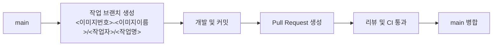
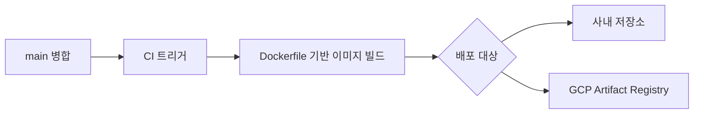

# 001 유지보수

템플릿 개발 시 브랜치 규칙과 이미지 배포 규칙을 정의한다.

## 템플릿 디렉터리 규칙

- 기본 구조: `templates/<이미지번호>_<이미지이름>`
- 예시: `templates/001_chatbot`, `templates/002_rag_chatbot`

권장 규칙:

- `<이미지번호>`: 3자리 숫자 (`001`, `002`, ...)
- `<이미지이름>`: 소문자 + snake_case

## 브랜치 네이밍 규칙

- 기본 형식: `<이미지번호>-<이미지이름>/<작업자>/<작업명>`
- 예시: `001-chatbot/keonho-kim/add-healthcheck`

권장 규칙:

- `<이미지이름>`: 소문자 + kebab-case
- `<작업자>`: 사내 계정 ID
- `<작업명>`: 동사로 시작하는 kebab-case (`add-dockerfile`, `fix-ci-pipeline`)

## 브랜치 전략 (Mermaid)

## 이미지 빌드/배포 전략 (Mermaid)

## 배포 태그 권장안

- 브랜치 기반 임시 태그: `<이미지번호>-<이미지이름>-<short_sha>`
- 릴리스 태그: `v<major>.<minor>.<patch>`
- 최신 안정 태그: `latest` (선택, 운영 정책에 따라 사용)

예시:

- `001-chatbot-a1b2c3d`
- `v1.2.0`

## 운영 체크리스트

- 브랜치는 항상 최신 `main`에서 생성한다.
- 하나의 브랜치에는 하나의 작업만 포함한다.
- PR 병합 전 Docker 빌드 검증을 수행한다.
- 병합 후 이미지는 사내 저장소 또는 GCP Artifact Registry로 푸시한다.
