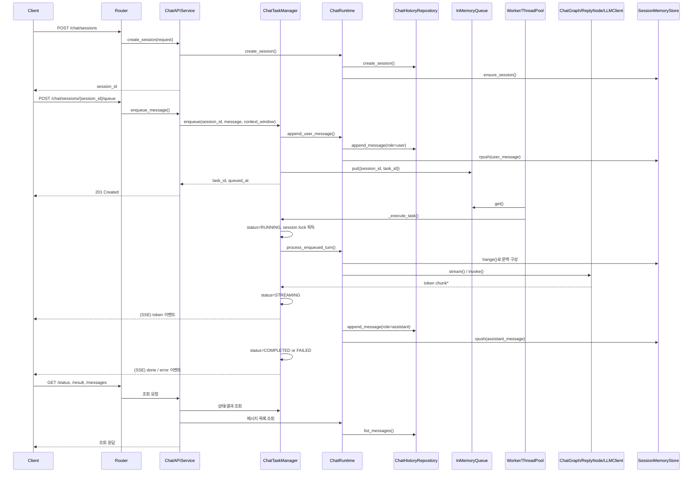

# 개발 문서 허브

이 문서는 현재 프로젝트의 아키텍처 기준, 의존성 방향, 개발 절차, 구현 방법을 정의하는 기준 문서다.

## 전체 의존 관계도

```mermaid
graph LR
    U[Client] --> M[api/main.py]
    M --> UI[static/index.html (/ui)]
    UI --> G1[static/js/ui/grid_manager.js]
    UI --> P1[static/js/chat/chat_presenter.js]
    UI --> C1[static/js/chat/chat_cell.js]
    G1 --> T1[static/js/chat/api_transport.js]
    C1 --> P1
    C1 --> T1
    T1 --> UR
    T1 --> R
    M --> R[api/chat/routers/chat.py]
    M --> UR[api/ui/routers/chat.py]
    UR --> US[api/ui/services/chat_service.py]
    US --> S
    R --> S[api/chat/services/chat_service.py]
    S --> T[api/chat/services/task_manager.py]
    S --> RT[api/chat/services/chat_runtime.py]

    T --> SR[shared/runtime]
    SR --> Q[shared/runtime/queue]
    SR --> W[shared/runtime/worker]
    SR --> P[shared/runtime/thread_pool]
    T --> RT

    RT --> MEM[core/common/memory/session_list_store.py]
    RT --> REPO[core/repositories/chat/history_repository.py]
    RT --> G[core/chat/graphs/chat_graph.py]

    G --> N[core/chat/nodes/reply_node.py]
    G --> ST[core/chat/state/graph_state.py]
    N --> CM[core/chat/models/*]
    ST --> CM

    REPO --> CM
    REPO --> DBS[core/repositories/chat/schemas/*]
    REPO --> DBC[integrations/db/client.py]
    DBC --> ENG[integrations/db/engines/*]

    N --> LLM[integrations/llm/client.py]
    LLM --> LOG[shared/logging/*]
    LLM --> EX[shared/exceptions/*]
    REPO --> EX
    R --> EX
    RT --> EX
```

## 계층 책임

### 계층 책임 선언

1. `src/base_template/api/*/routers`는 HTTP 경계(요청/응답, 상태코드, 예외 매핑)만 담당한다.
2. `src/base_template/api/chat/services`, `src/base_template/api/ui/services`는 물리적으로 `api/` 하위에 위치하지만 논리적으로 Application Service 계층이며, 유스케이스 오케스트레이션만 담당한다.
3. `src/base_template/core`는 애플리케이션 핵심 구현 계층이며 HTTP 프레임워크 타입에 의존하지 않는다.

| 계층 | 경로 | 책임 |
| --- | --- | --- |
| UI Frontend | `src/base_template/static` | 브라우저 UI 렌더링, API 호출, SSE 소비 |
| API Interface | `src/base_template/api/main.py`, `src/base_template/api/chat/routers`, `src/base_template/api/ui/routers` | HTTP 계약(요청/응답), 상태코드/예외 매핑, 앱 조립 |
| Application Service | `src/base_template/api/chat/services`, `src/base_template/api/ui/services` | 라우터 요청 조립, 유스케이스 오케스트레이션, 비동기 태스크/조회 오케스트레이션 |
| Core Domain | `src/base_template/core/chat` | 도메인 모델, 그래프/노드, 프롬프트 |
| Repository | `src/base_template/core/repositories` | 영속화 구현, DB 스키마 정의 |
| Integrations | `src/base_template/integrations` | 외부 시스템(DB/LLM/FS) 어댑터 |
| Common | `src/base_template/core/common` | 도메인 공통 유틸/메모리 저장소 |
| Shared | `src/base_template/shared` | 전역 인프라(설정/예외/로깅/런타임) |

`src/base_template/api/chat/services`, `src/base_template/api/ui/services`는 물리적으로 `api/` 하위에 있지만 논리적으로 Application Service 계층이다.

## 구조적 의존성 규칙

1. `api/*/routers`는 HTTP 경계만 담당하며 도메인 저장 로직을 직접 구현하지 않는다.
2. `api/*/services`는 Application 계층이며 유스케이스 오케스트레이션만 담당한다.
3. `core`는 FastAPI/HTTP 타입에 의존하지 않는다.
4. `core/repositories`는 DB 구현을 캡슐화하고 `core/chat/models`를 입출력 타입으로 사용한다.
5. `integrations`는 외부 라이브러리 차이를 내부 계약으로 변환한다.
6. `shared`는 재사용 가능한 인프라를 제공하며, 도메인 유스케이스를 포함하지 않는다.
7. 동시성 제어는 `task_manager`에서만 수행한다(Queue/Worker/ThreadPool + 세션 락).

## 레이어 의존성 매트릭스

| From | 허용 | 금지 |
| --- | --- | --- |
| `static/js/*` | `api/ui/*`, `api/chat/*` HTTP 호출 | `core/*`, `integrations/*` 직접 의존 |
| `api/ui/routers` | `api/ui/services`, `api/ui/models`, `shared/exceptions` | `core/repositories`, `integrations/*` 직접 호출 |
| `api/ui/services` | `api/chat/services`, `shared/logging`, `shared/exceptions` | `core/*`, `integrations/*` 직접 호출 |
| `api/chat/routers` | `api/chat/services`, `api/chat/models`, `shared/exceptions` | `core/repositories`, `integrations/*` 직접 호출 |
| `api/chat/services` | `core/chat`, `core/repositories`, `core/common`, `shared/runtime`, `shared/logging`, `shared/exceptions` | `integrations/*` 직접 호출 |
| `core/chat` | `integrations/llm`, `shared/*`, `core/chat/*` | `api/*` |
| `core/repositories` | `integrations/db`, `core/chat/models`, `shared/*` | `api/*` |
| `integrations/*` | `integrations/*`, `shared/*` | `api/*`, `core/chat`, `core/repositories` |
| `shared/*` | `shared/*`, (선택) `integrations/*` 어댑터 저장소 | `api/*`, 도메인 유스케이스 로직 |

## 금지 규칙 예시

1. Router에서 `ChatHistoryRepository`를 직접 생성/호출하지 않는다.
2. Application Service에서 `integrations.db.engines.*`를 직접 import하지 않는다.
3. `core/chat`에서 `fastapi` 타입 또는 HTTP DTO를 import하지 않는다.
4. `integrations/*`에서 `api/chat/services/*`를 import하지 않는다.
5. 도메인 상태 동시성 제어를 `task_manager` 외 위치에 분산 구현하지 않는다.
6. UI 조회 전용 라우터(`api/ui/routers`)에서 `api/chat/services/task_manager.py`를 직접 호출하지 않는다.

## 요청-응답 전체 시퀀스

### 시퀀스 다이어그램



### 단계별 처리

1. 세션 생성: `POST /chat/sessions` 요청으로 `session_id`를 생성하고 메모리 세션을 초기화한다.
2. 큐 등록: `POST /chat/sessions/{session_id}/queue` 호출 시 사용자 메시지를 DB와 메모리에 동시에 기록한 뒤 `task_id`를 반환한다.
3. 비동기 실행: Worker가 큐를 소비해 ThreadPool에서 태스크를 실행한다. 동일 `session_id`는 세션 락으로 직렬화한다.
4. LLM 호출: Runtime이 메모리 문맥(`lrange`)을 구성하고 Graph/Node를 통해 LLM `stream` 또는 `invoke`를 실행한다.
5. 스트리밍 전송: 토큰 청크를 스트림 버퍼에 적재하고 SSE `token` 이벤트로 전달한다.
6. 최종 저장: 어시스턴트 최종 응답을 DB와 메모리에 기록한다.
7. 종료 상태: 성공이면 `COMPLETED`, 실패면 `FAILED`로 태스크 상태를 확정한다.
8. 후속 조회: `/status`, `/result`, `/messages`로 상태/결과/이력을 조회한다.
9. UI 세션 삭제: `DELETE /ui-api/chat/sessions/{session_id}` 호출 시 세션/메시지 DB 이력과 메모리 캐시를 함께 삭제한다.

### 상태 전이

```text
QUEUED -> RUNNING -> STREAMING -> COMPLETED
QUEUED -> RUNNING -> FAILED
```

## Static 스크롤 규칙

정적 UI는 메시지 스크롤 소유권을 `src/base_template/static/css/main.css`의 `.chat-cell__messages`에 단일화한다.

1. `FOLLOWING`: 하단 근처 상태에서 토큰 수신 시 자동 하단 추적을 수행한다.
2. `PAUSED_BY_USER`: 사용자가 위로 스크롤하면 자동 추적을 중단한다.
3. 사용자가 다시 하단 근처로 이동하면 `FOLLOWING`으로 복귀한다.
4. 스트림 수신 버퍼와 화면 표시 버퍼를 분리해 서버 chunk 크기와 UI 표시 속도를 분리한다.
5. 스트리밍 중간 렌더는 경량 텍스트로 제한하고, `done`에서 최종 마크다운 렌더를 확정한다.
6. 자동 스크롤 보정은 `requestAnimationFrame` 다중 프레임으로 수행해 레이아웃 반영 지연을 흡수한다.

### Static 스크롤 트러블슈팅

1. 브라우저 캐시를 비우고 강력 새로고침(`Ctrl+Shift+R`)을 수행한다.
2. 개발자도구에서 `.chat-cell__messages`의 `scrollHeight > clientHeight`인지 확인한다.
3. 상위 컨테이너(`body`, `.app-body`, `.chat-grid`, `.chat-cell`)가 세로 스크롤을 소유하지 않는지 확인한다.
4. 장문 코드 블록 응답에서 메인 스레드 long task가 급증하는지 Performance 탭으로 확인한다.
5. 세션 전환 후 초기 위치가 하단으로 고정되는지 재현 시나리오로 확인한다.

## 개발 절차

### 1. 요구사항 분해

1. 변경 범위를 API 계약, 런타임 로직, 저장소, 외부 연동으로 분리한다.
2. 영향을 받는 파일과 의존 방향을 먼저 확정한다.

### 2. 모델/계약 정의

1. 도메인 타입은 `core/chat/models`에 먼저 정의한다.
2. HTTP DTO는 `api/chat/models`에서만 정의한다.
3. 저장 스키마는 `core/repositories/chat/schemas`에 반영한다.

### 3. 유스케이스 구현

1. 라우터는 입력 검증/예외 매핑만 수행한다.
2. 서비스는 유스케이스를 조합하고 응답 형태를 완성한다.
3. 런타임은 세션/문맥/LLM 호출/저장을 오케스트레이션한다.

### 4. 인프라 연결

1. 저장소에서 `DBClient`와 엔진 구현체를 연결한다.
2. 노드에서 `LLMClient`를 통해 LLM 공급자를 연결한다.
3. 비동기 경로는 `task_manager`를 통해서만 수행한다.

### 5. 문서 동기화

1. 변경된 구조/의존성을 `docs/`에 즉시 반영한다.
2. 문서와 실제 경로가 불일치하지 않도록 파일 단위로 점검한다.

### 6. 검증

1. 정적 검증과 테스트는 사용자 실행 환경에서 수행한다.
2. E2E 기준으로 세션 생성 -> 큐 등록 -> 스트리밍 -> 상태/결과/이력 조회를 확인한다.

## 개발 방법

### 계층별 구현 방법

- API: 엔드포인트와 DTO를 명확히 분리하고, 예외는 `BaseAppException` 코드로 매핑한다.
- Runtime: 상태 변화(세션/태스크)를 메서드 단위로 캡슐화한다.
- Core: 모델/그래프/노드를 분리해 LLM 호출 경로를 단일화한다.
- Repository: 쿼리/스키마/매핑 책임을 분리하고 DB 의존을 내부화한다.
- Integrations: 공급자별 차이를 어댑터 내부에서 흡수한다.
- Shared/Common: 도메인 공통 유틸과 전역 인프라를 명확히 분리한다.

### 변경 유형별 작업 진입점

| 변경 유형 | 시작 파일 | 후속 반영 |
| --- | --- | --- |
| Static UI 변경 | `src/base_template/static/js/*`, `src/base_template/static/index.html` | `docs/static/README.md`, `api/ui/*` 계약 |
| Chat API 계약 변경 | `api/chat/routers/chat.py`, `api/chat/models/*` | `api/chat/services/chat_service.py`, 문서 |
| Chat 실행 로직 변경 | `api/chat/services/chat_runtime.py` | `task_manager`, `core/chat/*`, 문서 |
| DB 저장 구조 변경 | `core/repositories/chat/history_repository.py` | `core/repositories/chat/schemas/*`, DB 문서 |
| LLM 동작 변경 | `core/chat/nodes/reply_node.py` | `integrations/llm/client.py`, Chat 문서 |
| 동시성 정책 변경 | `api/chat/services/task_manager.py` | `shared/runtime/*`, Chat 문서 |

## 문서 목록

| 문서 | 링크 | 설명 |
| --- | --- | --- |
| Static UI 아키텍처 | [docs/static/README.md](./static/README.md) | 정적 UI 구조, API 연동, SSE 처리 |
| Chat 아키텍처 | [docs/chat/README.md](./chat/README.md) | Chat API/Runtime/Queue/저장 흐름 |
| LLM 클라이언트 | [docs/intergrations/client/README.md](./intergrations/client/README.md) | `LLMClient` 계약과 로깅/예외 처리 |
| DB 통합 아키텍처 | [docs/intergrations/db/README.md](./intergrations/db/README.md) | DB 인터페이스/엔진 구현/벡터 검색 |
| DB 설치/구성 | [docs/intergrations/db/SETUP.md](./intergrations/db/SETUP.md) | 로컬 DB 실행 및 `.env` 설정 |
| 설정 로더 | [docs/shared/config/README.md](./shared/config/README.md) | 설정 소스 병합 규칙 |
| 공통 상수 | [docs/shared/const/README.md](./shared/const/README.md) | 전역 상수 정의 |
| 공통 예외 | [docs/shared/exceptions/README.md](./shared/exceptions/README.md) | 예외 모델/오류 전달 규칙 |
| 로깅 | [docs/shared/logging/README.md](./shared/logging/README.md) | 로거/저장소 계층 |
| 런타임 동시성 | [docs/shared/runtime/README.md](./shared/runtime/README.md) | Queue/Worker/ThreadPool 규칙 |
