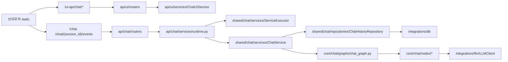

# 개발 문서 허브

이 문서는 `src/chatbot` 기준으로 문서를 읽고, 기능을 빠르게 추가/수정하기 위한 진입점이다.
핵심 모듈 문서는 코드 구조와 1:1로 맞췄고, `docs/setup/*`는 실행 환경/인프라 설정 절차를 다룬다.

## 문서 사용 원칙

1. 실제 파일 경로와 동일한 문서 경로를 사용한다.
2. API 인터페이스는 라우터/모델 코드 기준으로만 기술한다.
3. 동작 순서와 실패 복구 절차를 함께 제공한다.
4. 예시 코드는 현재 저장소의 구현 방식과 일치해야 한다.

## 문서 트리

```text
docs/
  README.md
  api/
    overview.md
    chat.md
    ui.md
    health.md
  core/
    overview.md
    chat.md
  shared/
    overview.md
    chat.md
    config.md
    const.md
    exceptions.md
    logging.md
    runtime.md
  integrations/
    overview.md
    db.md
    llm.md
    fs.md
  setup/
    overview.md
    env.md
    sqlite_vec.md
    postgresql_pgvector.md
    mongodb.md
    filesystem.md
  static/
    ui.md
```

## 코드-문서 매핑

| 코드 경로 | 문서 |
| --- | --- |
| `src/chatbot/api` | `docs/api/overview.md` |
| `src/chatbot/api/chat` | `docs/api/chat.md` |
| `src/chatbot/api/ui` | `docs/api/ui.md` |
| `src/chatbot/api/health` | `docs/api/health.md` |
| `src/chatbot/core` | `docs/core/overview.md` |
| `src/chatbot/core/chat` | `docs/core/chat.md` |
| `src/chatbot/shared` | `docs/shared/overview.md` |
| `src/chatbot/shared/chat` | `docs/shared/chat.md` |
| `src/chatbot/shared/runtime` | `docs/shared/runtime.md` |
| `src/chatbot/integrations` | `docs/integrations/overview.md` |
| `src/chatbot/static` | `docs/static/ui.md` |

## 설치/환경 문서

| 목적 | 문서 |
| --- | --- |
| setup 문서 인덱스 | `docs/setup/overview.md` |
| `.env` 키 상세/반영 여부 | `docs/setup/env.md` |
| SQLite + sqlite-vec 구성 | `docs/setup/sqlite_vec.md` |
| PostgreSQL + pgvector 구성 | `docs/setup/postgresql_pgvector.md` |
| MongoDB 구성 | `docs/setup/mongodb.md` |
| 파일 시스템 연동 | `docs/setup/filesystem.md` |

## 실행 경로 요약



## 빠른 작업 절차

### 1. 기능 추가

1. API 인터페이스를 먼저 확정한다. (`docs/api/chat.md`, `docs/api/ui.md`)
2. 도메인 상태/그래프 변경이 필요한지 확인한다. (`docs/core/chat.md`)
3. 실행기/저장소 영향도를 확인한다. (`docs/shared/chat.md`)
4. UI 연동 순서를 맞춘다. (`docs/static/ui.md`)

### 2. 장애 대응

1. 증상 위치를 먼저 분리한다: UI 렌더, API 응답, SSE 스트림, 저장소.
2. `request_id` 단위로 스트림 이벤트를 추적한다.
3. `ServiceExecutor` 상태(`IDLE/QUEUED/RUNNING/COMPLETED/FAILED`)를 확인한다.
4. 저장 실패는 `ChatHistoryRepository`와 DB 엔진 로그를 분리해 본다.

### 3. 구조 변경

1. `api/*`는 HTTP 경계만 유지한다.
2. 유스케이스 오케스트레이션은 `shared/chat/services`에 둔다.
3. 영속화 규칙은 `shared/chat/repositories`에 모은다.
4. 외부 라이브러리 의존은 `integrations/*`에 격리한다.

## 변경 유형별 진입점

| 변경 유형 | 시작 파일 | 반드시 함께 확인할 문서 |
| --- | --- | --- |
| 채팅 제출/이벤트 인터페이스 변경 | `src/chatbot/api/chat/routers/*.py` | `docs/api/chat.md`, `docs/static/ui.md` |
| 세션 목록/삭제 정책 변경 | `src/chatbot/api/ui/routers/*.py` | `docs/api/ui.md`, `docs/static/ui.md` |
| 응답 품질/분기 정책 변경 | `src/chatbot/core/chat/nodes/*.py` | `docs/core/chat.md`, `docs/shared/chat.md` |
| 저장 스키마/엔진 변경 | `src/chatbot/shared/chat/repositories/*.py` | `docs/shared/chat.md`, `docs/integrations/db.md` |
| SSE/큐/재시도 정책 변경 | `src/chatbot/shared/chat/services/service_executor.py` | `docs/shared/chat.md`, `docs/shared/runtime.md` |
| FE 렌더/연결 처리 변경 | `src/chatbot/static/js/chat/*.js` | `docs/static/ui.md`, `docs/api/chat.md` |

## 문서 동기화 체크리스트

1. 문서에 기록한 모든 경로가 실제 파일로 존재하는지 확인한다.
2. UI 세션 경로가 `/ui-api/chat/sessions*` 형태로 통일되어 있는지 확인한다.
3. SSE 식별자가 `task_id`가 아닌 `request_id`인지 확인한다.
4. static 문서의 호출 순서가 `api_transport.js`와 일치하는지 확인한다.
5. 문서 예시 페이로드의 필드명이 Pydantic 모델과 일치하는지 확인한다.
