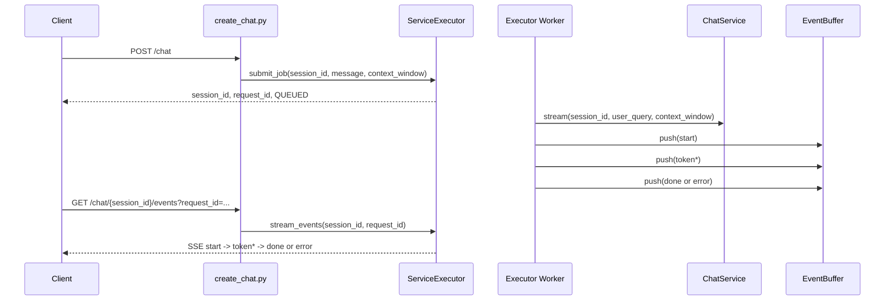

# API Chat 가이드

이 문서는 `src/chatbot/api/chat` 모듈의 HTTP 인터페이스, 실행 흐름, 수정 지점을 코드 기준으로 설명한다.

## 1. 용어 정리

| 용어 | 의미 | 관련 코드 |
| --- | --- | --- |
| 작업 제출 | 사용자 입력을 즉시 실행하지 않고 큐에 적재하는 단계 | `src/chatbot/api/chat/routers/create_chat.py` |
| 요청 식별자 | 작업 제출 1건을 식별하는 UUID | `request_id`, `src/chatbot/shared/chat/services/service_executor.py` |
| 세션 식별자 | 대화 컨텍스트를 구분하는 ID | `session_id`, `src/chatbot/shared/chat/services/chat_service.py` |
| 세션 상태 | 세션의 최근 실행 상태 | `IDLE`, `QUEUED`, `RUNNING`, `COMPLETED`, `FAILED` |
| SSE | 서버가 이벤트를 연속 전달하는 스트림 응답 | `text/event-stream`, `stream_chat_events.py` |
| 공개 이벤트 페이로드 | 내부 이벤트를 외부 응답 형태로 변환한 JSON | `_build_public_payload` |
| 세션 스냅샷 | 현재 세션 메시지와 최근 상태를 한번에 조회한 응답 | `get_chat_session.py` |

## 2. 관련 스크립트

| 분류 | 파일 | 역할 |
| --- | --- | --- |
| 라우터 집계 | `src/chatbot/api/chat/routers/router.py` | Chat 하위 라우터 등록 |
| 작업 제출 | `src/chatbot/api/chat/routers/create_chat.py` | `POST /chat` 처리 |
| 이벤트 구독 | `src/chatbot/api/chat/routers/stream_chat_events.py` | `GET /chat/{session_id}/events` SSE 중계 |
| 세션 스냅샷 | `src/chatbot/api/chat/routers/get_chat_session.py` | `GET /chat/{session_id}` 처리 |
| 예외 매핑 | `src/chatbot/api/chat/routers/common.py` | 도메인 예외를 HTTP 예외로 변환 |
| 요청 DTO | `src/chatbot/api/chat/models/stream.py` | `SubmitChatRequest`, `SubmitChatResponse` |
| 응답 DTO | `src/chatbot/api/chat/models/message.py` | 메시지 응답 모델 |
| 실행 런타임 | `src/chatbot/api/chat/services/runtime.py` | ChatService, ServiceExecutor 조립 |
| 실행 오케스트레이터 | `src/chatbot/shared/chat/services/service_executor.py` | 큐 소비, 이벤트 버퍼 push, SSE payload 변환 |
| 도메인 서비스 | `src/chatbot/shared/chat/services/chat_service.py` | 세션/메시지 처리, 그래프 실행 |

## 3. HTTP 인터페이스

## 3-1. 채팅 작업 제출

- Method: `POST`
- Path: `/chat`
- Status: `202 Accepted`
- Request Model: `SubmitChatRequest`
- Response Model: `SubmitChatResponse`

Request 예시:

```json
{
  "session_id": "3f3b...",
  "message": "다음 요구사항을 정리해줘",
  "context_window": 20
}
```

검증 규칙:

1. `message`는 빈 문자열이면 안 된다.
2. `context_window`는 `1..100` 범위다.
3. `session_id`가 비어 있으면 새 세션을 생성한다.
4. `session_id`가 존재하지 않으면 `CHAT_SESSION_NOT_FOUND`를 반환한다.

Response 예시:

```json
{
  "session_id": "3f3b...",
  "request_id": "28c7...",
  "status": "QUEUED"
}
```

## 3-2. 스트림 이벤트 구독

- Method: `GET`
- Path: `/chat/{session_id}/events`
- Query: `request_id` 필수, 최소 길이 1
- Status: `200 OK`
- Content-Type: `text/event-stream`

핵심 동작:

1. `ServiceExecutor.stream_events()`가 이벤트 버퍼를 polling한다.
2. 내부 이벤트를 `_build_public_payload()`로 정규화해 전송한다.
3. `done` 또는 `error` 이벤트에서 스트림을 종료한다.
4. 타임아웃이 발생하면 `type=error`, `status=FAILED` 이벤트를 전송한다.

SSE `data` payload 예시:

```json
{
  "session_id": "3f3b...",
  "request_id": "28c7...",
  "type": "token",
  "node": "response",
  "content": "안",
  "status": null,
  "error_message": null,
  "metadata": {
    "token_count": 12
  }
}
```

## 3-3. 세션 스냅샷 조회

- Method: `GET`
- Path: `/chat/{session_id}`
- Status: `200 OK`
- Response Model: `SessionSnapshotResponse`

Response 예시:

```json
{
  "session_id": "3f3b...",
  "messages": [
    {
      "message_id": "...",
      "role": "user",
      "content": "안녕하세요",
      "sequence": 1,
      "created_at": "2026-02-19T01:23:45.123456+00:00"
    }
  ],
  "last_status": "RUNNING",
  "updated_at": "2026-02-19T01:23:45.123456+00:00"
}
```

추가 규칙:

1. 스냅샷 메시지 조회는 현재 구현에서 `limit=200`, `offset=0` 고정이다.
2. `last_status`가 없으면 `IDLE`을 반환한다.

## 4. 실행 흐름

## 4-1. 작업 제출부터 스트림 종료까지



## 4-2. 세션 상태 전이

`ServiceExecutor` 기준 상태 전이:

```text
IDLE -> QUEUED -> RUNNING -> COMPLETED
IDLE -> QUEUED -> RUNNING -> FAILED
```

보정 규칙:

1. RUNNING 상태를 다시 QUEUED로 역전시키지 않는다.
2. 타임아웃과 예외는 FAILED로 기록한다.

## 5. 이벤트 인터페이스 상세

## 5-1. 외부 공개 이벤트 타입

| type | 설명 | 종료 여부 |
| --- | --- | --- |
| `start` | 실행 시작 이벤트 | 아니오 |
| `token` | 토큰 단위 본문 이벤트 | 아니오 |
| `done` | 정상 완료 이벤트 | 예 |
| `error` | 오류 종료 이벤트 | 예 |

## 5-2. node 값 의미

| node | 의미 | 생성 위치 |
| --- | --- | --- |
| `executor` | 실행기 시작/오류 이벤트 | `ServiceExecutor` |
| `response` | 일반 답변 생성 이벤트 | `core/chat/nodes/response_node.py` |
| `blocked` | 안전성 차단 응답 이벤트 | `core/chat/nodes/safeguard_message_node.py` |
| `safeguard` | 분류 이벤트 | `core/chat/nodes/safeguard_node.py` |
| `safeguard_route` | 분기 결정 이벤트 | `core/chat/nodes/safeguard_route_node.py` |

## 5-3. 내부 이벤트 정규화 규칙

`ServiceExecutor._normalize_graph_event()` 기준:

1. `event=token`은 `type=token`으로 전달한다.
2. `event=assistant_message`는 `node=blocked`일 때만 `type=token`으로 전달한다.
3. `event=done`은 `type=done`으로 전달한다.
4. `event=error`는 `type=error`로 전달한다.

`ServiceExecutor._build_public_payload()` 기준:

1. `done`이면 `status=COMPLETED`를 넣는다.
2. `error`이면 `status=FAILED`, `error_message`를 넣는다.
3. `metadata`가 있으면 그대로 전달한다.

## 6. 예외 코드와 HTTP 매핑

`src/chatbot/api/chat/routers/common.py` 기준:

| `detail.code` | HTTP 상태 |
| --- | --- |
| `CHAT_SESSION_NOT_FOUND` | `404 Not Found` |
| `CHAT_MESSAGE_EMPTY`, `CHAT_STREAM_NODE_INVALID` | `400 Bad Request` |
| `CHAT_JOB_QUEUE_FAILED` | `503 Service Unavailable` |
| `CHAT_STREAM_TIMEOUT` | `504 Gateway Timeout` |
| 기타 | `500 Internal Server Error` |

오류 응답 형태:

```json
{
  "detail": {
    "message": "작업 큐에 요청을 저장하지 못했습니다.",
    "detail": {
      "code": "CHAT_JOB_QUEUE_FAILED",
      "cause": "..."
    },
    "original": "..."
  }
}
```

## 7. 구현 변경 절차

## 7-1. 요청 필드 추가

예시: `priority` 필드 추가

1. `src/chatbot/api/chat/models/stream.py`의 `SubmitChatRequest`에 필드를 추가한다.
2. `src/chatbot/api/chat/routers/create_chat.py`에서 `submit_job` 인자를 확장한다.
3. `src/chatbot/shared/chat/services/service_executor.py` job payload를 확장한다.
4. 큐 소비 경로 `_handle_job()`에서 해당 필드 반영 로직을 추가한다.
5. 문서의 Request 예시를 갱신한다.

## 7-2. 이벤트 필드 추가

예시: `latency_ms`를 metadata에 추가

1. `ServiceExecutor`의 done 시점 메타 생성 로직을 수정한다.
2. 필요하면 `StreamPayload` 모델 설명을 갱신한다.
3. `docs/static/ui.md`의 런타임 표시 규칙을 동기화한다.

## 7-3. 타임아웃 정책 변경

1. `src/chatbot/api/chat/services/runtime.py`의 `CHAT_STREAM_TIMEOUT_SECONDS` 기본값을 조정한다.
2. `ServiceExecutor._raise_timeout_if_needed()` 동작이 의도와 일치하는지 확인한다.
3. 타임아웃 오류 코드가 여전히 `CHAT_STREAM_TIMEOUT`으로 노출되는지 확인한다.

## 8. 트러블슈팅

| 증상 | 원인 후보 | 확인 파일 | 조치 |
| --- | --- | --- | --- |
| 작업 제출은 성공했는데 이벤트가 오지 않음 | 워커 미동작 또는 버퍼 설정 오류 | `api/chat/services/runtime.py`, `shared/chat/services/service_executor.py` | 워커 스레드 시작/큐 poll 설정 확인 |
| `request_id`가 다른 이벤트가 섞여 보임 | 클라이언트 필터 누락 | `static/js/chat/api_transport.js` | `request_id` 검증 로직 유지 |
| 항상 `error`로 종료됨 | 노드 예외 또는 타임아웃 | `shared/chat/services/service_executor.py` | 오류 코드와 timeout 설정 점검 |
| `GET /chat/{session_id}`가 404 | 세션 생성 이전 조회 또는 잘못된 ID | `get_chat_session.py` | `POST /chat` 응답의 session_id 사용 |
| blocked 응답이 일반 응답처럼 처리됨 | node 분기 처리 누락 | `ServiceExecutor._normalize_graph_event` | `node=blocked` 처리 정책 확인 |

## 9. 소스 매칭 점검 항목

1. `POST /chat` 상태코드가 `202`인지 확인
2. `GET /chat/{session_id}/events`의 `request_id` 필수 검증이 유지되는지 확인
3. `SubmitChatRequest.context_window` 상한이 문서와 동일한지 확인
4. 예외 코드 매핑 표가 `routers/common.py`와 동일한지 확인
5. 이벤트 타입 집합이 `start`, `token`, `done`, `error`로 동일한지 확인
6. `done`과 `error` 종료 규칙이 실행기 코드와 동일한지 확인

## 10. 관련 문서

- `docs/api/overview.md`
- `docs/api/ui.md`
- `docs/core/chat.md`
- `docs/shared/chat.md`
- `docs/static/ui.md`
