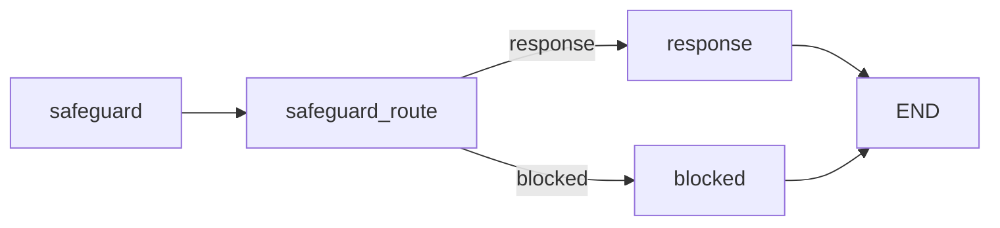

# Core Chat 가이드

이 문서는 `src/chatbot/core/chat`의 도메인 모델, 그래프 조립, 노드 실행 규칙을 코드 기준으로 설명한다.

## 1. 용어 정리

| 용어 | 의미 | 관련 코드 |
| --- | --- | --- |
| 세션 | 대화 컨텍스트 단위 | `ChatSession` |
| 메시지 | 세션 내부 단일 발화 | `ChatMessage` |
| 역할 | 메시지 작성 주체 | `ChatRole` |
| 그래프 상태 | 노드 간 전달되는 키 집합 | `ChatGraphState` |
| safeguard | 입력 유해성 분류 단계 | `safeguard_node` |
| 분기 노드 | 분류 결과로 다음 노드를 선택하는 단계 | `safeguard_route_node` |
| blocked 노드 | 차단 안내 문구를 생성하는 단계 | `safeguard_message_node` |
| response 노드 | 일반 답변을 생성하는 단계 | `response_node` |
| 출력 키 | 노드가 결과 문자열을 상태에 저장하는 키 | `assistant_message` |
| 스트림 이벤트 | 실행 중 상위 계층에 전달할 이벤트 | `token`, `assistant_message`, `safeguard_result` |

## 2. 디렉터리와 관련 스크립트

```text
src/chatbot/core/chat/
  const/
  graphs/
  models/
  nodes/
  prompts/
  state/
  utils/
```

| 분류 | 파일 | 역할 |
| --- | --- | --- |
| 엔티티 | `src/chatbot/core/chat/models/entities.py` | `ChatSession`, `ChatMessage`, `ChatRole` 정의 |
| 턴 결과 | `src/chatbot/core/chat/models/turn_result.py` | 1턴 처리 결과 묶음 모델 |
| 상수 | `src/chatbot/core/chat/const/settings.py` | DB 경로, 페이지, 문맥 길이 기본값 |
| 차단 문구 | `src/chatbot/core/chat/const/messages/safeguard.py` | 차단 메시지 Enum |
| 상태 | `src/chatbot/core/chat/state/graph_state.py` | 그래프 상태 키 정의 |
| 그래프 | `src/chatbot/core/chat/graphs/chat_graph.py` | 노드 등록, 엣지, stream 정책 |
| 응답 노드 | `src/chatbot/core/chat/nodes/response_node.py` | 일반 응답 생성 |
| 분류 노드 | `src/chatbot/core/chat/nodes/safeguard_node.py` | PASS/차단 라벨 분류 |
| 분기 노드 | `src/chatbot/core/chat/nodes/safeguard_route_node.py` | response/blocked 분기 |
| 차단 노드 | `src/chatbot/core/chat/nodes/safeguard_message_node.py` | 차단 문구 생성 |
| 프롬프트 | `src/chatbot/core/chat/prompts/chat_prompt.py`, `src/chatbot/core/chat/prompts/safeguard_prompt.py` | 시스템 프롬프트 |
| 매퍼 | `src/chatbot/core/chat/utils/mapper.py` | 도메인 모델과 DB 문서 변환 |

연동 스크립트:

1. `src/chatbot/shared/chat/graph/base_chat_graph.py`
2. `src/chatbot/shared/chat/nodes/llm_node.py`
3. `src/chatbot/shared/chat/nodes/branch_node.py`
4. `src/chatbot/shared/chat/nodes/message_node.py`
5. `src/chatbot/shared/chat/services/chat_service.py`
6. `src/chatbot/shared/chat/services/service_executor.py`

## 3. 모델 인터페이스

## 3-1. ChatSession

| 필드 | 타입 | 설명 |
| --- | --- | --- |
| `session_id` | `str` | 세션 식별자 |
| `title` | `str` | 세션 제목 |
| `created_at` | `datetime` | 생성 시각 |
| `updated_at` | `datetime` | 마지막 갱신 시각 |
| `message_count` | `int` | 메시지 개수 |
| `last_message_preview` | `str \| None` | 최근 메시지 미리보기 |

## 3-2. ChatMessage

| 필드 | 타입 | 설명 |
| --- | --- | --- |
| `message_id` | `str` | 메시지 식별자 |
| `session_id` | `str` | 소속 세션 ID |
| `role` | `ChatRole` | `user`, `assistant`, `system` |
| `content` | `str` | 메시지 본문 |
| `sequence` | `int` | 세션 내 순번 |
| `created_at` | `datetime` | 생성 시각 |
| `metadata` | `dict[str, Any]` | 부가 메타데이터 |

## 3-3. ChatGraphState

`src/chatbot/core/chat/state/graph_state.py` 기준:

```python
class ChatGraphState(TypedDict):
    session_id: str
    user_message: str
    history: list[ChatMessage]
    safeguard_result: NotRequired[str]
    safeguard_route: NotRequired[str]
    safeguard_reason: NotRequired[str]
    assistant_message: str
```

핵심:

1. `assistant_message`는 최종 출력 통합 키다.
2. safeguard 관련 키는 분류/분기 노드에서 채운다.

## 4. 그래프 구조

## 4-1. 노드와 엣지

`src/chatbot/core/chat/graphs/chat_graph.py` 기준:



구성 규칙:

1. 진입점은 `safeguard`다.
2. `safeguard_route`는 `safeguard_route` 값을 읽어 다음 노드를 결정한다.
3. `response`와 `blocked`는 종료 노드다.

## 4-2. stream 노드 정책

`stream_node` 설정:

| 노드 | 허용 이벤트 |
| --- | --- |
| `safeguard` | `safeguard_result` |
| `safeguard_route` | `safeguard_route`, `safeguard_result` |
| `response` | `token`, `assistant_message` |
| `blocked` | `assistant_message` |

의미:

1. 정의된 이벤트만 상위 계층으로 노출된다.
2. 정책 밖 이벤트는 `BaseChatGraph` 단계에서 필터링된다.

## 5. 노드별 동작

## 5-1. safeguard_node

- 파일: `src/chatbot/core/chat/nodes/safeguard_node.py`
- 내부 구현: `shared.chat.nodes.LLMNode`
- 입력: `user_message`
- 출력: `safeguard_result`
- 특징:
  1. `history_key="__skip_history__"`로 히스토리를 비활성화한다.
  2. `stream_tokens=False`로 단건 분류 결과를 반환한다.

## 5-2. safeguard_route_node

- 파일: `src/chatbot/core/chat/nodes/safeguard_route_node.py`
- 내부 구현: `shared.chat.nodes.BranchNode`
- 규칙:
  1. `PASS -> response`
  2. 그 외 -> `blocked`
  3. `PROMPT_INJETION` 오타는 `PROMPT_INJECTION`으로 정규화
  4. 허용 라벨 집합 밖 값은 `HARMFUL`로 보정

## 5-3. response_node

- 파일: `src/chatbot/core/chat/nodes/response_node.py`
- 내부 구현: `LLMNode`
- 출력 키: `assistant_message`
- 스트림: `token` 이벤트를 생성한다.

## 5-4. safeguard_message_node

- 파일: `src/chatbot/core/chat/nodes/safeguard_message_node.py`
- 내부 구현: `MessageNode`
- 메시지 소스: `SafeguardRejectionMessage`
- 출력 키: `assistant_message`

## 6. 프롬프트 인터페이스

## 6-1. CHAT_PROMPT

- 파일: `src/chatbot/core/chat/prompts/chat_prompt.py`
- 입력 변수: `user_message`
- 역할: 일반 응답 정책 제공

## 6-2. SAFEGUARD_PROMPT

- 파일: `src/chatbot/core/chat/prompts/safeguard_prompt.py`
- 입력 변수: `user_message`
- 출력 토큰 규칙: `PASS`, `PII`, `HARMFUL`, `PROMPT_INJECTION`

## 7. 상수 인터페이스

`src/chatbot/core/chat/const/settings.py` 기준:

| 상수 | 값 | 설명 |
| --- | --- | --- |
| `CHAT_DB_PATH` | `data/db/chat/chat_history.sqlite` 기본 | 이력 저장 기본 경로 |
| `CHAT_SESSION_COLLECTION` | `chat_sessions` | 세션 컬렉션명 |
| `CHAT_MESSAGE_COLLECTION` | `chat_messages` | 메시지 컬렉션명 |
| `CHAT_REQUEST_COMMIT_COLLECTION` | `chat_request_commits` | 저장 멱등성 추적 컬렉션명 |
| `DEFAULT_PAGE_SIZE` | `50` | 목록 조회 기본 크기 |
| `MAX_PAGE_SIZE` | `200` | 목록 조회 최대 크기 |
| `DEFAULT_CONTEXT_WINDOW` | `20` | 문맥 참조 기본 길이 |

## 8. 상위 계층 연동 포인트

## 8-1. ChatService 연동

`src/chatbot/shared/chat/services/chat_service.py`에서 core 그래프를 호출한다.

핵심 경로:

1. 사용자 메시지 저장
2. 최근 히스토리 구성
3. `chat_graph.stream_events()` 호출
4. done 시 assistant 메시지 영속화

## 8-2. ServiceExecutor 연동

`src/chatbot/shared/chat/services/service_executor.py`는 core 이벤트를 API 이벤트로 변환한다.

핵심 규칙:

1. `response`의 `token` 이벤트를 SSE token으로 전달
2. `blocked`의 `assistant_message`를 SSE token으로 변환
3. done/error에서 스트림 종료

## 9. 변경 작업 절차

## 9-1. 새 분류 라벨 추가

예시: `JAILBREAK` 추가

1. `SAFEGUARD_PROMPT` 라벨 규칙을 수정한다.
2. `safeguard_route_node`의 `allowed_selectors`를 확장한다.
3. 분기 정책을 `branch_map` 또는 `default_branch`에 반영한다.
4. 필요 시 `SafeguardRejectionMessage`에 문구를 추가한다.
5. `docs/api/chat.md`, `docs/static/ui.md` 이벤트 예시를 동기화한다.

## 9-2. 응답 노드 교체

예시: 모델 공급자 교체

1. `response_node.py`의 모델/클라이언트 조립부를 변경한다.
2. 출력 키 `assistant_message`를 유지한다.
3. 토큰 스트림 이벤트 스키마를 유지한다.
4. 상위 계층 SSE 파싱 로직이 그대로 동작하는지 확인한다.

## 9-3. 문맥 길이 정책 변경

1. `DEFAULT_CONTEXT_WINDOW` 값을 조정한다.
2. `SubmitChatRequest.context_window` 제한과 함께 맞춘다.
3. 정적 UI 기본 전송값도 동기화한다.

## 10. 트러블슈팅

| 증상 | 원인 후보 | 확인 파일 | 조치 |
| --- | --- | --- | --- |
| done 이벤트인데 본문이 비어 있음 | 출력 키 불일치 | `response_node.py`, `chat_graph.py` | 출력 키를 `assistant_message`로 유지 |
| 안전한 입력도 blocked로 감 | 라벨 정규화 누락 | `safeguard_route_node.py` | `aliases`, `allowed_selectors` 확인 |
| 분류 노드가 오류로 종료 | 프롬프트 입력 누락 | `llm_node.py` | 프롬프트 변수와 상태 키 일치 확인 |
| 메시지 저장은 됐는데 preview가 이상함 | 매퍼 preview 정책 차이 | `core/chat/utils/mapper.py`, `static/js/core/app.js` | preview 길이 정책 정렬 |
| 타임아웃 빈도가 높음 | 실행 제한 시간이 짧음 | `api/chat/services/runtime.py` | `CHAT_STREAM_TIMEOUT_SECONDS` 조정 |

## 11. 소스 매칭 점검 항목

1. 그래프 노드 이름과 문서 노드 이름이 일치하는가
2. `stream_node` 허용 이벤트 표가 코드와 일치하는가
3. `assistant_message` 출력 키가 모든 최종 경로에서 유지되는가
4. 상수 값 설명이 `settings.py`와 일치하는가
5. 문서에 기록한 관련 스크립트 경로가 모두 존재하는가

## 12. 관련 문서

- `docs/core/overview.md`
- `docs/api/chat.md`
- `docs/shared/chat.md`
- `docs/static/ui.md`
