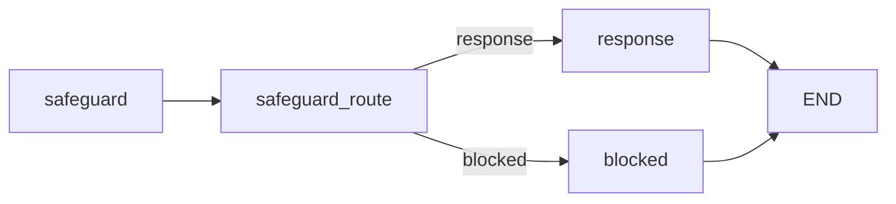

# Core Chat 레퍼런스

이 문서는 `src/chatbot/core/chat`의 모델, 상수, 프롬프트, 노드, 그래프를 코드 기준으로 설명한다.

## 1. 디렉터리 구조

```text
src/chatbot/core/chat/
  const/
  graphs/
  models/
  nodes/
  prompts/
  state/
  utils/
```

## 2. 도메인 모델

### 2-1. `ChatSession`

파일: `src/chatbot/core/chat/models/entities.py`

| 필드 | 타입 | 설명 |
| --- | --- | --- |
| `session_id` | `str` | 세션 식별자 |
| `title` | `str` | 세션 제목 |
| `created_at` | `datetime` | 생성 시각 |
| `updated_at` | `datetime` | 마지막 갱신 시각 |
| `message_count` | `int` | 저장된 메시지 수 |
| `last_message_preview` | `str \| None` | 최근 메시지 미리보기 |

### 2-2. `ChatMessage`

파일: `src/chatbot/core/chat/models/entities.py`

| 필드 | 타입 | 설명 |
| --- | --- | --- |
| `message_id` | `str` | 메시지 식별자 |
| `session_id` | `str` | 소속 세션 |
| `role` | `ChatRole` | `user`, `assistant`, `system` |
| `content` | `str` | 메시지 본문 |
| `sequence` | `int` | 세션 내 순번 |
| `created_at` | `datetime` | 생성 시각 |
| `metadata` | `dict[str, Any]` | 부가 메타데이터 |

### 2-3. `ChatTurnResult`

파일: `src/chatbot/core/chat/models/turn_result.py`

사용자 1턴 처리 결과를 세션, 사용자 메시지, assistant 메시지로 묶는 모델이다.

## 3. 상수와 상태

### 3-1. `settings.py`

파일: `src/chatbot/core/chat/const/settings.py`

| 상수 | 값 | 설명 |
| --- | --- | --- |
| `CHAT_DB_PATH` | 환경 변수 또는 `data/db/chat/chat_history.sqlite` | 기본 SQLite 경로 |
| `CHAT_SESSION_COLLECTION` | `chat_sessions` | 세션 컬렉션 이름 |
| `CHAT_MESSAGE_COLLECTION` | `chat_messages` | 메시지 컬렉션 이름 |
| `CHAT_REQUEST_COMMIT_COLLECTION` | `chat_request_commits` | 완료 저장 멱등성 기록 컬렉션 이름 |
| `DEFAULT_PAGE_SIZE` | `50` | 목록 조회 기본값 |
| `MAX_PAGE_SIZE` | `200` | 목록 조회 최대값 |
| `DEFAULT_CONTEXT_WINDOW` | `20` | 최근 문맥 길이 기본값 |

### 3-2. 차단 메시지

파일: `src/chatbot/core/chat/const/messages/safeguard.py`

현재 차단 라벨:

1. `PII`
2. `HARMFUL`
3. `PROMPT_INJECTION`

### 3-3. `ChatGraphState`

파일: `src/chatbot/core/chat/state/graph_state.py`

핵심 상태 키:

1. `session_id`
2. `user_message`
3. `history`
4. `safeguard_result`
5. `safeguard_route`
6. `assistant_message`

## 4. 프롬프트

### 4-1. `CHAT_PROMPT`

파일: `src/chatbot/core/chat/prompts/chat_prompt.py`

현재 응답 노드에 적용되는 시스템 프롬프트다.

### 4-2. `SAFEGUARD_PROMPT`

파일: `src/chatbot/core/chat/prompts/safeguard_prompt.py`

현재 사용자 입력을 `PASS`, `PII`, `HARMFUL`, `PROMPT_INJECTION`으로 분류하는 프롬프트다.

## 5. 노드 조립

### 5-1. `safeguard_node`

파일: `src/chatbot/core/chat/nodes/safeguard_node.py`

특징:

1. `ChatGoogleGenerativeAI`를 `LLMClient`로 감싼다.
2. `history_key="__skip_history__"`로 대화 이력을 사용하지 않는다.
3. `stream_tokens=False`로 분류 결과만 반환한다.
4. 출력 키는 `safeguard_result`다.

### 5-2. `safeguard_route_node`

파일: `src/chatbot/core/chat/nodes/safeguard_route_node.py`

특징:

1. `BranchNode`를 사용한다.
2. `PASS`면 `response`, 나머지는 `blocked`로 보낸다.
3. `PROMPT_INJETION` 오타를 `PROMPT_INJECTION`으로 정규화한다.
4. 허용 집합 밖 값은 `HARMFUL`로 보정한다.
5. 보정 결과를 다시 `safeguard_result`에 쓴다.

### 5-3. `response_node`

파일: `src/chatbot/core/chat/nodes/response_node.py`

특징:

1. `ChatGoogleGenerativeAI` 기반 응답 노드다.
2. 출력 키는 `assistant_message`다.
3. 토큰 스트리밍을 공개한다.

### 5-4. `safeguard_message_node`

파일: `src/chatbot/core/chat/nodes/safeguard_message_node.py`

특징:

1. `MessageNode`를 사용한다.
2. `SafeguardRejectionMessage`의 문구를 선택한다.
3. 출력 키는 `assistant_message`다.

## 6. 그래프 구조

파일: `src/chatbot/core/chat/graphs/chat_graph.py`


```mermaid
flowchart LR
    S[safeguard] --> R[safeguard_route]
    R -->|response| A[response]
    R -->|blocked| B[blocked]
    A --> END
    B --> END
```

현재 설정:

1. 진입점은 `safeguard`
2. `checkpointer`는 `InMemorySaver()`
3. `stream_node` 정책은 아래와 같다

| 노드 | 외부 노출 이벤트 |
| --- | --- |
| `safeguard` | `safeguard_result` |
| `safeguard_route` | `safeguard_route`, `safeguard_result` |
| `response` | `token`, `assistant_message` |
| `blocked` | `assistant_message` |

## 7. 유지보수 포인트

1. `assistant_message`는 상위 계층이 최종 응답으로 기대하는 키다.
2. 노드 이름은 SSE 페이로드의 `node` 값과 연결된다.
3. 세이프가드 라벨을 추가하면 프롬프트, 라우트 노드, 차단 메시지, 문서를 함께 수정해야 한다.
4. `DEFAULT_CONTEXT_WINDOW`는 API와 정적 UI의 기본 동작과 연결된다.

## 8. 관련 문서

- `docs/core/overview.md`
- `docs/api/chat.md`
- `docs/shared/chat/overview.md`
