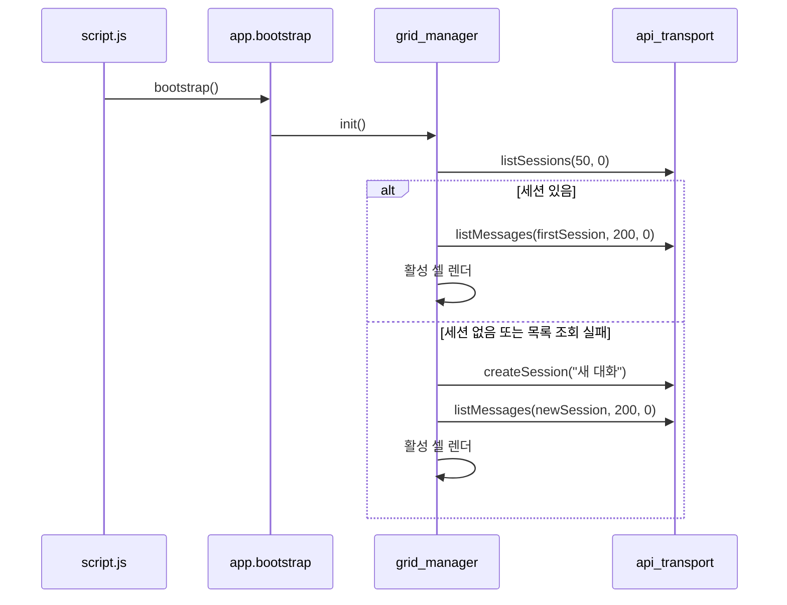

# Static UI 구현 레퍼런스

이 문서는 `src/chatbot/static`의 HTML, JavaScript 모듈, 백엔드 연동 흐름을 코드 기준으로 정리한다.

## 1. 구성 요소

관련 파일:

1. `src/chatbot/static/index.html`
2. `src/chatbot/static/js/core/app.js`
3. `src/chatbot/static/js/ui/grid_manager.js`
4. `src/chatbot/static/js/chat/api_transport.js`
5. `src/chatbot/static/js/chat/chat_cell.js`
6. `src/chatbot/static/js/chat/chat_presenter.js`
7. `src/chatbot/static/js/ui/theme.js`
8. `src/chatbot/static/js/ui/panel_toggle.js`
9. `src/chatbot/static/js/script.js`

## 2. 화면 구조

`index.html`은 다음 구조를 가진다.

1. 상단 헤더
2. 좌측 히스토리 패널
3. 우측 채팅 셀 영역
4. 새 세션 생성 버튼
5. 테마 토글 버튼
6. 패널 접기/펴기 버튼

스크립트 로드 순서:

1. DOM/마크다운/문법 하이라이팅 유틸
2. UI 제어 모듈
3. API 어댑터
4. 채팅 프레젠터와 셀
5. 앱 퍼사드
6. 최종 부트스트랩 스크립트

## 3. 모듈 책임

| 파일 | 코드 설명 | 유지보수 포인트 |
| --- | --- | --- |
| `js/core/app.js` | 히스토리 DOM 갱신과 전체 부트스트랩 조합 | UI 전역 상태는 얇게 유지하고 실제 동작은 하위 모듈에 둔다 |
| `js/ui/grid_manager.js` | 세션 생성/전환/삭제와 활성 채팅 셀 관리 | 단일 활성 셀 정책을 깨지 않도록 주의한다 |
| `js/chat/api_transport.js` | UI API, Chat API, SSE 요청 캡슐화 | 엔드포인트 경로와 payload 검증 규칙의 단일 진입점이다 |
| `js/chat/chat_cell.js` | 사용자 입력, 스트림 수신, 상태 전이 처리 | 요청 ID와 스트림 정리 로직이 가장 중요하다 |
| `js/chat/chat_presenter.js` | 메시지/상태 렌더링 보조 | 표현 변경은 여기에서 먼저 처리한다 |
| `js/ui/theme.js` | 라이트/다크 테마 토글 | localStorage 키를 유지하는 편이 하위 호환에 유리하다 |
| `js/ui/panel_toggle.js` | 좌측 패널 접기/펴기 | localStorage 키와 aria-label을 함께 유지한다 |
| `js/script.js` | `window.App.app.bootstrap()` 호출 | 실제 로직을 넣지 않는다 |

## 4. 초기 로딩 흐름



핵심 포인트:

1. 부트스트랩은 항상 단일 활성 세션을 만든다.
2. 세션 목록 조회 실패 시 새 세션 생성으로 이어진다.
3. 메시지 목록 조회 실패 시 빈 배열로 렌더링을 진행한다.

## 5. 백엔드 계약

### 5-1. UI API

`api_transport.js`가 사용하는 경로:

| 함수 | 경로 | 비고 |
| --- | --- | --- |
| `createSession(title)` | `POST /ui-api/chat/sessions` | 제목이 있으면 body에 포함 |
| `listSessions(limit, offset)` | `GET /ui-api/chat/sessions` | 기본 fallback 값은 `20`, `0` |
| `listMessages(sessionId, limit, offset)` | `GET /ui-api/chat/sessions/{session_id}/messages` | 기본 fallback 값은 `200`, `0` |
| `deleteSession(sessionId)` | `DELETE /ui-api/chat/sessions/{session_id}` | 삭제 성공 시 빈 처리 없음 |

주의:

1. 브라우저 초기 로딩은 `grid_manager.js`에서 `listSessions(50, 0)`을 직접 호출한다.
2. 즉, `api_transport` 내부 기본값과 실제 초기 호출값은 다르다.

### 5-2. Chat API

`streamMessage(sessionId, message, contextWindow, handlers)` 동작:

1. `POST /chat`으로 작업을 제출한다.
2. 응답에서 `session_id`, `request_id`를 읽는다.
3. 1초 대기 후 `GET /chat/{session_id}/events?request_id=...`로 SSE를 연결한다.
4. `done` 또는 `error` 이벤트가 오면 스트림을 닫는다.

제출 payload:

```json
{
  "session_id": "...",
  "message": "사용자 입력",
  "context_window": 20
}
```

SSE payload 핵심 필드:

1. `request_id`
2. `type`
3. `node`
4. `content`
5. `status`
6. `error_message`
7. `metadata`

## 6. 채팅 셀 상태 전이

`chat_cell.js` 기준 주요 상태:

| 상태 값 | 의미 |
| --- | --- |
| `isSending` | 현재 요청 전송/수신 중 여부 |
| `activeRequestId` | 현재 스트림의 요청 ID |
| `finalized` | 현재 요청 종료 여부 |
| `tokenBuffer` | `response` 노드 토큰 누적 버퍼 |
| `receivedText` | 렌더링 중인 실시간 본문 |
| `scrollMode` | `FOLLOWING` 또는 `PAUSED_BY_USER` |

전송 흐름:

1. 사용자가 Enter 또는 전송 버튼으로 메시지를 보낸다.
2. 사용자 메시지를 즉시 렌더링한다.
3. assistant placeholder를 만든다.
4. `streamMessage()`로 요청을 시작한다.
5. `start` 이벤트에서 상태를 갱신한다.
6. `token` 이벤트에서 `response` 노드 토큰만 누적한다.
7. `done`이면 본문을 확정하고 히스토리 preview를 갱신한다.
8. `error`이면 실패 상태를 표시한다.

중지 버튼 동작:

1. 스트림 핸들을 닫는다.
2. 상태를 `STOP`으로 바꾼다.
3. 현재 셀의 입력을 다시 활성화한다.

## 7. 오류 처리 규칙

### 7-1. API 계층

`api_transport.parseErrorMessage()`는 다음 순서로 오류 메시지를 뽑는다.

1. payload 자체 문자열
2. `payload.message`
3. `payload.detail`
4. `payload.detail.message`
5. 없으면 HTTP status 기반 기본 문구

### 7-2. 스트림 계층

1. SSE payload 형식이 틀리면 오류로 종료한다.
2. `request_id`가 현재 요청과 다르면 오류로 본다.
3. 스트림 오류가 발생해도 `tokenBuffer`가 남아 있으면 성공 완료로 마감한다.
4. 버퍼가 없으면 실패 상태를 보여준다.

### 7-3. 세션 계층

1. 세션 목록 조회 실패 시 새 세션 생성 경로로 이어진다.
2. 메시지 목록 조회 실패 시 빈 메시지 목록으로 렌더한다.
3. 세션 삭제 실패 시 `alert`와 콘솔 로그를 남긴다.

## 8. 유지보수 포인트

1. `request_id` 검증은 오래된 이벤트가 현재 셀에 섞이는 것을 막는 핵심 규칙이다.
2. `response` 노드 토큰만 본문 버퍼에 누적한다는 규칙을 바꾸면 blocked 경로 처리도 다시 설계해야 한다.
3. 히스토리 preview는 `grid_manager.normalizePreview()`와 `chat_presenter.firstLine()` 기준이 모두 관여한다.
4. localStorage 키는 테마와 패널 상태 복원에 사용되므로 이름을 바꾸면 마이그레이션이 필요하다.

## 9. 추가 개발과 확장 가이드

### 9-1. 새 UI 상태 추가

1. 상태 전이 책임은 `chat_cell.js`에 둔다.
2. 표현 변경은 `chat_presenter.js`로 분리한다.
3. 전역 세션 관리가 필요하면 `grid_manager.js`에 추가한다.

### 9-2. 스트림 이벤트 확장

1. `api_transport.js`에서 payload 검증을 확장한다.
2. `chat_cell.js`에서 소비 여부를 결정한다.
3. 사용하지 않는 이벤트는 무시해도 되지만, 기존 종료 이벤트 계약은 유지한다.

### 9-3. 프레임워크 전환

현재 구조는 역할이 이미 분리되어 있어 React/Vue로 옮길 때 다음 단위로 대응하기 쉽다.

1. `api_transport.js` -> API client
2. `grid_manager.js` -> 세션 컨테이너
3. `chat_cell.js` -> 채팅 화면 컴포넌트
4. `chat_presenter.js` -> 렌더링 유틸 또는 view model

## 10. 관련 문서

- `docs/api/chat.md`
- `docs/api/ui.md`
