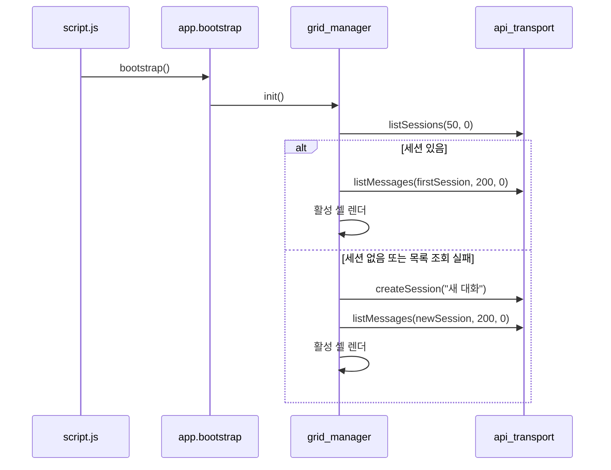

# Static UI 구현 레퍼런스

이 문서는 `src/chatbot/static`의 HTML, JavaScript 모듈, 백엔드 연동 흐름을 코드 기준으로 정리한다.

## 1. 구성 요소

관련 파일:

1. `src/chatbot/static/index.html`
2. `src/chatbot/static/js/core/app.js`
3. `src/chatbot/static/js/ui/grid_manager.js`
4. `src/chatbot/static/js/chat/api_transport.js`
5. `src/chatbot/static/js/chat/chat_cell.js`
6. `src/chatbot/static/js/chat/chat_presenter.js`
7. `src/chatbot/static/js/ui/theme.js`
8. `src/chatbot/static/js/ui/panel_toggle.js`
9. `src/chatbot/static/js/script.js`

## 2. 화면 구조

`index.html`은 다음 영역으로 구성된다.

1. 상단 헤더
2. 좌측 히스토리 패널
3. 우측 채팅 영역
4. 새 세션 생성 버튼
5. 테마 토글 버튼
6. 패널 접기/펴기 버튼

스크립트 로드 순서:

1. DOM/마크다운/문법 하이라이팅 유틸
2. UI 제어 모듈
3. API 전송 모듈
4. 채팅 프레젠터와 채팅 셀
5. 앱 퍼사드
6. 최종 부트스트랩 스크립트

## 3. 모듈 책임

| 파일 | 역할 |
| --- | --- |
| `js/core/app.js` | 히스토리 DOM 갱신과 전체 부트스트랩 |
| `js/ui/grid_manager.js` | 세션 생성/전환/삭제와 활성 채팅 셀 관리 |
| `js/chat/api_transport.js` | UI API, Chat API, SSE 요청 캡슐화 |
| `js/chat/chat_cell.js` | 사용자 입력, 스트림 수신, 상태 전이 처리 |
| `js/chat/chat_presenter.js` | 메시지/상태 렌더링 보조 |
| `js/ui/theme.js` | 라이트/다크 테마 토글 |
| `js/ui/panel_toggle.js` | 좌측 패널 접기/펴기 |
| `js/script.js` | `window.App.app.bootstrap()` 호출 |

## 4. 초기 로딩 흐름

## 5. 백엔드 계약

### 5-1. UI API

`api_transport.js`가 사용하는 경로:

| 함수 | 경로 | 비고 |
| --- | --- | --- |
| `createSession(title)` | `POST /ui-api/chat/sessions` | 제목이 있으면 body에 포함 |
| `listSessions(limit, offset)` | `GET /ui-api/chat/sessions` | 내부 fallback은 `20`, `0` |
| `listMessages(sessionId, limit, offset)` | `GET /ui-api/chat/sessions/{session_id}/messages` | 내부 fallback은 `200`, `0` |
| `deleteSession(sessionId)` | `DELETE /ui-api/chat/sessions/{session_id}` | 삭제 실패 시 alert 표시 |

주의:

1. 초기 부트스트랩은 `grid_manager.js`에서 `listSessions(50, 0)`을 호출한다.
2. 메시지 목록 조회는 `listMessages(sessionId, 200, 0)`을 사용한다.

### 5-2. Chat API

`streamMessage(sessionId, message, contextWindow, handlers)` 흐름:

1. `POST /chat`으로 작업을 제출한다.
2. 응답에서 `session_id`, `request_id`를 읽는다.
3. 약 1초 대기 후 `GET /chat/{session_id}/events?request_id=...`로 SSE를 연결한다.
4. `done` 또는 `error` 이벤트가 오면 스트림을 닫는다.

SSE에서 실제로 중요하게 보는 필드:

1. `request_id`
2. `type`
3. `node`
4. `content`
5. `status`
6. `error_message`
7. `metadata`

## 6. 채팅 셀 상태 전이

`chat_cell.js` 기준 주요 상태:

| 상태 값 | 의미 |
| --- | --- |
| `isSending` | 현재 요청 전송/수신 중 여부 |
| `activeRequestId` | 현재 스트림의 요청 ID |
| `finalized` | 현재 요청 종료 여부 |
| `tokenBuffer` | `response` 노드 토큰 누적 버퍼 |
| `receivedText` | 렌더링 중인 실시간 본문 |
| `scrollMode` | `FOLLOWING` 또는 `PAUSED_BY_USER` |

전송 흐름:

1. 사용자 메시지를 즉시 렌더링한다.
2. assistant placeholder를 만든다.
3. `start` 이벤트에서 스트림 진행 상태를 표시한다.
4. `token` 이벤트에서 `response` 노드 텍스트만 누적한다.
5. `done`이면 본문을 확정한다.
6. `error`이면 실패 상태를 표시한다.
7. 스트림 에러가 나더라도 `tokenBuffer`가 남아 있으면 성공 완료로 마감한다.

중지 버튼 동작:

1. 스트림 핸들을 닫는다.
2. 상태를 `STOP`으로 바꾼다.
3. 입력창을 다시 활성화한다.

## 7. 유지보수 포인트

1. `request_id` 검증은 오래된 이벤트가 현재 셀에 섞이는 것을 막는 핵심 규칙이다.
2. `response` 노드 토큰만 본문 버퍼에 누적한다는 규칙을 바꾸면 `blocked` 경로 처리도 다시 설계해야 한다.
3. 히스토리 preview는 `grid_manager.normalizePreview()`와 `chat_presenter.firstLine()` 모두와 연결된다.
4. localStorage 키는 `chatbot-theme`, `chatbot-panel-collapsed` 두 개다.
