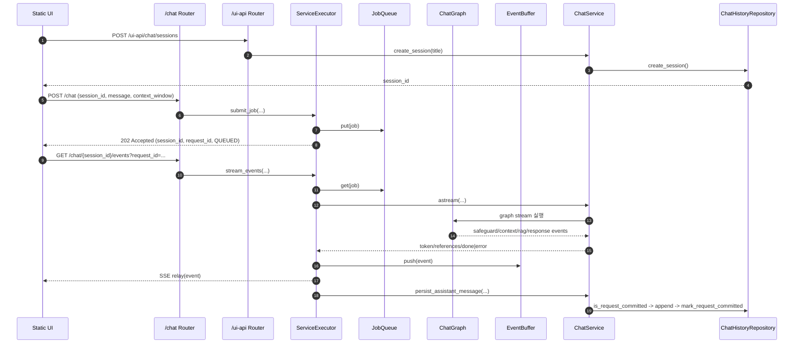
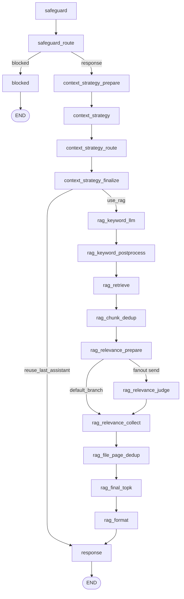

# RAG Chatbot Template

LLM 기반 RAG Chatbot을 빠르게 시작하기 위한 Python/FastAPI 템플릿입니다.
권장 Python 버전은 `3.13+`입니다.

## 1. 빠른 시작

### 1-1. 프로젝트명 초기화(선택)

```bash
bash init.sh my-project
```

- 단일 인자(`my-project`)를 받습니다.
- 내부에서 `PROJECT_SLUG=my-project`, `PACKAGE_NAME=my_project`로 변환합니다.

### 1-2. 가상환경/의존성 설치

```bash
uv venv .venv
uv sync
```

### 1-3. 환경 변수 파일 생성

```bash
cp .env.sample .env
```

필수 값 예시:

```env
GEMINI_MODEL=gemini-3.1-flash-lite-preview
GEMINI_EMBEDDING_MODEL=gemini-embedding-001
GEMINI_PROJECT=...
GEMINI_EMBEDDING_DIM=1024
```

## 2. 서버 실행

```bash
uv run uvicorn rag_chatbot.api.main:app --host 0.0.0.0 --port 8000 --reload
```

접속 주소:

- API 문서: `http://127.0.0.1:8000/docs`
- 헬스체크: `http://127.0.0.1:8000/health`
- 내장 Chat UI: `http://127.0.0.1:8000/ui`

## 3. API 요약

### 3-1. Chat API

| Method | Path | 설명 |
| --- | --- | --- |
| `POST` | `/chat` | 채팅 작업 제출 (`session_id`, `message`, `context_window`) |
| `GET` | `/chat/{session_id}` | 세션 스냅샷 조회 (메시지 + 최근 상태) |
| `GET` | `/chat/{session_id}/events?request_id=...` | 요청 단위 SSE 이벤트 구독 |

### 3-2. UI API

| Method | Path | 설명 |
| --- | --- | --- |
| `POST` | `/ui-api/chat/sessions` | UI 세션 생성 |
| `GET` | `/ui-api/chat/sessions` | UI 세션 목록 |
| `GET` | `/ui-api/chat/sessions/{session_id}/messages` | UI 메시지 목록 |
| `DELETE` | `/ui-api/chat/sessions/{session_id}` | 세션+메시지 삭제 |

## 4. 실행 흐름

### 4-1. End-to-End 시퀀스



### 4-2. 그래프 흐름도



### 4-3. 노드별 작업 표

| 노드 | 주요 작업 | 입력 | 출력 | 다음 노드 |
| --- | --- | --- | --- | --- |
| `safeguard` | 입력 안전성 판정(`PASS/PII/HARMFUL/PROMPT_INJECTION`) | `user_message` | `safeguard_result` | `safeguard_route` |
| `safeguard_route` | 결과값 정규화/별칭 교정 후 분기 결정 | `safeguard_result` | `safeguard_route`, `safeguard_result` | `context_strategy_prepare` (`safeguard_route=response`), `blocked` (`safeguard_route=blocked`) |
| `blocked` | 차단 사유별 고정 안내 문구 생성 | `safeguard_result` | `assistant_message` | `END` |
| `context_strategy_prepare` | 히스토리에서 직전 assistant 메시지 추출 | `history` | `last_assistant_message` | `context_strategy` |
| `context_strategy` | 재사용/검색 전략 원문 토큰 생성 | `user_message`, `last_assistant_message` | `context_strategy_raw` | `context_strategy_route` |
| `context_strategy_route` | 전략 토큰 정규화(`REUSE_LAST_ASSISTANT/USE_RAG`) | `context_strategy_raw` | `context_strategy` | `context_strategy_finalize` |
| `context_strategy_finalize` | 전략 확정 및 초기 컨텍스트 세팅 | `context_strategy`, `last_assistant_message` | `context_strategy`, `rag_context`, `rag_references` | `response` (`reuse_last_assistant`), `rag_keyword_llm` (`use_rag`) |
| `rag_keyword_llm` | 검색 키워드 원문 생성 | `user_message` | `rag_keyword_raw` | `rag_keyword_postprocess` |
| `rag_keyword_postprocess` | 사용자 질의 + 생성 키워드 목록 정규화 | `user_message`, `rag_keyword_raw` | `rag_queries` | `rag_retrieve` |
| `rag_retrieve` | 임베딩 + 벡터 검색으로 원본 청크 수집 | `rag_queries` | `rag_retrieved_chunks` | `rag_chunk_dedup` |
| `rag_chunk_dedup` | `chunk_id` 기준 중복 제거 | `rag_retrieved_chunks` | `rag_candidates` | `rag_relevance_prepare` |
| `rag_relevance_prepare` | 판정 배치/팬아웃 입력 생성 | `user_message`, `rag_candidates` | `rag_relevance_batch_id`, `rag_relevance_judge_inputs`, `rag_relevance_judge_results`, `rag_relevance_passed_docs` | `rag_relevance_judge` (fan-out), `rag_relevance_collect` (default branch) |
| `rag_relevance_judge` | 단건 문서 관련성 0/1 판정 | `rag_relevance_batch_id`, `rag_relevance_candidate_index`, `rag_relevance_candidate`, `user_query`, `body` | `rag_relevance_judge_results` | `rag_relevance_collect` |
| `rag_relevance_collect` | 판정 결과 집계/순서 복원 | `rag_relevance_batch_id`, `rag_relevance_judge_results`, `rag_relevance_passed_docs` | `rag_relevance_passed_docs`, `rag_relevance_judge_inputs`, `rag_relevance_judge_results` | `rag_file_page_dedup` |
| `rag_file_page_dedup` | 파일/페이지 기준 중복 제거 | `rag_relevance_passed_docs` | `rag_file_page_deduped_docs` | `rag_final_topk` |
| `rag_final_topk` | 점수 기반 최종 top-k 선택 | `rag_file_page_deduped_docs` | `rag_filtered_docs` | `rag_format` |
| `rag_format` | 최종 `rag_context`/`rag_references` 생성 | `rag_filtered_docs` | `rag_context`, `rag_references` | `response` |
| `response` | 최종 답변 생성 | `user_message`, `rag_context` | `assistant_message` | `END` |

### 4-4. 이벤트 계약 요약

1. 정상 이벤트 순서: `start -> token* -> references -> done`
2. 실패 이벤트 순서: `start -> token*? -> error`
3. 필수 식별자: `session_id`, `request_id`
4. 종료 조건: `done` 또는 `error`
5. 저장 멱등성: `request_id` 기준 assistant 메시지 저장은 단 한 번만 수행

## 5. 환경 변수 핵심

| 변수 | 기본값 | 설명 |
| --- | --- | --- |
| `GEMINI_MODEL` | `.env.sample` 참조 | 응답/분류 LLM 모델명 |
| `GEMINI_EMBEDDING_MODEL` | `gemini-embedding-001` | RAG 임베딩 모델명 |
| `GEMINI_PROJECT` | 빈값 | Gemini 프로젝트 ID |
| `GEMINI_EMBEDDING_DIM` | `1024` | 임베딩 벡터 차원 |
| `CHAT_DB_PATH` | `data/db/chat/chat_history.sqlite` | Chat 이력 SQLite 경로 |
| `CHAT_STREAM_TIMEOUT_SECONDS` | `180` | 스트림 타임아웃(초) |
| `CHAT_MEMORY_MAX_MESSAGES` | `200` | 세션 메모리 보관 메시지 수 |
| `CHAT_PERSIST_RETRY_LIMIT` | `2` | done 후 저장 재시도 횟수 |
| `CHAT_PERSIST_RETRY_DELAY_SECONDS` | `0.5` | 저장 재시도 간격(초) |
| `CHAT_JOB_QUEUE_MAX_SIZE` | `0` | 작업 큐 최대 크기 (`0`이면 무제한) |
| `CHAT_JOB_QUEUE_POLL_TIMEOUT` | `0.2` | 작업 큐 poll timeout(초) |
| `CHAT_EVENT_BUFFER_MAX_SIZE` | `0` | 이벤트 버퍼 최대 크기 (`0`이면 무제한) |
| `CHAT_EVENT_BUFFER_POLL_TIMEOUT` | `0.2` | 이벤트 버퍼 pop timeout(초) |
| `CHAT_EVENT_BUFFER_TTL_SECONDS` | `600` | 이벤트 버킷 TTL(초) |
| `CHAT_EVENT_BUFFER_GC_INTERVAL_SECONDS` | `30` | InMemory 버퍼 GC 주기(초) |
| `CHAT_REDIS_EVENT_BUFFER_KEY_PREFIX` | `chat:stream` | Redis 이벤트 버퍼 키 prefix |
| `LANCEDB_URI` | `data/db/vector` | LanceDB 저장 경로 |

참고:

- `.env.sample`의 `CHAT_TASK_*`, `CHAT_BUFFER_BACKEND` 키는 현재 Chat 런타임(`runtime.py`)에서 직접 사용하지 않습니다.
- ingestion/벡터 저장소 실행 방법은 `docs/setup/ingestion.md`를 참고하세요.

## 6. 채팅 이력 초기화

기본 저장소는 SQLite(`CHAT_DB_PATH`)입니다.

```bash
rm -f data/db/chat/chat_history.sqlite
```

또는 테이블 데이터만 삭제:

```bash
sqlite3 data/db/chat/chat_history.sqlite "DELETE FROM chat_messages; DELETE FROM chat_sessions;"
```

## 7. 프로젝트 구조

```text
src/rag_chatbot/
  api/                  # FastAPI 라우터, DTO, DI 조립
  core/
    chat/               # 도메인 모델, 그래프, 노드, 프롬프트
  shared/
    chat/               # ChatService/ServiceExecutor/Repository/Memory
    runtime/            # Queue/EventBuffer/Worker/ThreadPool
    logging/            # 공통 로깅
    config/             # 설정/환경 로더
    exceptions/         # 공통 예외
    const/              # 공통 상수
  integrations/         # DB/LLM/Embedding/FS 외부 연동 어댑터
  static/               # 정적 UI
ingestion/              # 문서 파싱/청킹/임베딩/적재 파이프라인
tests/                  # pytest 테스트
docs/                   # 개발 문서
```

## 8. 문서 인덱스

| 문서 | 링크 | 설명 |
| --- | --- | --- |
| 문서 허브 | [docs/README.md](docs/README.md) | 전체 맵, 변경 진입점 |
| Setup 개요 | [docs/setup/overview.md](docs/setup/overview.md) | 환경/인프라 문서 인덱스 |
| Setup ENV | [docs/setup/env.md](docs/setup/env.md) | `.env` 키 상세 설명 |
| Setup Ingestion | [docs/setup/ingestion.md](docs/setup/ingestion.md) | 통합 ingestion 실행/시퀀스 |
| Setup LanceDB | [docs/setup/lancedb.md](docs/setup/lancedb.md) | 벡터 엔진 구성 |
| Setup PostgreSQL | [docs/setup/postgresql_pgvector.md](docs/setup/postgresql_pgvector.md) | PostgreSQL + pgvector 구성 |
| Setup MongoDB | [docs/setup/mongodb.md](docs/setup/mongodb.md) | MongoDB 구성 |
| Setup FileSystem | [docs/setup/filesystem.md](docs/setup/filesystem.md) | 파일 시스템 로그 연동 |
| API 개요 | [docs/api/overview.md](docs/api/overview.md) | API 문서 구성 |
| API Chat | [docs/api/chat.md](docs/api/chat.md) | `/chat` 인터페이스, SSE |
| API UI | [docs/api/ui.md](docs/api/ui.md) | `/ui-api/chat` 인터페이스 |
| API Health | [docs/api/health.md](docs/api/health.md) | `/health` 엔드포인트 |
| Core Chat | [docs/core/chat.md](docs/core/chat.md) | 그래프/노드 동작 |
| Shared Chat | [docs/shared/chat/README.md](docs/shared/chat/README.md) | 실행기/저장/멱등 규칙 |
| Static UI | [docs/static/ui.md](docs/static/ui.md) | 정적 UI 구조/이벤트 처리 |
| Integrations 개요 | [docs/integrations/overview.md](docs/integrations/overview.md) | 외부 연동 문서 맵 |

## 9. 테스트

전체:

```bash
uv run pytest
```

E2E:

```bash
uv run pytest tests/e2e/test_chat_api_server_e2e.py -q
```
