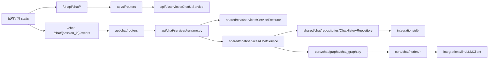

# 개발 문서 허브

이 문서는 `src/rag_chatbot` 기준으로 문서를 읽고, 기능을 빠르게 추가/수정하기 위한 진입점이다.
핵심 모듈 문서는 코드 구조와 1:1로 맞췄고, `docs/setup/*`는 실행 환경/인프라 설정 절차를 다룬다.

## 문서 트리

```text
docs/
  README.md
  api/
    overview.md
    chat.md
    ui.md
    health.md
  core/
    overview.md
    chat.md
  shared/
    overview.md
    chat/
      README.md
      interface/
        ports.md
      graph/
        base_chat_graph.md
      memory/
        session_store.md
      nodes/
        _state_adapter.md
        branch_node.md
        fanout_branch_node.md
        function_node.md
        llm_node.md
        message_node.md
      repositories/
        history_repository.md
        schemas/
          session_schema.md
          message_schema.md
          request_commit_schema.md
      services/
        chat_service.md
        service_executor.md
    config.md
    const.md
    exceptions.md
    logging.md
    runtime.md
  integrations/
    overview.md
    db/
      README.md
      client.md
      base/
        engine.md
        models.md
        pool.md
        query_builder.md
        session.md
      query_builder/
        read_builder.md
        write_builder.md
        delete_builder.md
      engines/
        sql_common.md
        sqlite/*.md
        postgres/*.md
        lancedb/*.md
        redis/*.md
        mongodb/*.md
        elasticsearch/*.md
    llm/
      README.md
      client.md
    embedding/
      README.md
      client.md
    fs/
      README.md
      base/engine.md
      engines/local.md
      file_repository.md
  setup/
    overview.md
    env.md
    ingestion.md
    lancedb.md
    postgresql_pgvector.md
    mongodb.md
    filesystem.md
  static/
    ui.md
```

## 코드-문서 매핑

| 코드 경로 | 문서 |
| --- | --- |
| `src/rag_chatbot/api` | `docs/api/overview.md` |
| `src/rag_chatbot/api/chat` | `docs/api/chat.md` |
| `src/rag_chatbot/api/ui` | `docs/api/ui.md` |
| `src/rag_chatbot/api/health` | `docs/api/health.md` |
| `src/rag_chatbot/core` | `docs/core/overview.md` |
| `src/rag_chatbot/core/chat` | `docs/core/chat.md` |
| `src/rag_chatbot/shared` | `docs/shared/overview.md` |
| `src/rag_chatbot/shared/chat` | `docs/shared/chat/README.md` |
| `src/rag_chatbot/shared/chat/interface` | `docs/shared/chat/interface/ports.md` |
| `src/rag_chatbot/shared/chat/graph` | `docs/shared/chat/graph/base_chat_graph.md` |
| `src/rag_chatbot/shared/chat/memory` | `docs/shared/chat/memory/session_store.md` |
| `src/rag_chatbot/shared/chat/nodes` | `docs/shared/chat/nodes/*.md` |
| `src/rag_chatbot/shared/chat/repositories` | `docs/shared/chat/repositories/history_repository.md` |
| `src/rag_chatbot/shared/chat/repositories/schemas` | `docs/shared/chat/repositories/schemas/*.md` |
| `src/rag_chatbot/shared/chat/services` | `docs/shared/chat/services/chat_service.md`, `docs/shared/chat/services/service_executor.md` |
| `src/rag_chatbot/shared/runtime` | `docs/shared/runtime.md` |
| `src/rag_chatbot/integrations` | `docs/integrations/overview.md` |
| `src/rag_chatbot/integrations/db` | `docs/integrations/db/README.md` |
| `src/rag_chatbot/integrations/db/base` | `docs/integrations/db/base/*.md` |
| `src/rag_chatbot/integrations/db/query_builder` | `docs/integrations/db/query_builder/*.md` |
| `src/rag_chatbot/integrations/db/engines` | `docs/integrations/db/engines/sql_common.md`, `docs/integrations/db/engines/*/*.md` |
| `src/rag_chatbot/integrations/llm` | `docs/integrations/llm/README.md`, `docs/integrations/llm/client.md` |
| `src/rag_chatbot/integrations/embedding` | `docs/integrations/embedding/README.md`, `docs/integrations/embedding/client.md` |
| `src/rag_chatbot/integrations/fs` | `docs/integrations/fs/README.md`, `docs/integrations/fs/file_repository.md` |
| `src/rag_chatbot/integrations/fs/base` | `docs/integrations/fs/base/engine.md` |
| `src/rag_chatbot/integrations/fs/engines` | `docs/integrations/fs/engines/local.md` |
| `ingestion` | `docs/setup/ingestion.md` |
| `src/rag_chatbot/static` | `docs/static/ui.md` |

## 설치/환경 문서

| 목적 | 문서 |
| --- | --- |
| setup 문서 인덱스 | `docs/setup/overview.md` |
| `.env` 키 상세/반영 여부 | `docs/setup/env.md` |
| 통합 ingestion 실행/시퀀스 | `docs/setup/ingestion.md` |
| 파일 기반 LanceDB 구성 | `docs/setup/lancedb.md` |
| PostgreSQL + pgvector 구성 | `docs/setup/postgresql_pgvector.md` |
| MongoDB 구성 | `docs/setup/mongodb.md` |
| 파일 시스템 연동 | `docs/setup/filesystem.md` |

## 실행 경로 요약



## 빠른 작업 흐름

### 1. 기능 추가

1. API 인터페이스를 먼저 확정한다. (`docs/api/chat.md`, `docs/api/ui.md`)
2. 도메인 상태/그래프 변경이 필요한지 확인한다. (`docs/core/chat.md`)
3. 실행기/저장소 영향도를 확인한다. (`docs/shared/chat/README.md`, `docs/shared/chat/services/*.md`, `docs/shared/chat/repositories/*.md`)
4. UI 연동 순서를 맞춘다. (`docs/static/ui.md`)

### 2. ingestion 변경

1. `docs/setup/ingestion.md`에서 단계별 영향 범위를 먼저 확인한다.
2. 백엔드별 차이점(`lancedb/postgres/elasticsearch`)을 점검한다.
3. `--reset` 필요 여부와 차원 정책(`GEMINI_EMBEDDING_DIM`)을 확정한다.

### 3. 장애 대응

1. 증상 위치를 먼저 분리한다: UI 렌더, API 응답, SSE 스트림, 저장소.
2. `request_id` 단위로 스트림 이벤트를 추적한다.
3. `ServiceExecutor` 상태(`IDLE/QUEUED/RUNNING/COMPLETED/FAILED`)를 확인한다.
4. 저장 실패는 `ChatHistoryRepository`와 DB 엔진 로그를 분리해 본다.
