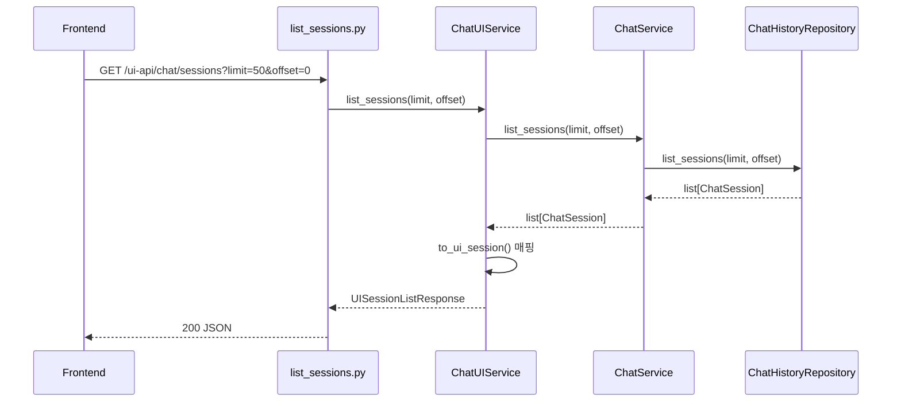

# API UI 가이드

이 문서는 `src/rag_chatbot/api/ui` 모듈을 기준으로 UI 전용 API의 인터페이스, 동작 순서, 수정 지점을 정리한다.

## 1. 용어 정리

| 용어 | 의미 | 관련 코드 |
| --- | --- | --- |
| UI API | 프런트엔드 화면 관리용 조회/생성/삭제 API 집합 | `/ui-api/chat/*` |
| UI 서비스 | Core ChatService 호출 결과를 UI DTO로 변환하는 계층 | `src/rag_chatbot/api/ui/services/chat_service.py` |
| UI DTO | UI에서 직접 소비하는 요청/응답 모델 | `src/rag_chatbot/api/ui/models/*.py` |
| 매퍼 | Core 엔티티를 UI DTO로 바꾸는 순수 함수 | `src/rag_chatbot/api/ui/utils/mappers.py` |
| 페이지네이션 | 목록 조회 범위를 `limit`, `offset`으로 제어하는 규칙 | `list_sessions.py`, `list_messages.py` |

## 2. 관련 스크립트

| 분류 | 파일 | 역할 |
| --- | --- | --- |
| 라우터 집계 | `src/rag_chatbot/api/ui/routers/router.py` | `/ui-api/chat` prefix 라우터 조립 |
| 세션 생성 | `src/rag_chatbot/api/ui/routers/create_session.py` | `POST /sessions` |
| 세션 목록 | `src/rag_chatbot/api/ui/routers/list_sessions.py` | `GET /sessions` |
| 메시지 목록 | `src/rag_chatbot/api/ui/routers/list_messages.py` | `GET /sessions/{session_id}/messages` |
| 세션 삭제 | `src/rag_chatbot/api/ui/routers/delete_session.py` | `DELETE /sessions/{session_id}` |
| 예외 변환 | `src/rag_chatbot/api/ui/routers/common.py` | `BaseAppException` HTTP 변환 |
| 서비스 | `src/rag_chatbot/api/ui/services/chat_service.py` | 조회/생성/삭제 유스케이스 조합 |
| 서비스 DI | `src/rag_chatbot/api/ui/services/__init__.py` | `get_chat_ui_service()` 제공 |
| 모델 | `src/rag_chatbot/api/ui/models/session.py`, `src/rag_chatbot/api/ui/models/message.py` | 요청/응답 DTO |
| 매퍼 | `src/rag_chatbot/api/ui/utils/mappers.py` | `to_ui_session`, `to_ui_message` |
| 경로 상수 | `src/rag_chatbot/api/const/chat.py` | UI API prefix/path |
| 페이지 상수 | `src/rag_chatbot/core/chat/const/settings.py` | `DEFAULT_PAGE_SIZE=50`, `MAX_PAGE_SIZE=200` |

## 3. 실행 흐름

## 3-1. 요청 처리 경로

```text
HTTP 요청
  -> UI Router
  -> ChatUIService
  -> ChatService
  -> ChatHistoryRepository
  -> UI DTO 변환
  -> HTTP 응답
```

## 3-2. 예외 처리 경로

```text
BaseAppException
  -> ui/routers/common.to_http_exception()
  -> HTTPException
  -> JSON detail 응답
```

## 3-3. 세션 목록 조회 시퀀스



## 4. 엔드포인트 인터페이스

## 4-1. 공통 규칙

1. Prefix는 `/ui-api/chat`다.
2. Query `limit`의 허용 범위는 `1..200`이다.
3. Query `offset`의 허용 범위는 `0 이상`이다.
4. Query 기본값은 `DEFAULT_PAGE_SIZE=50`이다.
5. 잘못된 Query는 FastAPI 검증으로 `422`를 반환한다.

주의:

1. API 기본 `limit`는 50이다.
2. 정적 UI는 `grid_manager.js`에서 목록/메시지 조회를 `limit=200`으로 호출할 수 있다.
3. 즉, API 기본값과 UI 호출값은 다를 수 있으므로 문서를 분리해 관리한다.

## 4-2. 세션 생성

- Method: `POST`
- Path: `/ui-api/chat/sessions`
- Status: `201 Created`
- Request Model: `UICreateSessionRequest`
- Response Model: `UICreateSessionResponse`

Request:

```json
{
  "title": "새 대화"
}
```

Response:

```json
{
  "session_id": "3f3b..."
}
```

동작 규칙:

1. 제목이 비어 있으면 저장소 기본 제목이 적용된다.
2. 생성 응답은 `session_id`만 반환한다.

## 4-3. 세션 목록 조회

- Method: `GET`
- Path: `/ui-api/chat/sessions`
- Query:
  - `limit` 기본 50, 최소 1, 최대 200
  - `offset` 기본 0, 최소 0
- Status: `200 OK`
- Response Model: `UISessionListResponse`

Response:

```json
{
  "sessions": [
    {
      "session_id": "3f3b...",
      "title": "새 대화",
      "updated_at": "2026-02-19T01:23:45.123456+00:00",
      "message_count": 3,
      "last_message_preview": "요약 미리보기"
    }
  ],
  "limit": 50,
  "offset": 0
}
```

동작 규칙:

1. 정렬은 저장소의 `updated_at DESC`를 따른다.
2. 응답의 `limit`, `offset`은 요청 값을 그대로 반환한다.

## 4-4. 메시지 목록 조회

- Method: `GET`
- Path: `/ui-api/chat/sessions/{session_id}/messages`
- Query:
  - `limit` 기본 50, 최소 1, 최대 200
  - `offset` 기본 0, 최소 0
- Status: `200 OK`
- Response Model: `UIMessageListResponse`

Response:

```json
{
  "session_id": "3f3b...",
  "messages": [
    {
      "message_id": "...",
      "role": "assistant",
      "content": "안녕하세요",
      "sequence": 2,
      "created_at": "2026-02-19T01:23:50.123456+00:00"
    }
  ],
  "limit": 50,
  "offset": 0
}
```

동작 규칙:

1. 세션이 없으면 `CHAT_SESSION_NOT_FOUND` 예외를 발생시킨다.
2. 메시지 순서는 `sequence ASC`다.

## 4-5. 세션 삭제

- Method: `DELETE`
- Path: `/ui-api/chat/sessions/{session_id}`
- Status: `200 OK`
- Response Model: `UIDeleteSessionResponse`

Response:

```json
{
  "session_id": "3f3b...",
  "deleted": true
}
```

동작 규칙:

1. 세션과 메시지를 함께 삭제한다.
2. 없는 세션이면 `404`를 반환한다.

## 5. 검증 규칙과 오류 응답

## 5-1. Query와 Body 검증

| 항목 | 규칙 | 실패 상태 |
| --- | --- | --- |
| `limit` | `1 <= limit <= 200` | `422` |
| `offset` | `offset >= 0` | `422` |
| body | Pydantic 모델 파싱 가능 | `422` |

## 5-2. 예외 코드 매핑

`src/rag_chatbot/api/ui/routers/common.py` 기준:

| 도메인 코드 | HTTP 상태 | 설명 |
| --- | --- | --- |
| `CHAT_SESSION_NOT_FOUND` | `404 Not Found` | 세션 조회/삭제 대상 없음 |
| 그 외 `BaseAppException` | `500 Internal Server Error` | 미정의 도메인 오류 |

## 5-3. 오류 응답 형태

```json
{
  "detail": {
    "message": "요청한 세션을 찾을 수 없습니다.",
    "detail": {
      "code": "CHAT_SESSION_NOT_FOUND",
      "cause": "session_id=..."
    },
    "original": null
  }
}
```

## 6. 계층별 책임

| 계층 | 해야 하는 일 | 하면 안 되는 일 |
| --- | --- | --- |
| Router | HTTP 파라미터 수신, 서비스 호출, 예외 변환 | 저장소 직접 호출 |
| UI Service | Core 서비스 호출, DTO 변환 | DB 엔진 import, HTTP 예외 생성 |
| Mapper | 엔티티 -> DTO 변환 | 외부 의존성 접근 |
| Core Service | 세션/메시지 도메인 처리 | UI 렌더링 책임 처리 |

## 7. 변경 작업 절차

## 7-1. 응답 필드 추가

예시: 세션 목록에 `owner_name` 추가

1. `src/rag_chatbot/api/ui/models/session.py`에 필드를 추가한다.
2. `src/rag_chatbot/api/ui/utils/mappers.py`의 매핑을 수정한다.
3. 필요하면 `src/rag_chatbot/shared/chat/repositories/history_repository.py` 조회 데이터를 확장한다.
4. `docs/static/ui.md` 렌더링 규칙을 갱신한다.

## 7-2. 정렬 정책 변경

예시: 생성 시각 기준 정렬

1. `ChatHistoryRepository.list_sessions()` 정렬 필드를 수정한다.
2. 응답 스키마는 유지하고 문서의 정렬 설명을 갱신한다.
3. 정적 UI 첫 세션 자동 선택 동작을 재검증한다.

## 7-3. 기본 페이지 크기 변경

예시: 기본값 50 -> 100

1. `src/rag_chatbot/core/chat/const/settings.py`의 `DEFAULT_PAGE_SIZE`를 수정한다.
2. `docs/api/ui.md`와 `docs/static/ui.md` 예시 값을 동시에 수정한다.
3. 대량 조회 시 렌더링 성능을 확인한다.

## 7-4. 삭제 정책 변경

예시: soft delete 적용

1. 저장소 `delete_session()` 정책을 변경한다.
2. `ChatService.delete_session()`의 예외 규칙을 유지 또는 조정한다.
3. API 응답의 `deleted` 의미를 문서에 명확히 정의한다.
4. 정적 UI의 삭제 후 fallback 동작을 점검한다.

## 8. 정적 UI 연동 순서

`src/rag_chatbot/static/js/ui/grid_manager.js` 기준:

1. 앱 부트스트랩에서 `GET /ui-api/chat/sessions` 호출
2. 활성 세션 결정 후 `GET /ui-api/chat/sessions/{session_id}/messages` 호출
3. 삭제 클릭 시 `DELETE /ui-api/chat/sessions/{session_id}` 호출
4. 답변 생성은 UI API가 아니라 Chat API `POST /chat` + SSE를 사용

## 9. 호출 예시

## 9-1. 세션 생성

```bash
curl -X POST "http://localhost:8000/ui-api/chat/sessions" \
  -H "Content-Type: application/json" \
  -d '{"title":"요구사항 분석"}'
```

## 9-2. 세션 목록 조회

```bash
curl "http://localhost:8000/ui-api/chat/sessions?limit=50&offset=0"
```

## 9-3. 메시지 목록 조회

```bash
curl "http://localhost:8000/ui-api/chat/sessions/<SESSION_ID>/messages?limit=50&offset=0"
```

## 9-4. 세션 삭제

```bash
curl -X DELETE "http://localhost:8000/ui-api/chat/sessions/<SESSION_ID>"
```

## 10. 트러블슈팅

| 증상 | 원인 후보 | 확인 위치 | 조치 |
| --- | --- | --- | --- |
| 목록이 비어 보임 | 조회 조건 또는 정렬 문제 | `history_repository.list_sessions()` | 정렬 필드와 페이징 확인 |
| 없는 세션이 500으로 응답 | 예외 매핑 누락 | `ui/routers/common.py` | `CHAT_SESSION_NOT_FOUND -> 404` 매핑 유지 |
| 삭제 후 화면 미반영 | 프런트 fallback 누락 | `static/js/ui/grid_manager.js` | 삭제 후 활성 세션 전환 규칙 보완 |
| 메시지 순서가 뒤섞임 | 저장소 정렬 변경 영향 | `history_repository.list_messages()` | `sequence ASC` 유지 |

## 11. 소스 매칭 점검 항목

1. 네 엔드포인트가 `/ui-api/chat` prefix 아래 등록되어 있는가
2. 생성 API 상태코드가 `201`인가
3. 목록 Query 범위가 `1..200`, `0+`인가
4. `CHAT_SESSION_NOT_FOUND`가 `404`로 매핑되는가
5. 문서의 기본 페이지 값이 코드 상수와 일치하는가
6. 문서의 파일 경로가 실제 저장소에 존재하는가

## 12. 관련 문서

- `docs/api/overview.md`
- `docs/api/chat.md`
- `docs/static/ui.md`
- `docs/shared/chat.md`
- `docs/shared/exceptions.md`
