# Core Chat 가이드

이 문서는 `src/rag_chatbot/core/chat`의 도메인 모델, 그래프 조립, 노드 실행 규칙을 코드 기준으로 설명한다.

## 1. 용어 정리

| 용어 | 의미 | 관련 코드 |
| --- | --- | --- |
| 세션 | 대화 컨텍스트 단위 | `ChatSession` |
| 메시지 | 세션 내부 단일 발화 | `ChatMessage` |
| 그래프 상태 | 노드 간 전달되는 키 집합 | `ChatGraphState` |
| safeguard | 입력 유해성 분류 단계 | `safeguard_node` |
| context_strategy | 이전 응답 재사용 vs RAG 수행 결정 단계 | `context_strategy_*` |
| RAG 파이프라인 | 키워드 생성, 검색, 중복제거, 관련성 필터, 포맷 단계 | `rag_*_node` |
| blocked 노드 | 차단 안내 문구 생성 단계 | `safeguard_message_node` |
| response 노드 | 최종 일반 답변 생성 단계 | `response_node` |
| 출력 키 | 최종 응답 문자열 저장 키 | `assistant_message` |

## 2. 디렉터리와 관련 스크립트

```text
src/rag_chatbot/core/chat/
  const/
  graphs/
  models/
  nodes/
  prompts/
  state/
  utils/
```

| 분류 | 파일 | 역할 |
| --- | --- | --- |
| 엔티티 | `src/rag_chatbot/core/chat/models/entities.py` | `ChatSession`, `ChatMessage`, `ChatRole` 정의 |
| 턴 결과 | `src/rag_chatbot/core/chat/models/turn_result.py` | 1턴 처리 결과 모델 |
| 상수 | `src/rag_chatbot/core/chat/const/settings.py` | DB 경로, 페이지, 문맥 길이 기본값 |
| 상태 | `src/rag_chatbot/core/chat/state/graph_state.py` | 그래프 상태 키 정의 |
| 그래프 | `src/rag_chatbot/core/chat/graphs/chat_graph.py` | 노드 등록, 엣지, stream 정책 |
| 노드 | `src/rag_chatbot/core/chat/nodes/*.py` | safeguard/context_strategy/RAG/response 조립 |
| 프롬프트 | `src/rag_chatbot/core/chat/prompts/*.py` | 시스템 프롬프트 |
| 매퍼 | `src/rag_chatbot/core/chat/utils/mapper.py` | 도메인 모델과 DB 문서 변환 |

## 3. ChatGraphState 핵심 키

`src/rag_chatbot/core/chat/state/graph_state.py` 기준 주요 키:

1. 입력: `session_id`, `user_message`, `history`
2. 분류/분기: `safeguard_result`, `safeguard_route`
3. 전략: `context_strategy`, `context_strategy_raw`, `last_assistant_message`
4. RAG 중간 결과: `rag_queries`, `rag_retrieved_chunks`, `rag_candidates`, `rag_filtered_docs`
5. RAG 최종 결과: `rag_context`, `rag_references`
6. 최종 출력: `assistant_message`

## 4. 그래프 구조

### 4-1. 전체 노드 전개

`src/rag_chatbot/core/chat/graphs/chat_graph.py` 기준:

```mermaid
flowchart LR
    S[safeguard] --> SR[safeguard_route]
    SR -->|blocked| B[blocked]
    SR -->|response| CSP[context_strategy_prepare]

    CSP --> CS[context_strategy]
    CS --> CSR[context_strategy_route]
    CSR --> CSF[context_strategy_finalize]

    CSF -->|reuse_last_assistant| RSP[response]
    CSF -->|use_rag| RKL[rag_keyword_llm]

    RKL --> RKP[rag_keyword_postprocess]
    RKP --> RR[rag_retrieve]
    RR --> RCD[rag_chunk_dedup]
    RCD --> RRP[rag_relevance_prepare]

    RRP --> RRJ[rag_relevance_judge]
    RRP --> RRC[rag_relevance_collect]
    RRJ --> RRC

    RRC --> RFP[rag_file_page_dedup]
    RFP --> RFT[rag_final_topk]
    RFT --> RF[rag_format]
    RF --> RSP

    RSP --> END
    B --> END
```



### 4-2. stream 노드 정책

`chat_graph.stream_node` 설정:

| 노드 | 허용 이벤트 |
| --- | --- |
| `safeguard` | `safeguard_result` |
| `safeguard_route` | `safeguard_route`, `safeguard_result` |
| `rag_format` | `rag_context`, `rag_references` |
| `response` | `token`, `assistant_message` |
| `blocked` | `assistant_message` |

의미:

1. 정의된 이벤트만 `BaseChatGraph`에서 외부로 전달된다.
2. `rag_references`는 상위 계층에서 SSE `references` 이벤트로 정규화된다.

## 5. 단계별 동작

### 5-1. safeguard

- 파일: `src/rag_chatbot/core/chat/nodes/safeguard_node.py`
- 입력: `user_message`
- 출력: `safeguard_result`
- 특징:
1. `history_key="__skip_history__"`로 히스토리 비활성화
2. `stream_tokens=False`로 단건 분류 결과 생성

### 5-2. context_strategy

- 파일: `src/rag_chatbot/core/chat/nodes/context_strategy_*.py`
- 역할:
1. 이전 assistant 메시지 추출
2. 전략 분류(`reuse_last_assistant` 또는 `use_rag`)
3. 전략 결과에 맞춰 RAG 진입/생략 결정

### 5-3. RAG 파이프라인

1. `rag_keyword_llm` / `rag_keyword_postprocess`
- 질의 키워드 목록 생성 및 정규화

2. `rag_retrieve`
- LanceDB `rag_chunks`에서 벡터 검색 수행
- 출력: `rag_retrieved_chunks`

3. `rag_chunk_dedup`
- 중복 청크 제거
- 출력: `rag_candidates`

4. `rag_relevance_prepare` / `rag_relevance_judge` / `rag_relevance_collect`
- 관련성 판정 입력 생성, 판정 실행, 통과 문서 수집

5. `rag_file_page_dedup` / `rag_final_topk`
- 파일/페이지 중복 제거 및 최종 top-k 선택

6. `rag_format`
- `rag_context`, `rag_references` 생성
- references 이벤트의 원본 데이터 제공 노드

### 5-4. response / blocked

- `response_node`: 일반 응답 생성 (`assistant_message`)
- `safeguard_message_node`: 차단 메시지 생성 (`assistant_message`)

## 6. 프롬프트 인터페이스

### 6-1. CHAT_PROMPT

- 파일: `src/rag_chatbot/core/chat/prompts/chat_prompt.py`
- 입력 변수: `user_message`, `rag_context`

### 6-2. SAFEGUARD_PROMPT

- 파일: `src/rag_chatbot/core/chat/prompts/safeguard_prompt.py`
- 입력 변수: `user_message`
- 출력 라벨: `PASS`, `PII`, `HARMFUL`, `PROMPT_INJECTION`

## 7. 상위 계층 연동 포인트

1. `ChatService`는 그래프를 실행하고 done 시 assistant 저장을 수행한다.
2. `ServiceExecutor`는 그래프 이벤트를 공개 SSE 이벤트(`start/token/references/done/error`)로 정규화한다.
3. `request_id` 기준으로 스트림/저장 멱등성이 유지된다.

## 8. 트러블슈팅

| 증상 | 원인 후보 | 확인 파일 | 조치 |
| --- | --- | --- | --- |
| RAG를 써야 하는데 바로 response로 감 | context_strategy 분기 결과 | `context_strategy_*`, `chat_graph.py` | 전략 분기 조건 점검 |
| references 이벤트가 비어 있음 | `rag_format` 출력 누락 | `rag_format_node.py`, `service_executor.py` | `rag_references` 생성/전달 경로 점검 |
| 검색 결과가 없음 | 벡터 저장소 미적재 | `rag_retrieve_node.py`, `docs/setup/ingestion.md` | ingestion 재실행 |
| done 이벤트인데 본문이 비어 있음 | `assistant_message` 누락 | `response_node.py`, `chat_service.py` | 출력 키 매핑 점검 |

## 9. 관련 문서

- `docs/core/overview.md`
- `docs/api/chat.md`
- `docs/shared/chat/README.md`
- `docs/static/ui.md`
