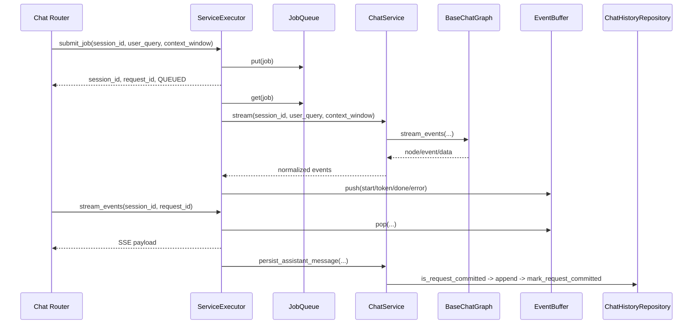

# Shared Chat 가이드

이 문서는 `src/rag_chatbot/shared/chat` 모듈의 실행 흐름, 저장 규칙, 변경 지점을 코드 기준으로 정리한다.

## 1. 용어 정리

| 용어 | 의미 | 관련 스크립트 |
| --- | --- | --- |
| ChatService | 세션/메시지 처리와 그래프 실행을 담당하는 서비스 | `services/chat_service.py` |
| ServiceExecutor | 큐 소비, 이벤트 버퍼 중계, 상태 관리, 후처리 저장을 담당 | `services/service_executor.py` |
| ChatHistoryRepository | 세션/메시지/요청 커밋을 저장소에 영속화 | `repositories/history_repository.py` |
| ChatSessionMemoryStore | 세션별 최근 메시지 캐시 | `memory/session_store.py` |
| BaseChatGraph | 그래프 실행/스트림 이벤트 표준화 | `graph/base_chat_graph.py` |
| GraphPort | 그래프 실행 인터페이스 | `interface/ports.py` |
| ServiceExecutorPort | 실행 오케스트레이터 인터페이스 | `interface/ports.py` |
| request_id 커밋 | done 후 assistant 메시지 중복 저장을 방지하는 멱등성 기록 | `repositories/history_repository.py` |

## 2. 디렉터리와 관련 스크립트

```text
src/rag_chatbot/shared/chat/
  interface/
  graph/
  memory/
  nodes/
  repositories/
  services/
```

| 분류 | 파일 | 역할 |
| --- | --- | --- |
| 포트 | `src/rag_chatbot/shared/chat/interface/ports.py` | Graph/Service/Executor 인터페이스 정의 |
| 그래프 실행 | `src/rag_chatbot/shared/chat/graph/base_chat_graph.py` | 그래프 컴파일/실행/이벤트 필터링 |
| 메모리 캐시 | `src/rag_chatbot/shared/chat/memory/session_store.py` | 세션 메시지 캐시 rpush/lrange |
| 공통 노드 | `src/rag_chatbot/shared/chat/nodes/llm_node.py` | LLM 호출 노드 구현 |
| 공통 노드 | `src/rag_chatbot/shared/chat/nodes/branch_node.py` | 분기 노드 구현 |
| 공통 노드 | `src/rag_chatbot/shared/chat/nodes/message_node.py` | 메시지 선택 노드 구현 |
| 저장소 | `src/rag_chatbot/shared/chat/repositories/history_repository.py` | 세션/메시지/커밋 저장 |
| 스키마 | `src/rag_chatbot/shared/chat/repositories/schemas/*.py` | DB 컬렉션 스키마 생성 |
| 서비스 | `src/rag_chatbot/shared/chat/services/chat_service.py` | 도메인 유스케이스 실행 |
| 실행기 | `src/rag_chatbot/shared/chat/services/service_executor.py` | 큐 워커 + SSE 이벤트 중계 |

연결 스크립트:

1. `src/rag_chatbot/core/chat/graphs/chat_graph.py`
2. `src/rag_chatbot/api/chat/services/runtime.py`
3. `src/rag_chatbot/api/chat/routers/*.py`
4. `src/rag_chatbot/api/ui/services/chat_service.py`

## 3. 실행 흐름

## 3-1. 작업 제출부터 SSE 소비까지



## 3-2. 세션 상태 전이

`ServiceExecutor` 내부 상태:

```text
IDLE -> QUEUED -> RUNNING -> COMPLETED
IDLE -> QUEUED -> RUNNING -> FAILED
```

규칙:

1. RUNNING 상태를 다시 QUEUED로 역전하지 않는다.
2. timeout/예외는 FAILED로 기록한다.

## 3-3. 이벤트 타입

외부로 노출되는 표준 이벤트:

1. `start`
2. `token`
3. `references`
4. `done`
5. `error`

`done` 또는 `error` 이벤트를 전송하면 해당 request 스트림을 종료한다.

## 4. 핵심 인터페이스

## 4-1. GraphPort

주요 메서드:

1. `invoke`, `ainvoke`
2. `stream_events`, `astream_events`
3. `set_stream_node`

설명:

1. 그래프 구현체 교체 시 상위 서비스가 의존하는 인터페이스다.
2. stream 이벤트 필터링 정책을 인터페이스 수준에서 수용한다.

## 4-2. ChatServicePort

주요 메서드:

1. `create_session`, `list_sessions`, `get_session`, `delete_session`
2. `stream`, `astream`
3. `persist_assistant_message`

설명:

1. 저장소와 그래프 실행 로직을 상위 계층으로부터 숨긴다.
2. UI API와 Chat API가 동일 도메인 경계를 공유하게 한다.

## 4-3. ServiceExecutorPort

주요 메서드:

1. `submit_job`
2. `stream_events`
3. `get_session_status`

설명:

1. HTTP 라우터는 실행기 구현 내부를 모르고 포트 메서드만 사용한다.
2. 큐/버퍼 백엔드 교체 시 라우터 코드는 유지된다.

## 5. 저장과 멱등성 규칙

## 5-1. 메시지 저장 경로

1. 사용자 메시지: `ChatService._append_user_message_existing_session`
2. assistant 메시지: `ChatService.append_assistant_message`
3. 미리보기 갱신: `ChatHistoryRepository.append_message`

## 5-2. request_id 기반 멱등 저장

`persist_assistant_message` 규칙:

1. `is_request_committed(request_id)`로 기저장 여부 확인
2. 미저장일 때만 assistant 메시지 저장
3. 저장 성공 후 `mark_request_committed` 기록
4. 중복 done 또는 재시도에도 중복 저장 금지

## 5-3. 세션 삭제 정합성

1. 저장소에서 세션+메시지를 삭제한다.
2. 메모리 캐시도 함께 `clear_session`한다.
3. 없는 세션 삭제는 `CHAT_SESSION_NOT_FOUND` 예외로 처리한다.

## 6. 문맥 처리 규칙

`ChatService._build_context_history` 기준:

1. `context_window`는 최소 1로 보정한다.
2. 메모리 캐시에서 최근 메시지를 가져온다.
3. 현재 요청 메시지는 문맥에서 제외한다.
4. 최대 길이를 넘으면 뒤에서 `window` 개수만 유지한다.

메모리 초기화:

1. 세션 캐시가 없으면 저장소 최근 메시지로 초기화한다.
2. 세션별 최대 메시지 수는 `CHAT_MEMORY_MAX_MESSAGES`로 제한한다.

## 7. 동시성과 후처리

## 7-1. 세션 락 규칙

1. `ServiceExecutor`는 세션별 락을 보유한다.
2. 같은 `session_id` 요청은 직렬 처리한다.
3. 다른 세션은 병렬 처리 가능하다.

## 7-2. 후처리 저장 재시도

환경 변수:

1. `CHAT_PERSIST_RETRY_LIMIT` 기본 `2`
2. `CHAT_PERSIST_RETRY_DELAY_SECONDS` 기본 `0.5`

동작:

1. 저장 실패 시 제한 횟수 내에서 재시도한다.
2. 제한 초과 시 오류 로그를 기록하고 중단한다.

## 8. 조립과 환경 변수

조립 파일: `src/rag_chatbot/api/chat/services/runtime.py`

| 변수 | 기본값 | 의미 |
| --- | --- | --- |
| `CHAT_STREAM_TIMEOUT_SECONDS` | `180.0` | 실행/대기 타임아웃 |
| `CHAT_PERSIST_RETRY_LIMIT` | `2` | 후처리 저장 재시도 횟수 |
| `CHAT_PERSIST_RETRY_DELAY_SECONDS` | `0.5` | 저장 재시도 간격 |
| `CHAT_JOB_QUEUE_MAX_SIZE` | `0` | 작업 큐 최대 크기 |
| `CHAT_JOB_QUEUE_POLL_TIMEOUT` | `0.2` | 작업 큐 poll timeout |
| `CHAT_EVENT_BUFFER_MAX_SIZE` | `0` | 이벤트 버퍼 최대 크기 |
| `CHAT_EVENT_BUFFER_POLL_TIMEOUT` | `0.2` | 이벤트 버퍼 poll timeout |
| `CHAT_EVENT_BUFFER_TTL_SECONDS` | `600` | 이벤트 버킷 TTL |
| `CHAT_EVENT_BUFFER_GC_INTERVAL_SECONDS` | `30.0` | InMemory 버퍼 GC 주기 |
| `CHAT_REDIS_EVENT_BUFFER_KEY_PREFIX` | `chat:stream` | Redis 이벤트 버퍼 키 prefix |
| `CHAT_MEMORY_MAX_MESSAGES` | `200` | 세션 메모리 최대 보관 수 |

## 9. 변경 작업 절차

## 9-1. 큐 백엔드 전환

1. `runtime.py`에서 `InMemoryQueue`를 `RedisQueue`로 교체한다.
2. Redis 연결 URL/큐 이름/타임아웃 환경 변수를 설정한다.
3. 큐 포화(`max_size`) 정책을 운영값으로 확정한다.

## 9-2. 이벤트 버퍼 전환

1. `runtime.py`에서 `InMemoryEventBuffer`를 `RedisEventBuffer`로 교체한다.
2. `EventBufferConfig.redis_key_prefix`, TTL을 설정한다.
3. 스트림 종료 후 `cleanup()` 호출이 유지되는지 확인한다.

## 9-3. 멱등성 정책 수정

1. `history_repository.py`의 request 커밋 조회/기록 로직을 수정한다.
2. `ChatService.persist_assistant_message` 규칙을 함께 수정한다.
3. 중복 저장 회귀 여부를 done 재전송 시나리오로 검증한다.

## 10. 트러블슈팅

| 증상 | 원인 후보 | 확인 스크립트 | 조치 |
| --- | --- | --- | --- |
| SSE가 중간에 끊김 | 버퍼 timeout 또는 timeout_seconds 초과 | `service_executor.py`, `runtime.py` | timeout 값과 poll timeout 동기화 |
| assistant가 두 번 저장됨 | request 커밋 체크 누락 | `chat_service.py`, `history_repository.py` | `is_request_committed` 경로 점검 |
| 세션 전환 후 이전 문맥이 섞임 | 메모리 캐시 초기화 누락 | `session_store.py`, `chat_service.py` | `ensure_session`/`clear_session` 경로 점검 |
| 큐 제출 실패가 잦음 | 큐 포화 또는 백엔드 연결 불안정 | `service_executor.py`, `queue/*.py` | 큐 크기/timeout/백엔드 상태 점검 |
| blocked 응답이 누락됨 | 이벤트 정규화 규칙 미스매치 | `service_executor.py` | `assistant_message` to `token` 변환 규칙 확인 |

## 11. 소스 매칭 점검 항목

1. 문서의 상태 전이가 `ServiceExecutor` 상수와 일치하는가
2. 이벤트 타입 집합이 `start/token/done/error`와 일치하는가
3. 환경 변수 기본값이 `runtime.py` 코드와 일치하는가
4. request_id 멱등 저장 흐름이 `chat_service.py`/`history_repository.py`와 일치하는가
5. 문서의 경로가 실제 `src/rag_chatbot/shared/chat` 파일과 일치하는가

## 12. 관련 문서

- `docs/shared/overview.md`
- `docs/shared/runtime.md`
- `docs/api/chat.md`
- `docs/core/chat.md`
