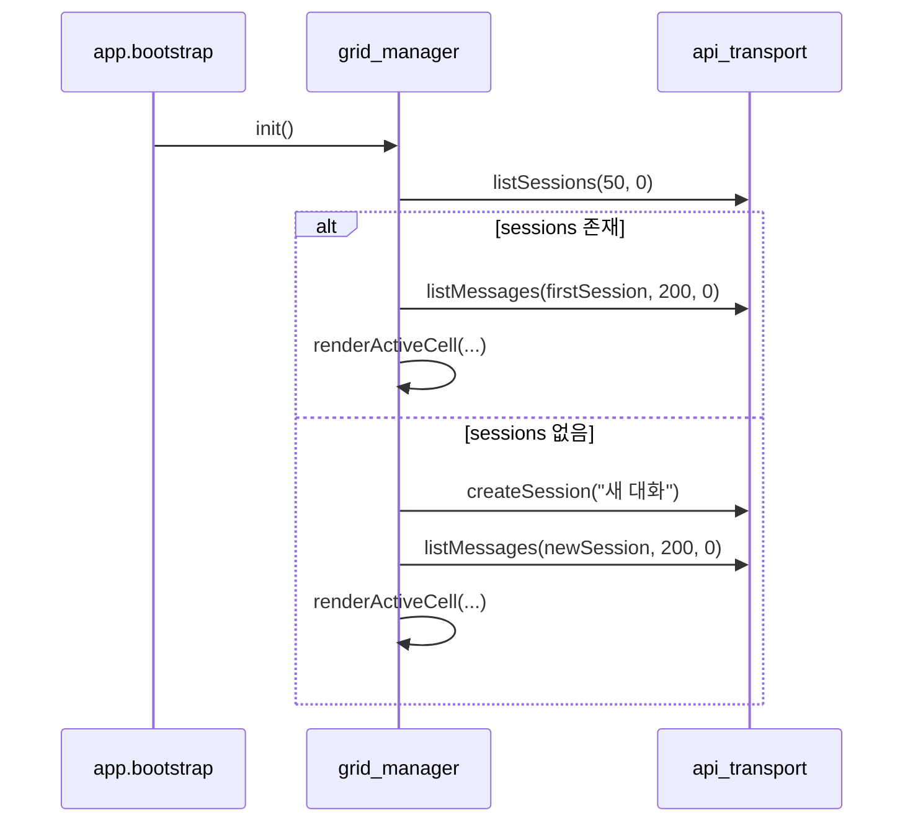
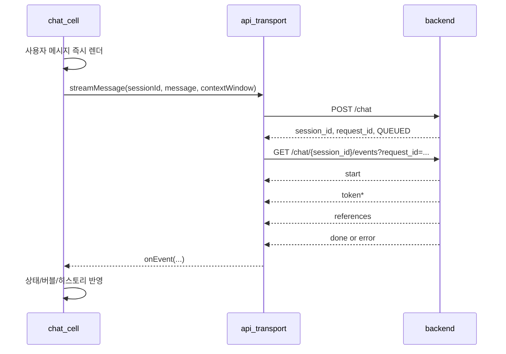

# Static UI 구현 가이드

이 문서는 `src/rag_chatbot/static`의 동작을 기준으로, 프런트엔드에서 분석/구현/확장할 때 필요한 내용을 한 번에 제공한다.

## 1. 범위

이 문서가 다루는 범위:

1. 실제 코드 기준 모듈 책임
2. 백엔드 API/SSE 인터페이스
3. 부트스트랩/전송/삭제 시퀀스
4. 상태 모델과 전이 규칙
5. 실패 처리와 복구 규칙
6. React/Vue 전환 시 구현 구조

이 문서가 다루지 않는 범위:

1. 디자인 시스템/스타일 가이드
2. 서버 내부 아키텍처 상세

## 2. 코드 읽기 순서

다음 순서로 읽으면 전체 흐름을 빠르게 파악할 수 있다.

1. `src/rag_chatbot/static/index.html`
2. `src/rag_chatbot/static/js/core/app.js`
3. `src/rag_chatbot/static/js/ui/grid_manager.js`
4. `src/rag_chatbot/static/js/chat/api_transport.js`
5. `src/rag_chatbot/static/js/chat/chat_cell.js`
6. `src/rag_chatbot/static/js/chat/chat_presenter.js`

## 3. 모듈 책임과 공개 함수

| 모듈 | 파일 | 공개 함수/객체 | 책임 |
| --- | --- | --- | --- |
| App 퍼사드 | `js/core/app.js` | `window.App.app.bootstrap` 외 | 히스토리 UI 관리, 모듈 초기화 |
| Grid 컨트롤러 | `js/ui/grid_manager.js` | `window.App.grid.*` | 세션 로딩/전환/삭제, 단일 셀 유지 |
| API 어댑터 | `js/chat/api_transport.js` | `createSession`, `listSessions`, `listMessages`, `deleteSession`, `streamMessage` | HTTP/SSE 호출 캡슐화 |
| Cell 컴포넌트 | `js/chat/chat_cell.js` | `window.App.chatCell.create` | 입력/전송/스트림 렌더/중지/정리 |
| Presenter | `js/chat/chat_presenter.js` | `render*`, `setStatus`, `setRuntimeInfo` | 렌더/표현 로직 분리 |

`chatCell.create(...)` 반환값:

```js
{
  element: HTMLElement,
  destroy: () => void
}
```

`grid_manager`는 활성 셀 전환 시 반드시 기존 셀의 `destroy()`를 호출한다.

## 4. 백엔드 인터페이스

## 4-1. UI API

### 세션 생성

- `POST /ui-api/chat/sessions`
- Request:

```json
{
  "title": "새 대화"
}
```

- Response:

```json
{
  "session_id": "..."
}
```

### 세션 목록

- `GET /ui-api/chat/sessions?limit={n}&offset={n}`
- `api_transport` 기본값: `limit=20`, `offset=0`

- Response:

```json
{
  "sessions": [
    {
      "session_id": "...",
      "title": "...",
      "updated_at": "...",
      "message_count": 3,
      "last_message_preview": "..."
    }
  ],
  "limit": 20,
  "offset": 0
}
```

### 메시지 목록

- `GET /ui-api/chat/sessions/{session_id}/messages?limit={n}&offset={n}`
- `api_transport` 기본값: `limit=200`, `offset=0`

- Response:

```json
{
  "session_id": "...",
  "messages": [
    {
      "message_id": "...",
      "role": "user|assistant",
      "content": "...",
      "sequence": 1,
      "created_at": "..."
    }
  ],
  "limit": 200,
  "offset": 0
}
```

### 세션 삭제

- `DELETE /ui-api/chat/sessions/{session_id}`
- Response:

```json
{
  "session_id": "...",
  "deleted": true
}
```

## 4-2. Chat API

### 요청 제출

- `POST /chat`

```json
{
  "session_id": "...",
  "message": "사용자 입력",
  "context_window": 20
}
```

- Response:

```json
{
  "session_id": "...",
  "request_id": "...",
  "status": "QUEUED"
}
```

### 스트림 구독

- `GET /chat/{session_id}/events?request_id={request_id}`
- `Content-Type: text/event-stream`

SSE payload:

```json
{
  "session_id": "...",
  "request_id": "...",
  "type": "start|token|references|done|error",
  "node": "executor|safeguard|rag|response|blocked",
  "content": "...",
  "status": "COMPLETED|FAILED|null",
  "error_message": "...",
  "metadata": {}
}
```

### 세션 스냅샷(선택)

- `GET /chat/{session_id}`
- Done 후 서버 기준 최종 동기화가 필요할 때 사용

## 4-3. API 에러 파싱 규칙

`api_transport.parseErrorMessage()`는 아래 순서로 메시지를 추출한다.

1. payload가 문자열이면 그대로 사용
2. `payload.message`
3. `payload.detail`
4. `payload.detail.message`
5. 없으면 `status` 기반 기본 메시지

## 5. 시퀀스

## 5-1. 앱 부트스트랩



## 5-2. 메시지 전송/스트림



## 5-3. 세션 삭제

1. 히스토리 삭제 버튼 클릭
2. 확인 대화상자 승인
3. `DELETE /ui-api/chat/sessions/{session_id}` 호출
4. 성공 시 히스토리 목록에서 제거
5. 활성 세션 삭제였다면 다음 세션 활성화
6. 남은 세션이 없으면 새 세션 자동 생성

## 6. 상태 모델

## 6-1. Grid 전역 상태

`grid_manager.js` 기준:

```js
{
  activeSessionId: string | null,
  activeCell: { id, title, element, destroy } | null,
  sessionMeta: Record<string, { title, preview }>,
  isLoading: boolean
}
```

`isLoading`이 true면 생성/전환/삭제를 잠가 중복 요청을 방지한다.

## 6-2. Cell 상태

`chat_cell.js` 기준:

```js
{
  sessionId: string,
  activeRequestId: string,
  isSending: boolean,
  finalized: boolean,
  streamHandle: { close },
  tokenBuffer: string,
  receivedText: string,
  references: object[],
  scrollMode: 'FOLLOWING' | 'PAUSED_BY_USER'
}
```

## 7. references UI 동작

1. `type=references` 이벤트를 수신하면 assistant 메시지 하단에 카드 캐러셀을 렌더링한다.
2. 캐러셀은 데스크톱 기준으로 한 화면에 카드가 최대 3개 보이며, 태블릿/모바일에서는 각각 2개/1개로 줄어든다.
3. 초기 렌더 시 우측 끝(`scrollRight`)을 기준으로 정렬해 최신 reference 카드부터 보이게 한다.
4. 캐러셀은 마우스 드래그(좌/우)와 이전/다음 버튼으로 페이지 단위 이동을 지원한다.
5. 첫/마지막 경계에 도달하면 이동이 멈추며, 해당 방향 버튼은 비활성화된다(루프 없음).
6. 카드에는 `file_name`(필수), `file_path`/`score`/본문 미리보기를 표시하고, 카드 클릭 시 모달을 열어 `body` 전문과 `metadata`를 보여준다.
7. 모달 본문은 Markdown 우선 렌더링 후 allowlist sanitize를 적용한다.

## 6-3. 상태 전이

전송 상태 전이:

```text
IDLE -> SENDING -> STREAMING -> DONE
IDLE -> SENDING -> STREAMING -> FAILED
IDLE -> SENDING -> STOPPED
```

스크롤 상태 전이:

```text
FOLLOWING <-> PAUSED_BY_USER
```

## 7. 스트림 처리 규칙

`chat_cell.connectStream()` 기준.

1. `onQueued`에서 `activeRequestId`를 갱신한다.
2. `onEvent`에서 `payload.request_id`가 현재 요청과 다르면 무시한다.
3. `token`은 `node === "response"`일 때만 본문 버퍼에 누적한다.
4. `done`은 `payload.content` 우선, 비어 있으면 `tokenBuffer`를 사용한다.
5. `error`는 `error_message`를 우선 표시한다.
6. 스트림 오류라도 `tokenBuffer`가 있으면 성공 완료로 마감한다.

## 8. 실패 처리 매트릭스

| 구간 | 실패 조건 | 처리 |
| --- | --- | --- |
| 세션 목록 로딩 | `listSessions` 실패 | 새 세션 생성 경로로 fallback |
| 메시지 목록 로딩 | `listMessages` 실패 | 빈 배열 렌더 |
| 요청 제출 | `POST /chat` 실패 | assistant placeholder를 실패 상태로 표시 |
| SSE 파싱 | payload 형식 오류 | `onError` 경로로 종료 |
| SSE 연결 | 네트워크 오류 | tokenBuffer 존재 시 성공 마감, 없으면 실패 |
| 세션 삭제 | `DELETE` 실패 | alert + 콘솔 에러 |

## 9. React/Vue 전환 구현 청사진

## 9-1. 컴포넌트/모듈 매핑

| 현재 모듈 | React 예시 | Vue 예시 |
| --- | --- | --- |
| `app.js` | `AppShell` + context | `AppShell` + provide/inject |
| `grid_manager.js` | `useSessionController` + `SessionList` | `useSessionController` + `SessionList.vue` |
| `chat_cell.js` | `ChatPanel` + `useChatStream` | `ChatPanel.vue` + `useChatStream` |
| `api_transport.js` | `apiClient.ts` | `apiClient.ts` |
| `chat_presenter.js` | presentational components | presentational components |

## 9-2. 권장 상태 스키마

```ts
type StreamStatus = 'IDLE' | 'QUEUED' | 'STREAMING' | 'DONE' | 'FAILED' | 'STOPPED';

interface SessionMeta {
  sessionId: string;
  title: string;
  preview: string;
}

interface StreamState {
  sessionId: string | null;
  requestId: string | null;
  status: StreamStatus;
  tokenBuffer: string;
  errorMessage: string | null;
}
```

## 9-3. Hook/Composable 책임 분리

1. `useSessionController`
- 세션 목록 조회/생성/삭제
- 활성 세션 전환
- 전환 시 메시지 preload

2. `useChatStream`
- 요청 제출
- SSE 연결/파싱
- 종료/중지/정리

3. `useScrollFollow`
- 자동 스크롤 상태 관리
- 사용자 스크롤에 따른 FOLLOWING/PAUSED 전환

## 9-4. 필수 정리 동작

1. 세션 전환 시 이전 stream abort
2. 컴포넌트 unmount 시 abort + listener 해제
3. 삭제된 세션의 pending request 무효화
4. stale event(`request_id` 불일치) 무시

## 10. 구현 체크리스트

1. UI API와 Chat API를 분리된 모듈에서 호출하는가
2. `request_id` 검증 로직이 있는가
3. 중복 전송 방지 잠금(`isLoading`/`isSending`)이 있는가
4. 스트림 종료 시 리소스 정리(Abort, timer clear)가 되는가
5. 스크롤 소유권이 `.chat-cell__messages`로 고정되어 있는가
6. 삭제 후 active session fallback 규칙이 구현되어 있는가
7. 에러 메시지가 사용자/개발자 관점으로 분리되어 있는가

## 11. 검증 시나리오

1. 첫 진입(세션 없음)
- 새 세션 자동 생성
- 활성 셀 렌더

2. 첫 진입(세션 있음)
- 첫 세션 자동 활성화
- 메시지 목록 표시

3. 메시지 전송 성공
- `start -> token* -> done`
- 히스토리 preview 갱신

4. 메시지 전송 실패
- placeholder 실패 표시
- 재전송 가능 상태 유지

5. 전송 중 세션 전환
- 이전 스트림 종료
- 새 세션 상태 오염 없음

6. 활성 세션 삭제
- 다음 세션 자동 활성화
- 없으면 새 세션 생성

7. 스크롤 중 스트리밍
- 하단 근처면 자동 추적
- 위로 올리면 자동 추적 중지

## 12. 관련 문서

- `docs/api/chat.md`
- `docs/api/ui.md`
- `docs/shared/chat.md`
- `docs/shared/runtime.md`

## 13. 빠른 구현 절차(신규 프런트엔드 기준)

이 절차를 그대로 따르면, 신규 화면에서도 현재 static 동작과 동일한 동작을 구현할 수 있다.

### 13-1. 1단계: API 클라이언트 분리

구현 파일 기준:

1. `uiApiClient.ts` 또는 `uiApiClient.js`
2. `chatApiClient.ts` 또는 `chatApiClient.js`

필수 구현 함수:

1. UI API: `createSession`, `listSessions`, `listMessages`, `deleteSession`
2. Chat API: `submitMessage`, `openEventStream`

완료 기준:

1. 모든 함수가 `Promise`를 반환한다.
2. 에러 메시지는 `message -> detail -> detail.message -> status fallback` 순서로 추출한다.
3. URL path segment는 반드시 `encodeURIComponent`를 적용한다.

### 13-2. 2단계: 세션 스토어 구현

필수 상태:

```ts
interface SessionStoreState {
  activeSessionId: string | null;
  sessionMeta: Record<string, { title: string; preview: string }>;
  isLoading: boolean;
}
```

필수 액션:

1. `bootstrapSession()`
2. `createNewSession()`
3. `activateSession(sessionId)`
4. `deleteSession(sessionId)`

완료 기준:

1. 동시 클릭 시 중복 요청이 발생하지 않는다(`isLoading` 잠금).
2. 활성 세션 삭제 시 다음 세션으로 자연스럽게 전환된다.
3. 세션이 0개면 자동으로 새 세션을 생성한다.

### 13-3. 3단계: 채팅 패널 구현

필수 상태:

```ts
interface ChatPanelState {
  sessionId: string;
  activeRequestId: string;
  isSending: boolean;
  finalized: boolean;
  tokenBuffer: string;
  receivedText: string;
  scrollMode: 'FOLLOWING' | 'PAUSED_BY_USER';
}
```

필수 동작:

1. 사용자 입력 즉시 user 버블 렌더
2. assistant placeholder 생성
3. 스트림 token 누적 렌더
4. `done/error/stop`에서 종료 처리
5. 컴포넌트 unmount 시 stream/timer/listener 정리

완료 기준:

1. `request_id`가 현재 요청과 다르면 이벤트를 무시한다.
2. `node === "response"`인 token만 본문에 누적한다.
3. 스트림 실패 시 `tokenBuffer`가 존재하면 성공 마감한다.

### 13-4. 4단계: 히스토리/프리뷰 동기화

필수 규칙:

1. user 입력 직후 preview를 즉시 갱신한다.
2. assistant 완료 후 최종 첫 줄로 preview를 다시 갱신한다.
3. 최대 길이 정책(현재 60자)을 일관되게 적용한다.

완료 기준:

1. 전송 성공/실패/중지 모든 경로에서 preview가 깨지지 않는다.
2. 세션 전환 후 이전 세션 preview가 유지된다.

### 13-5. 5단계: 스크롤 소유권 구현

필수 규칙:

1. 스크롤 컨테이너는 채팅 본문(`.chat-cell__messages`)만 사용한다.
2. 사용자가 하단 근처에 있을 때만 자동 스크롤을 유지한다.
3. 사용자가 위로 올리면 자동 스크롤을 중지한다.
4. 프로그램 스크롤 직후 짧은 guard 시간 동안 사용자 스크롤 판정을 유예한다.

완료 기준:

1. 스트리밍 중에도 사용자가 읽고 있는 위치를 강제로 빼앗지 않는다.
2. 하단 복귀 시 자동 추적이 다시 활성화된다.

## 14. DOM/이벤트 인터페이스 명세

## 14-1. 필수 DOM 식별자

| 식별자 | 타입 | 역할 |
| --- | --- | --- |
| `#chatGrid` | `main` | 활성 채팅 셀 mount 지점 |
| `#historyList` | `ul` | 세션 히스토리 목록 |
| `#addCell` | `button` | 새 세션 생성 트리거 |
| `#themeToggle` | `button` | 테마 전환 |
| `#panelToggle` | `button` | 좌측 패널 접기/펴기 |
| `#sidePanel` | `aside` | 히스토리 패널 컨테이너 |

## 14-2. 로컬 스토리지 키

| 키 | 의미 | 값 |
| --- | --- | --- |
| `rag_chatbot-theme` | 테마 유지 | `light` / `dark` |
| `rag_chatbot-panel-collapsed` | 패널 접힘 여부 | `true` / `false` |

프레임워크 전환 시에도 이 키를 유지하면, 정적 UI와 사용자 경험이 동일하다.

## 14-3. SSE 이벤트별 UI 반영 규칙

| `type` | 조건 | UI 상태 | 버블 처리 | 비고 |
| --- | --- | --- | --- | --- |
| `start` | `request_id` 일치 | STREAMING | 변경 없음 | 현재 노드 표시 |
| `token` | `node === response` | STREAMING | `tokenBuffer += content` | 실시간 렌더 |
| `token` | `node !== response` | STREAMING | 변경 없음 | 노드 상태만 갱신 |
| `done` + `status=FAILED` | 항상 | FAILED | 실패 메시지 표시 | `error_message` 우선 |
| `done` + 성공 | content/tokenBuffer 존재 | DONE | 최종 본문 렌더 | preview 갱신 |
| `error` | 항상 | FAILED | tokenBuffer 없으면 오류 본문 | tokenBuffer 있으면 성공 마감 가능 |

## 15. React 구현 최소 스켈레톤

아래는 현재 static 로직을 React로 옮길 때 필요한 최소 구조다.

```tsx
type StreamEvent = {
  session_id: string;
  request_id: string;
  type: 'start' | 'token' | 'done' | 'error';
  node: string;
  content?: string;
  status?: string | null;
  error_message?: string | null;
  metadata?: Record<string, unknown> | null;
};

function useChatStream() {
  const [requestId, setRequestId] = useState<string>('');
  const [status, setStatus] = useState<'IDLE' | 'STREAMING' | 'DONE' | 'FAILED'>('IDLE');
  const [tokenBuffer, setTokenBuffer] = useState('');

  const requestIdRef = useRef('');
  const tokenBufferRef = useRef('');
  const streamRef = useRef<{ close: () => void } | null>(null);

  const closeStream = useCallback(() => {
    streamRef.current?.close();
    streamRef.current = null;
  }, []);

  const appendToken = useCallback((chunk: string) => {
    setTokenBuffer((prev) => {
      const next = prev + chunk;
      tokenBufferRef.current = next;
      return next;
    });
  }, []);

  const start = useCallback((sessionId: string, message: string) => {
    closeStream();
    setStatus('STREAMING');
    setRequestId('');
    setTokenBuffer('');
    requestIdRef.current = '';
    tokenBufferRef.current = '';

    streamRef.current = apiTransport.streamMessage(sessionId, message, 20, {
      onQueued: (queued) => {
        const queuedId = String(queued.request_id || '');
        requestIdRef.current = queuedId;
        setRequestId(queuedId);
      },
      onEvent: (event: StreamEvent) => {
        const activeId = requestIdRef.current;
        if (activeId && event.request_id !== activeId) {
          return;
        }
        if (event.type === 'token' && event.node === 'response') {
          appendToken(String(event.content || ''));
          return;
        }
        if (event.type === 'done') {
          setStatus(event.status === 'FAILED' ? 'FAILED' : 'DONE');
          closeStream();
          return;
        }
        if (event.type === 'error') {
          setStatus(tokenBufferRef.current.trim() ? 'DONE' : 'FAILED');
          closeStream();
        }
      },
      onError: () => {
        setStatus(tokenBufferRef.current.trim() ? 'DONE' : 'FAILED');
        closeStream();
      }
    });
  }, [appendToken, closeStream]);

  useEffect(() => () => closeStream(), [closeStream]);

  return { start, closeStream, requestId, status, tokenBuffer };
}
```

적용 시 주의:

1. `requestId` 비교는 ref 기반으로 관리해야 stale closure를 피하기 쉽다.
2. 세션 전환 시 `closeStream()`을 먼저 호출한다.
3. `useEffect` cleanup에서 반드시 스트림을 닫는다.

## 16. Vue 구현 최소 스켈레톤

```ts
import { onBeforeUnmount, ref } from 'vue';

export function useChatStream() {
  const requestId = ref<string>('');
  const status = ref<'IDLE' | 'STREAMING' | 'DONE' | 'FAILED'>('IDLE');
  const tokenBuffer = ref('');
  let handle: { close: () => void } | null = null;

  const closeStream = () => {
    if (handle) {
      handle.close();
      handle = null;
    }
  };

  const start = (sessionId: string, message: string) => {
    closeStream();
    status.value = 'STREAMING';
    tokenBuffer.value = '';

    handle = apiTransport.streamMessage(sessionId, message, 20, {
      onQueued: (queued) => {
        requestId.value = String(queued.request_id || '');
      },
      onEvent: (event) => {
        if (requestId.value && requestId.value !== String(event.request_id || '')) {
          return;
        }
        if (event.type === 'token' && event.node === 'response') {
          tokenBuffer.value += String(event.content || '');
          return;
        }
        if (event.type === 'done') {
          status.value = event.status === 'FAILED' ? 'FAILED' : 'DONE';
          closeStream();
          return;
        }
        if (event.type === 'error') {
          status.value = tokenBuffer.value.trim() ? 'DONE' : 'FAILED';
          closeStream();
        }
      },
      onError: () => {
        status.value = tokenBuffer.value.trim() ? 'DONE' : 'FAILED';
        closeStream();
      }
    });
  };

  onBeforeUnmount(() => closeStream());

  return { requestId, status, tokenBuffer, start, closeStream };
}
```

적용 시 주의:

1. `ref` 상태와 로컬 변수(handle)의 생명주기를 명확히 분리한다.
2. 라우트 변경으로 컴포넌트가 교체될 때 `onBeforeUnmount` 정리가 필수다.

## 17. 변경 요구사항별 수정 지점

## 17-1. 세션 목록을 100개로 늘리고 싶을 때

1. `grid_manager.bootstrapSession()`의 `listSessions(50, 0)` 호출 인자를 수정한다.
2. API 문서(`docs/api/ui.md`)의 예시 `limit`도 동일하게 맞춘다.
3. 초기 로딩 시간 증가를 고려해 skeleton/loading 표시를 추가한다.

## 17-2. 문맥 길이(`context_window`)를 화면에서 조절하고 싶을 때

1. `chat_cell`의 고정값(`DEFAULT_CONTEXT_WINDOW`)을 상태 기반 입력값으로 교체한다.
2. 값 범위 검증(최소 1)을 UI 레벨과 API 전송 레벨에 동시에 둔다.
3. 히스토리 재열림 시 마지막 선택값 복원 정책(localStorage 또는 세션별 메타)을 정의한다.

## 17-3. 전송 중지 시 부분 응답을 항상 보존하고 싶을 때

1. `handleStop()` 경로에서 `tokenBuffer`를 최종 본문으로 승격할지 정책을 결정한다.
2. 보존 정책이면 `DONE_PARTIAL` 같은 별도 상태 라벨을 도입한다.
3. 히스토리 preview는 부분 응답 기준으로 갱신한다.

## 18. 트러블슈팅

| 증상 | 원인 후보 | 확인 방법 | 조치 |
| --- | --- | --- | --- |
| `done`이 왔는데 본문이 비어 있음 | `node=response` token 누락 또는 파싱 누락 | 네트워크 탭 SSE payload 확인 | `token` 누적 조건과 `done.content` fallback 점검 |
| 다른 세션 답변이 현재 창에 표시됨 | `request_id` 가드 누락 | 로그로 `activeRequestId`와 `event.request_id` 비교 | 이벤트 무시 가드 추가 |
| 세션 전환 후 이전 응답이 이어서 옴 | 전환 시 stream close 누락 | 전환 직전/직후 close 호출 로그 확인 | `activateSession` 시작 시 `closeStream` 강제 |
| 스크롤이 계속 바닥으로 튐 | 사용자 스크롤 판정 누락 | 스크롤 이벤트에서 `scrollMode` 변화를 로그 확인 | `PAUSED_BY_USER` 전이와 guard 적용 |
| 삭제 후 빈 화면이 남음 | fallback 생성 누락 | 삭제 후 activeSessionId 값 확인 | next session 없으면 `createNewSession()` 호출 |

## 19. 구현 완료 판정 기준

아래 9개가 모두 만족되면 “정적 UI 동등 동작”으로 판정한다.

1. 첫 진입 시 세션 자동 선택/생성이 정상 동작한다.
2. 세션 전환 시 이전 스트림이 정리되고 상태 오염이 없다.
3. 메시지 전송 중 중복 클릭이 차단된다.
4. `request_id` 불일치 이벤트를 무시한다.
5. `token(response)` 누적으로 실시간 본문이 자연스럽게 갱신된다.
6. 실패 시 사용자에게 읽을 수 있는 메시지가 표시된다.
7. 활성 세션 삭제 후 다음 세션 또는 새 세션으로 전환된다.
8. 스크롤 자동 추적과 사용자 수동 탐색이 충돌하지 않는다.
9. 화면 해제(unmount) 시 stream/timer/listener 누수가 없다.
