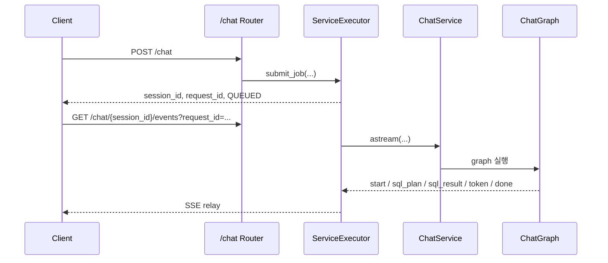

# API Chat

`/chat` 계열 API와 SSE 이벤트 계약을 정리한다.

## 1. startup 전제

`/chat` API가 정상 동작하려면 서버 startup에서 아래가 먼저 완료되어야 합니다.

1. `table_allowlist` 로드
2. allowlist 기반 schema introspection
3. `QueryTargetRegistry` 등록

현재 PostgreSQL 기준으로는 startup에서 introspection이 먼저 DB를 검사하고, 실제 query target 연결은 첫 SQL 실행 시점에 lazy connect 됩니다.

## 2. 엔드포인트

### 1-1. 채팅 작업 제출

- Method: `POST`
- Path: `/chat`
- Request:

```json
{
  "session_id": "세션 ID 또는 생략",
  "message": "사용자 입력",
  "context_window": 20
}
```

- Response:

```json
{
  "session_id": "...",
  "request_id": "...",
  "status": "QUEUED"
}
```

### 1-2. 스트림 이벤트 구독

- Method: `GET`
- Path: `/chat/{session_id}/events?request_id=...`
- Content-Type: `text/event-stream`

### 1-3. 세션 스냅샷 조회

- Method: `GET`
- Path: `/chat/{session_id}`

## 3. SSE 이벤트 구조

```json
{
  "session_id": "...",
  "request_id": "...",
  "type": "start|token|sql_plan|sql_result|done|error",
  "node": "executor|safeguard|schema_selection_parse|raw_sql_generate|raw_sql_execute|sql_result_collect|response|blocked",
  "content": "...",
  "status": "COMPLETED|FAILED|null",
  "error_message": "...",
  "metadata": {}
}
```

## 4. 이벤트 타입

| type | 설명 |
| --- | --- |
| `start` | 실행 시작 |
| `token` | 응답 토큰 스트림 |
| `sql_plan` | 스키마 선택 또는 SQL 생성 결과 |
| `sql_result` | SQL 실행 결과 또는 결과 집계 |
| `done` | 정상 종료 |
| `error` | 실행기 수준 오류 종료 |

## 5. 주요 node 값

| node | 의미 |
| --- | --- |
| `executor` | 실행기 시작/오류 |
| `safeguard` | 안전성 분류 |
| `schema_selection_parse` | 선택 alias 결과 |
| `raw_sql_generate` | 1차 SQL 생성 결과 |
| `raw_sql_generate_retry` | 재시도 SQL 생성 결과 |
| `raw_sql_execute` | 1차 SQL 실행 결과 |
| `raw_sql_execute_retry` | 재시도 SQL 실행 결과 |
| `sql_result_collect` | 최종 성공/실패 집계, 후속 질의 메타 생성 |
| `response` | 최종 자연어 응답 |
| `blocked` | 안전성 차단 응답 |

## 6. 요청 처리 흐름



## 7. 실패 의미

| 코드 | 의미 |
| --- | --- |
| `CHAT_JOB_QUEUE_FAILED` | 작업 큐 적재 실패 |
| `CHAT_SESSION_NOT_FOUND` | 존재하지 않는 세션 요청 |
| `CHAT_STREAM_TIMEOUT` | 스트림 타임아웃 |
| `RAW_SQL_INVALID_FORMAT` | 실행 금지 SQL 또는 잘못된 형식 |
| `RAW_SQL_EXECUTION_FAILED` | DB 실행 실패 |

## 8. 운영 포인트

- `done` 이후 assistant 메시지와 `answer_source_meta`가 저장됩니다.
- `sql_result_collect`에서 생성한 `answer_source_meta`는 후속 설명 질의에 재사용됩니다.
- 여러 alias가 선택되면 alias별 SQL을 별도로 실행하고, 응답은 하나로 종합합니다.
