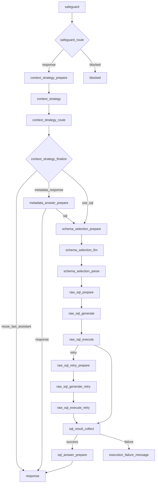

# Core Chat 가이드

이 문서는 `src/text_to_sql/core/chat`의 현재 그래프, 상태 계약, 노드 책임을 Raw SQL 파이프라인 기준으로 설명합니다.

## 1. 주요 개념

| 항목 | 의미 |
| --- | --- |
| `schema_snapshot` | allowlist와 DB introspection을 결합한 정적 스키마 스냅샷 |
| `selected_target_aliases` | schema selection 단계가 선택한 target alias 목록 |
| `raw_sql_inputs` | alias별 SQL 생성 입력 |
| `sql_texts_by_alias` | LLM이 생성한 alias별 SQL 문자열 |
| `execution_reports` | alias별 실행 결과 |
| `answer_source_meta` | 후속 질의 설명에 사용하는 컬럼/테이블 근거 메타데이터 |

## 2. startup 전제

현재 그래프는 startup에서 이미 아래 값이 준비되어 있다고 가정합니다.

1. `table_allowlist` 로드 완료
2. allowlist 기반 `schema_snapshot` 생성 완료
3. `QueryTargetRegistry` 등록 완료

주의:

- startup에서는 allowlist target별 schema introspection이 먼저 수행됩니다.
- query target registry는 startup에 만들어지지만, 실제 DB 연결은 첫 조회 시점에 lazy connect 됩니다.

## 3. 그래프 구조

## 4. 상태 키

| 분류 | 키 |
| --- | --- |
| 입력 | `session_id`, `user_message`, `history` |
| 컨텍스트 전략 | `context_strategy`, `context_strategy_raw`, `last_assistant_message`, `last_answer_source_meta`, `metadata_summary` |
| 스키마 선택 | `schema_snapshot`, `schema_selection_context`, `schema_selection_raw`, `selected_target_aliases` |
| SQL 생성/재시도 | `raw_sql_inputs`, `sql_texts_by_alias`, `sql_retry_feedbacks`, `retry_count_by_alias` |
| 실행 결과 | `execution_reports`, `success_aliases`, `failed_aliases`, `failure_codes`, `failure_details` |
| 응답 컨텍스트 | `answer_source_meta`, `sql_answer_context`, `sql_plan`, `sql_result`, `assistant_message` |

## 5. 노드별 역할

| 노드 | 역할 | 출력 |
| --- | --- | --- |
| `safeguard` | 정책 위반 여부 분류 | `safeguard_result` |
| `context_strategy_prepare` | 직전 답변과 메타데이터 복원 | `last_assistant_message`, `last_answer_source_meta`, `metadata_summary` |
| `context_strategy` | 재사용/메타/SQL 전략 분류 | `context_strategy_raw` |
| `context_strategy_finalize` | 최종 전략과 metadata 경로 확정 | `context_strategy`, `metadata_route` |
| `metadata_answer_prepare` | 직전 SQL 메타데이터로 설명 컨텍스트 생성 | `sql_answer_context` 또는 SQL fallback |
| `schema_selection_prepare` | alias 선택 프롬프트 입력 생성 | `schema_selection_context` |
| `schema_selection_llm` | alias 선택 | `schema_selection_raw` |
| `schema_selection_parse` | 선택 문자열 파싱 및 검증 | `selected_target_aliases`, `sql_plan` |
| `raw_sql_prepare` | alias별 SQL 생성 입력 구성 | `raw_sql_inputs` |
| `raw_sql_generate` | alias별 raw SQL 생성 | `sql_texts_by_alias`, `sql_plan` |
| `raw_sql_execute` | 읽기 전용 SQL 실행 | `execution_reports`, `sql_result` |
| `raw_sql_retry_prepare` | DB 오류 기반 재시도 입력 준비 | `raw_sql_inputs` |
| `sql_result_collect` | 실행 결과 집계 및 후속 설명 메타 생성 | `sql_result`, `answer_source_meta` |
| `sql_answer_prepare` | 최종 응답용 문맥 생성 | `sql_answer_context` |
| `response` | 최종 자연어 응답 생성 | `assistant_message` |

## 6. 후속 질의 처리 규칙

1. 직전 답변만으로 충분한 질문이면 `REUSE_LAST_ASSISTANT`
2. 직전 SQL 결과의 컬럼 의미, 지표 정의, 값 해설이면 `USE_METADATA`
3. 메타데이터가 부족하거나 새로운 값을 요구하면 `USE_SQL`
4. `USE_METADATA`로 분류됐더라도 설명 가능한 컬럼이 없으면 SQL 경로로 내려갑니다.

## 7. 이벤트 계약

`chat_graph.stream_node` 기준 공개 이벤트는 다음 노드에서만 발생합니다.

| 노드 | 이벤트 |
| --- | --- |
| `safeguard` | `safeguard_result` |
| `safeguard_route` | `safeguard_route`, `safeguard_result` |
| `schema_selection_parse` | `sql_plan` |
| `raw_sql_generate` | `sql_plan` |
| `raw_sql_generate_retry` | `sql_plan` |
| `raw_sql_execute` | `sql_result` |
| `raw_sql_execute_retry` | `sql_result` |
| `sql_result_collect` | `sql_result` |
| `response` | `token`, `assistant_message` |
| `blocked` | `assistant_message` |
| 실패 메시지 노드 | `assistant_message` |
