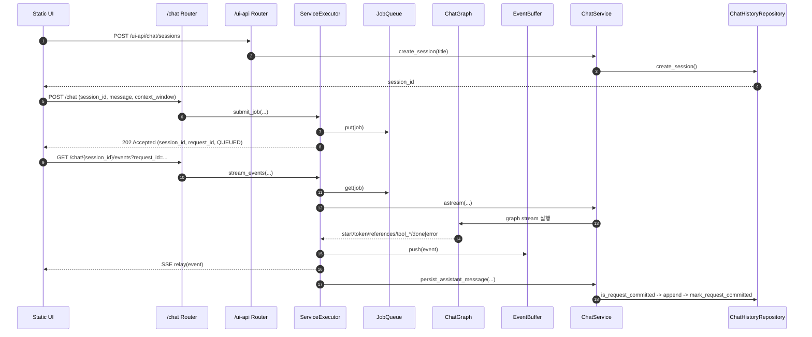
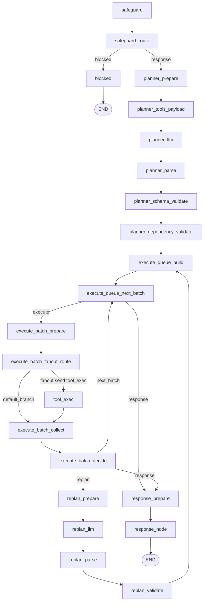

# Plan-and-then-Execute Agent Template

LLM 기반 Plan-and-then-Execute Agent 애플리케이션을 빠르게 시작하기 위한 Python/FastAPI 템플릿이다.
권장 Python 버전은 `3.13+`이다.

현재 템플릿은 `RuntimeEnvironmentLoader`로 환경을 로드한 뒤, `safeguard -> planner -> execute -> replan -> response` 파이프라인을 실행한다.
기본 런타임은 `Gemini LLM 노드 + SQLite ChatHistoryRepository + InMemoryQueue + InMemoryEventBuffer` 조합이다.
Planner는 `ToolRegistry`에 등록된 Tool 스펙을 기반으로 실행 계획 JSON을 만들고, Execute 단계는 배치 fan-out으로 Tool을 호출한다.

## 1. 빠른 시작

### 1-1. 프로젝트명 초기화(선택)

```bash
bash init.sh my-project
```

### 1-2. 가상환경/의존성 설치

```bash
uv venv .venv
uv sync
```

### 1-3. 환경 변수 파일 생성

기본 로컬 실행:

```bash
cp .env.sample .env
```

현재 기본 그래프는 Gemini 설정과 기본 Tool Registry를 사용한다.

```env
ENV=local
LOG_STDOUT=1

GEMINI_MODEL=gemini-3.1-flash-lite-preview
GEMINI_PROJECT=your-gcp-project-id
GEMINI_API_KEY=

CHAT_DB_PATH=data/db/chat/chat_history.sqlite
CHAT_MEMORY_MAX_MESSAGES=200
CHAT_STREAM_TIMEOUT_SECONDS=180
CHAT_PERSIST_RETRY_LIMIT=2
CHAT_PERSIST_RETRY_DELAY_SECONDS=0.5

CHAT_JOB_QUEUE_MAX_SIZE=0
CHAT_JOB_QUEUE_POLL_TIMEOUT=0.2
CHAT_EVENT_BUFFER_MAX_SIZE=0
CHAT_EVENT_BUFFER_POLL_TIMEOUT=0.2
CHAT_EVENT_BUFFER_TTL_SECONDS=600
CHAT_EVENT_BUFFER_GC_INTERVAL_SECONDS=30
CHAT_REDIS_EVENT_BUFFER_KEY_PREFIX=chat:stream
```

런타임 환경이 `dev/stg/prod`인 경우에는 루트 `.env` 외에 환경별 리소스 파일도 준비해야 한다.

예시(`dev`):

```bash
cp src/plan_and_then_execute_agent/resources/dev/.env.sample src/plan_and_then_execute_agent/resources/dev/.env
```

`RuntimeEnvironmentLoader`는 아래 순서로 환경을 로드한다.

1. 프로젝트 루트 `.env`
2. `ENV` / `APP_ENV` / `APP_STAGE` 해석
3. 값이 비어 있으면 `local`
4. 필요 시 `src/plan_and_then_execute_agent/resources/<env>/.env`

### 1-4. 서버 실행

```bash
uv run uvicorn plan_and_then_execute_agent.api.main:app --host 0.0.0.0 --port 8000 --reload
```

앱 시작 시 실제로 준비되는 순서:

1. `api/main.py`가 `RuntimeEnvironmentLoader`로 루트 `.env`와 환경별 `.env`를 먼저 로드한다.
2. 환경 로드 이후 Chat/UI/Health 라우터와 정적 UI를 import 및 등록한다.
3. `api/chat/services/runtime.py`가 `ChatHistoryRepository`, `ChatService`, `ServiceExecutor`, JobQueue, EventBuffer를 모듈 레벨에서 조립한다.
4. 기본 저장소는 `CHAT_DB_PATH` 기준 SQLite를 사용한다.
5. 기본 큐와 이벤트 버퍼는 각각 `InMemoryQueue`, `InMemoryEventBuffer`로 고정 조립된다.

접속 주소:

- API 문서: `http://127.0.0.1:8000/docs`
- 헬스체크: `http://127.0.0.1:8000/health`
- 정적 UI: `http://127.0.0.1:8000/ui`

## 2. API 인터페이스 요약

### 2-1. Chat API

| Method | Path | 상태코드 | 설명 |
| --- | --- | --- | --- |
| `POST` | `/chat` | `202` | 채팅 작업 제출 (`session_id`, `message`, `context_window`) |
| `GET` | `/chat/{session_id}` | `200` | 세션 스냅샷(메시지/최근 상태) 조회 |
| `GET` | `/chat/{session_id}/events?request_id=...` | `200` | 요청 단위 SSE 이벤트 구독 |

### 2-2. UI API

| Method | Path | 상태코드 | 설명 |
| --- | --- | --- | --- |
| `POST` | `/ui-api/chat/sessions` | `201` | UI 세션 생성 |
| `GET` | `/ui-api/chat/sessions` | `200` | UI 세션 목록 |
| `GET` | `/ui-api/chat/sessions/{session_id}/messages` | `200` | UI 메시지 목록 |
| `DELETE` | `/ui-api/chat/sessions/{session_id}` | `200` | 세션+메시지 삭제 |

### 2-3. Health API

| Method | Path | 상태코드 | 설명 |
| --- | --- | --- | --- |
| `GET` | `/health` | `200` | 서버 생존 상태 확인 |

## 3. 동작 방식

현재 시스템은 `세션 + 비동기 작업 큐 + SSE + Tool 실행 그래프` 구조로 동작한다.

1. UI는 `/ui-api/chat/sessions`로 세션을 만들거나 기존 세션 목록을 불러온다.
2. 사용자가 메시지를 보내면 `POST /chat`을 호출한다.
3. 서버는 `session_id`, `request_id`, `status=QUEUED`를 즉시 반환한다.
4. UI는 `GET /chat/{session_id}/events?request_id=...`로 요청 단위 스트림을 구독한다.
5. `ServiceExecutor`가 작업 큐를 소비하며 `start -> token/references/tool_* -> done|error` 이벤트를 EventBuffer와 SSE로 보낸다.
6. `ChatService`는 사용자 메시지 저장, 그래프 실행, assistant 응답 영속화를 담당한다.
7. 그래프는 `safeguard -> planner -> execute -> replan -> response` 순서로 진행한다.
8. Planner는 `ToolRegistry`의 Tool 스펙을 바탕으로 실행 계획 JSON을 생성한다.
9. Execute 단계는 의존성 레벨별 batch fan-out으로 Tool을 실행하고, 실패가 누적되면 Replan으로 분기한다.
10. 완료 시 assistant 응답은 `request_id` 멱등 기준으로 1회만 저장된다.
11. 필요하면 `GET /chat/{session_id}`로 최종 스냅샷을 조회한다.

중요:

- 기본 Tool인 `get_weather`, `api_agent_response`는 현재 실제 외부 네트워크 호출이 아니라 고정 응답 기반 예시 구현이다.
- `add_number`는 실제 덧셈 Tool 예시이며 Planner가 정수 계산 질문에 사용할 수 있다.
- Redis Queue/EventBuffer, PostgreSQL 저장소 전환은 기본 동작이 아니라 `runtime.py` 조립 변경이 필요한 확장 경로다.

### 3-1. End-to-End 시퀀스



### 3-2. 그래프 흐름도



### 3-3. 노드별 작업 표

| 노드 | 주요 작업 | 입력 | 출력 | 다음 노드 |
| --- | --- | --- | --- | --- |
| `safeguard` | LLM으로 입력 안전성 판정(`PASS/PII/HARMFUL/PROMPT_INJECTION`) | `user_message` | `safeguard_result` | `safeguard_route` |
| `safeguard_route` | 결과값 정규화/별칭 교정 후 분기 결정 | `safeguard_result` | `safeguard_route`, `safeguard_result` | `planner_prepare` 또는 `blocked` |
| `blocked` | 차단 사유별 고정 안내 문구 생성 | `safeguard_result` | `assistant_message` | `END` |
| `planner_prepare` | 최근 히스토리 요약, 실행 상태 기본값 정리 | `history`, `step_results`, `step_failures` | `planner_history_summary`, `step_results`, `step_failures`, `replan_count` | `planner_tools_payload` |
| `planner_tools_payload` | Planner 프롬프트용 Tool 스펙 payload 생성 | `ToolRegistry` | `planner_tools_payload`, `available_tool_names` | `planner_llm` |
| `planner_llm` | 실행 계획 JSON 원문 생성 | `user_message`, `planner_history_summary`, `planner_tools_payload` | `plan_raw` | `planner_parse` |
| `planner_parse` | 계획 원문 JSON 파싱 | `plan_raw` | `plan_obj` | `planner_schema_validate` |
| `planner_schema_validate` | 계획 스키마 정규화 | `plan_obj` | `plan_id`, `plan_steps` | `planner_dependency_validate` |
| `planner_dependency_validate` | `tool_name` 등록 여부, `depends_on` 무결성/사이클 검증 | `plan_steps`, `ToolRegistry` | `plan_steps` | `execute_queue_build` |
| `execute_queue_build` | 의존성 레벨별 실행 큐 생성, 배치 상태 초기화 | `plan_steps` | `execute_queue`, `step_results`, `step_failures` 등 | `execute_queue_next_batch` |
| `execute_queue_next_batch` | 다음 batch 선택 또는 응답 단계 전환 | `execute_queue` | `current_batch`, `execute_decision` 등 | `execute_batch_prepare` 또는 `response_prepare` |
| `execute_batch_prepare` | fan-out용 ToolCall 입력 목록 생성 | `current_batch`, `plan_steps`, `session_id`, `request_id`, `plan_id` | `batch_tool_exec_inputs` | `execute_batch_fanout_route` |
| `execute_batch_fanout_route` | fan-out 라우팅(입력 있으면 fan-out, 없으면 기본 분기) | `batch_tool_exec_inputs` | 없음 | `tool_exec` 또는 `execute_batch_collect` |
| `tool_exec` | Tool 실행(타임아웃/재시도/이벤트 발행) | `tool_call` | `batch_tool_results` 또는 `batch_tool_failures` | `execute_batch_collect` |
| `execute_batch_collect` | 배치 결과 병합, timeout/누락 step 실패 보정 | `batch_tool_results`, `batch_tool_failures`, `current_batch` | `step_results`, `step_failures`, `batch_has_failures` 등 | `execute_batch_decide` |
| `execute_batch_decide` | 다음 분기 결정(`next_batch/replan/response`) | `batch_has_failures`, `execute_queue`, `replan_count` | `execute_decision` | `execute_queue_next_batch`, `replan_prepare`, `response_prepare` |
| `replan_prepare` | 이전 계획/실패 요약 생성, 재계획 횟수 증가 | `plan_id`, `plan_steps`, `step_failures` | `replan_previous_plan_summary`, `replan_failure_summary`, `replan_count` | `replan_llm` |
| `replan_llm` | 수정 계획 JSON 원문 생성 | `replan_previous_plan_summary`, `replan_failure_summary`, `planner_tools_payload` | `replan_raw` | `replan_parse` |
| `replan_parse` | 재계획 원문 JSON 파싱 | `replan_raw` | `plan_obj` | `replan_validate` |
| `replan_validate` | 재계획 스키마/도구/의존성 검증 | `plan_obj`, `ToolRegistry` | `plan_id`, `plan_steps` | `execute_queue_build` |
| `response_prepare` | 실행 결과를 최종 답변 컨텍스트로 요약 | `plan_id`, `plan_steps`, `step_results`, `step_failures` | `rag_context`, `plan_execution_summary`, `rag_references` | `response_node` |
| `response_node` | 최종 답변 생성 | `user_message`, `rag_context` | `assistant_message` | `END` |

### 3-4. 기본 Tool 요약

| Tool | 설명 | 현재 구현 상태 |
| --- | --- | --- |
| `add_number` | 두 정수 `a`, `b`를 더한다. | 실제 계산 예시 |
| `get_weather` | 지역별 날씨 조회 API 예시 | 현재는 고정 응답 예시 |
| `api_agent_response` | 내부 Agent API `/chat` + `/events` 흐름 예시 | 현재는 고정 응답 예시 |

### 3-5. 이벤트 계약 요약

1. 이벤트 순서: `start -> token* -> references? -> tool_start/tool_result/tool_error* -> done|error`
2. 필수 식별자: `session_id`, `request_id`
3. 종료 조건: `done` 또는 `error`
4. 저장 멱등성: `request_id` 기준 단 한 번만 assistant 메시지 저장

SSE `data` 예시:

```json
{
  "session_id": "...",
  "request_id": "...",
  "type": "tool_result",
  "node": "tool_exec",
  "content": "...",
  "status": null,
  "error_message": null,
  "metadata": {
    "tool_name": "add_number",
    "step_id": "step-1",
    "plan_id": "plan-1"
  }
}
```

이벤트 타입:

- `start`
- `token`
- `references`
- `tool_start`
- `tool_result`
- `tool_error`
- `done`
- `error`

## 4. 환경 변수 (`.env`)

기본 샘플: `.env.sample`

전체 키 상세 설명과 로딩 우선순위는 `docs/setup/env.md`를 참고한다.

### 4-1. 런타임/로그

| 변수 | 기본값 | 설명 |
| --- | --- | --- |
| `ENV` | `local`(빈값일 때) | `local/dev/stg/prod` 런타임 선택 |
| `LOG_STDOUT` | `False` | stdout 로그 출력 여부 |

### 4-2. LLM

| 변수 | 기본값 | 설명 |
| --- | --- | --- |
| `GEMINI_MODEL` | - | safeguard/planner/replan/response 노드에서 사용할 모델명 |
| `GEMINI_PROJECT` | - | Gemini 프로젝트 식별자 |
| `GEMINI_API_KEY` | - | Gemini 인증에 사용하는 API 키(환경에 따라 필요) |
| `GEMINI_EMBEDDING_MODEL` | - | 임베딩 확장 시 사용할 모델명 |
| `GEMINI_EMBEDDING_DIM` | `1024` | 임베딩 차원 기본값 |

### 4-3. Chat 저장/실행

| 변수 | 기본값 | 설명 |
| --- | --- | --- |
| `CHAT_DB_PATH` | `data/db/chat/chat_history.sqlite` | Chat 이력 SQLite 경로 |
| `CHAT_MEMORY_MAX_MESSAGES` | `200` | 세션 메모리 최대 메시지 수 |
| `CHAT_STREAM_TIMEOUT_SECONDS` | `180` | SSE 대기/실행 타임아웃 |
| `CHAT_PERSIST_RETRY_LIMIT` | `2` | 완료 저장 재시도 횟수 |
| `CHAT_PERSIST_RETRY_DELAY_SECONDS` | `0.5` | 완료 저장 재시도 간격(초) |

### 4-4. 큐 / 이벤트 버퍼

| 변수 | 기본값 | 설명 |
| --- | --- | --- |
| `CHAT_JOB_QUEUE_MAX_SIZE` | `0` | 작업 큐 최대 크기 (`0` 무제한) |
| `CHAT_QUEUE_MAX_SIZE` | `0` | 작업 큐 fallback 키 |
| `CHAT_JOB_QUEUE_POLL_TIMEOUT` | `0.2` | 작업 큐 poll timeout(초) |
| `CHAT_QUEUE_POLL_TIMEOUT` | `0.2` | 작업 큐 poll fallback 키 |
| `CHAT_EVENT_BUFFER_MAX_SIZE` | `0` | 이벤트 버퍼 최대 크기 (`0` 무제한) |
| `CHAT_EVENT_BUFFER_POLL_TIMEOUT` | `0.2` | 이벤트 버퍼 pop timeout(초) |
| `CHAT_EVENT_BUFFER_TTL_SECONDS` | `600` | 이벤트 버퍼 TTL(초) |
| `CHAT_EVENT_BUFFER_GC_INTERVAL_SECONDS` | `30` | 인메모리 버퍼 GC 주기(초) |
| `CHAT_REDIS_EVENT_BUFFER_KEY_PREFIX` | `chat:stream` | Redis 이벤트 키 prefix |

중요:

- 현재 기본 런타임은 분기 없이 `InMemoryQueue`, `InMemoryEventBuffer`를 사용한다.
- Redis Queue/EventBuffer 관련 키는 확장 조립 시 의미가 있다.

### 4-5. PostgreSQL 선택값

| 변수 | 기본값 | 설명 |
| --- | --- | --- |
| `POSTGRES_HOST` | `127.0.0.1` | PostgreSQL 호스트 |
| `POSTGRES_PORT` | `5432` | PostgreSQL 포트 |
| `POSTGRES_USER` | `postgres` | PostgreSQL 사용자 |
| `POSTGRES_PW` | `postgres` | PostgreSQL 비밀번호 |
| `POSTGRES_DATABASE` | `playground` | PostgreSQL 데이터베이스 |
| `POSTGRES_DSN` | - | DSN 직접 지정 |
| `POSTGRES_ENABLE_VECTOR` | `0` | PostgreSQL 벡터 테스트 활성화 여부 |

### 4-6. MongoDB / Redis / Elasticsearch / LanceDB / SQLite 선택값

MongoDB:

| 변수 | 기본값 | 설명 |
| --- | --- | --- |
| `MONGODB_HOST` | `127.0.0.1` | MongoDB 호스트 |
| `MONGODB_PORT` | `27017` | MongoDB 포트 |
| `MONGODB_USER` | - | MongoDB 사용자 |
| `MONGODB_PW` | - | MongoDB 비밀번호 |
| `MONGODB_DB` | `playground` | MongoDB 데이터베이스 |
| `MONGODB_AUTH_DB` | - | 인증 DB |
| `MONGODB_URI` | - | MongoDB URI 직접 지정 |

Redis:

| 변수 | 기본값 | 설명 |
| --- | --- | --- |
| `REDIS_HOST` | `127.0.0.1` | Redis 호스트 |
| `REDIS_PORT` | `6379` | Redis 포트 |
| `REDIS_DB` | `0` | Redis DB 인덱스 |
| `REDIS_PW` | - | Redis 비밀번호 |
| `REDIS_URL` | - | Redis URL 직접 지정 |

Elasticsearch:

| 변수 | 기본값 | 설명 |
| --- | --- | --- |
| `ELASTICSEARCH_SCHEME` | `https` | Elasticsearch 스킴 |
| `ELASTICSEARCH_HOST` | `127.0.0.1` | Elasticsearch 호스트 |
| `ELASTICSEARCH_PORT` | `9200` | Elasticsearch 포트 |
| `ELASTICSEARCH_USER` | - | Elasticsearch 사용자 |
| `ELASTICSEARCH_PW` | - | Elasticsearch 비밀번호 |
| `ELASTICSEARCH_CA_CERTS` | - | CA 인증서 경로 |
| `ELASTICSEARCH_VERIFY_CERTS` | `true` | 인증서 검증 여부 |
| `ELASTICSEARCH_SSL_FINGERPRINT` | - | TLS fingerprint |
| `ELASTICSEARCH_HOSTS` | - | 호스트 배열 직접 지정 |

LanceDB / SQLite:

| 변수 | 기본값 | 설명 |
| --- | --- | --- |
| `LANCEDB_URI` | `data/db/vector` | LanceDB 벡터 저장 경로 |
| `SQLITE_DB_DIR` | `data/db` | SQLite 엔진 기본 디렉터리 |
| `SQLITE_DB_PATH` | `data/db/playground.sqlite` | SQLite 엔진 기본 경로 |
| `SQLITE_BUSY_TIMEOUT_MS` | `5000` | SQLite 잠금 대기 시간(ms) |

### 4-7. `.env.sample`에는 있지만 현재 기본 런타임 미반영인 키

아래 키는 `.env.sample`에 존재하지만 현재 `api/chat/services/runtime.py`가 직접 소비하지 않는다.

1. `CHAT_TASK_MAX_WORKERS`
2. `CHAT_TASK_QUEUE_MAX_SIZE`
3. `CHAT_BUFFER_BACKEND`
4. `CHAT_TASK_STREAM_MAX_CHUNKS`
5. `CHAT_TASK_RESULT_TTL_SECONDS`
6. `CHAT_TASK_MAX_STORED`
7. `CHAT_TASK_CLEANUP_INTERVAL_SECONDS`

주의:

- 위 값들은 예비 설정/확장 실험용 샘플로 남아 있으며, 기본 Chat 런타임의 동작을 바꾸지 않는다.
- 설정을 추가 반영하려면 `api/chat/services/runtime.py` 조립 코드가 함께 변경되어야 한다.

## 5. 채팅 이력 초기화

기본 저장소는 SQLite(`CHAT_DB_PATH`)다.

전체 파일 초기화:

```bash
rm -f data/db/chat/chat_history.sqlite
```

테이블 데이터만 삭제:

```bash
sqlite3 data/db/chat/chat_history.sqlite "DELETE FROM chat_messages; DELETE FROM chat_sessions; DELETE FROM chat_request_commits;"
```

## 6. 프로젝트 구조

### 6-1. 최상위 구조

```text
.
  src/plan_and_then_execute_agent/
    api/                # HTTP 진입점, DTO, DI 조립
    core/               # Plan-and-then-Execute 도메인 규칙과 그래프 조립
    shared/             # 공통 실행 인프라와 재사용 컴포넌트
    integrations/       # 외부 시스템 연동 어댑터
    resources/          # 런타임 환경별 리소스 파일
    static/             # 정적 UI 리소스
  tests/                # pytest 테스트
  docs/                 # 코드 기준 상세 문서
  data/                 # 기본 로컬 실행 데이터 경로
```

### 6-2. `src/plan_and_then_execute_agent/` 디렉터리 레벨 책임 맵

| 경로 | 역할 | 구현 책임 범위 | 책임 밖 범위 |
| --- | --- | --- | --- |
| `src/plan_and_then_execute_agent/api` | FastAPI 진입 계층 | 라우터 등록, 요청/응답 모델, HTTP 예외 변환, 런타임 의존성 주입 | 도메인 규칙 자체, Queue/DB 엔진 세부 구현 |
| `src/plan_and_then_execute_agent/core` | Agent 도메인 계층 | 상태 모델, 프롬프트, 노드 조립, 그래프 분기 규칙 | HTTP 프로토콜, 저장소/큐 인프라 운영 |
| `src/plan_and_then_execute_agent/shared` | 공용 실행 계층 | 서비스 오케스트레이션, 저장소, 메모리, 런타임 유틸리티, 공통 예외/로깅/설정 | 특정 외부 제품 API 세부 구현 |
| `src/plan_and_then_execute_agent/integrations` | 외부 연동 계층 | LLM/DB/파일 시스템/임베딩 어댑터, 연결/매퍼/엔진 | Agent 유스케이스 정책, API 라우팅 |
| `src/plan_and_then_execute_agent/resources` | 환경 리소스 계층 | `dev/stg/prod`별 `.env.sample` 및 환경 파일 보관 | 런타임 로직 |
| `src/plan_and_then_execute_agent/static` | 웹 UI 정적 리소스 계층 | HTML/CSS/JS, 아이콘, 프런트 상태 처리 | FastAPI 비즈니스 로직, 도메인 정책 |

### 6-3. `src/plan_and_then_execute_agent/api` 하위 구조

```text
src/plan_and_then_execute_agent/api/
  main.py               # 앱 엔트리, /ui 마운트, lifespan startup/shutdown
  const/                # API prefix/path/tag 상수
  chat/                 # 비동기 Chat API
  ui/                   # UI 전용 세션/메시지 API
  health/               # 서버 상태 확인 API
```

| 경로 | 역할 | 구현 책임 범위 |
| --- | --- | --- |
| `src/plan_and_then_execute_agent/api/chat/models` | Chat DTO | `/chat` 요청/응답 검증, SSE 구독 입력/출력 모델 |
| `src/plan_and_then_execute_agent/api/chat/routers` | Chat 라우터 | 작업 제출, 스트림 구독, 세션 스냅샷 조회 |
| `src/plan_and_then_execute_agent/api/chat/services` | Chat 런타임 조립 | `ChatService`, `ServiceExecutor`, 큐/버퍼 싱글턴 조립 |
| `src/plan_and_then_execute_agent/api/chat/utils` | Chat API 보조 유틸 | 도메인 모델을 API 응답 형태로 변환 |
| `src/plan_and_then_execute_agent/api/ui/models` | UI DTO | 세션/메시지 목록 응답 모델 |
| `src/plan_and_then_execute_agent/api/ui/routers` | UI 라우터 | 세션 생성, 조회, 삭제 엔드포인트 |
| `src/plan_and_then_execute_agent/api/ui/services` | UI 서비스 | `ChatService` 결과를 UI 응답 모델로 매핑 |
| `src/plan_and_then_execute_agent/api/ui/utils` | UI 매퍼 | 도메인 엔티티를 UI DTO로 변환 |
| `src/plan_and_then_execute_agent/api/health` | Health API | `/health` 단일 엔드포인트와 응답 모델 관리 |

### 6-4. `src/plan_and_then_execute_agent/core/chat` 하위 구조

```text
src/plan_and_then_execute_agent/core/chat/
  const/                # 도메인 상수와 기본 메시지
  models/               # ChatSession, ChatMessage 같은 엔티티
  state/                # 그래프 상태 키 정의
  prompts/              # 시스템 프롬프트
  nodes/                # safeguard/planner/execute/replan/response 노드 조립체
  graphs/               # LangGraph 그래프 조립
  tools/                # 기본 Tool 구현과 Registry
  utils/                # 도메인 매핑 유틸
```

| 경로 | 역할 | 구현 책임 범위 |
| --- | --- | --- |
| `src/plan_and_then_execute_agent/core/chat/const` | 도메인 설정값 | 컬렉션명, 페이지 크기, 기본 문맥 길이, 차단 메시지 |
| `src/plan_and_then_execute_agent/core/chat/models` | 핵심 엔티티 | 세션, 메시지, 역할 모델 정의 |
| `src/plan_and_then_execute_agent/core/chat/state` | 그래프 상태 계약 | 노드 간 전달되는 상태 키의 타입 계약 |
| `src/plan_and_then_execute_agent/core/chat/prompts` | 프롬프트 정책 | safeguard, planner, replan, response 프롬프트 |
| `src/plan_and_then_execute_agent/core/chat/nodes` | 도메인 노드 조립 | 실제 사용할 LLM/분기/실행/메시지 노드 인스턴스 선언 |
| `src/plan_and_then_execute_agent/core/chat/graphs` | 그래프 정의 | 노드 연결, 진입점, 조건 분기, stream 정책 설정 |
| `src/plan_and_then_execute_agent/core/chat/tools` | Tool 구현과 등록 | 기본 Tool 함수와 `ToolRegistry` singleton 구성 |
| `src/plan_and_then_execute_agent/core/chat/utils` | 도메인 매핑 유틸 | 도메인 모델과 문서/DB 표현 사이 매핑 지원 |

### 6-5. `src/plan_and_then_execute_agent/shared` 하위 구조

```text
src/plan_and_then_execute_agent/shared/
  chat/                 # 그래프 실행, 저장소, 메모리, 서비스
  runtime/              # 큐, 이벤트 버퍼, 워커, 스레드풀
  config/               # 설정/런타임 환경 로더
  logging/              # 공통 로거와 로그 저장소
  exceptions/           # 공통 예외 모델
  const/                # 공통 상수
```

| 경로 | 역할 | 구현 책임 범위 |
| --- | --- | --- |
| `src/plan_and_then_execute_agent/shared/chat/interface` | 포트 계약 | 그래프, 서비스, 실행기 인터페이스 정의 |
| `src/plan_and_then_execute_agent/shared/chat/graph` | 그래프 공통 실행기 | 그래프 컴파일, 이벤트 표준화, stream 필터링 |
| `src/plan_and_then_execute_agent/shared/chat/nodes` | 재사용 노드 | `LLMNode`, `BranchNode`, `MessageNode`, `ToolExecNode` 같은 범용 노드 |
| `src/plan_and_then_execute_agent/shared/chat/repositories` | 대화 이력 저장소 | 세션/메시지 CRUD, `request_id` 멱등 저장 관리 |
| `src/plan_and_then_execute_agent/shared/chat/memory` | 세션 메모리 캐시 | 최근 메시지 컨텍스트 메모리 유지 |
| `src/plan_and_then_execute_agent/shared/chat/services` | 서비스 계층 | `ChatService`, `ServiceExecutor` 실행 오케스트레이션 |
| `src/plan_and_then_execute_agent/shared/chat/tools` | Tool 공통 타입 | Tool 계약, registry, planner payload 유틸 |
| `src/plan_and_then_execute_agent/shared/runtime` | 실행 인프라 | Queue, EventBuffer, Worker, ThreadPool 제공 |
| `src/plan_and_then_execute_agent/shared/config` | 설정 로딩 | `.env`/JSON/환경 변수 병합 및 런타임 환경 해석 |
| `src/plan_and_then_execute_agent/shared/logging` | 공통 로깅 | Logger, 로그 모델, 저장소 구현 |
| `src/plan_and_then_execute_agent/shared/exceptions` | 공통 예외 | 코드/원인 추적이 가능한 애플리케이션 예외 정의 |

### 6-6. `src/plan_and_then_execute_agent/integrations` 하위 구조

```text
src/plan_and_then_execute_agent/integrations/
  llm/                  # LLM 클라이언트 래퍼
  db/                   # DB 클라이언트, 엔진, 쿼리 빌더
  fs/                   # 파일 시스템 저장소
  embedding/            # 임베딩 클라이언트
```

| 경로 | 역할 | 구현 책임 범위 |
| --- | --- | --- |
| `src/plan_and_then_execute_agent/integrations/llm` | LLM 연동 | LangChain 모델 래핑, 호출 로깅, 예외 표준화 |
| `src/plan_and_then_execute_agent/integrations/db/base` | DB 공통 타입 | 엔진/세션/모델/쿼리 계약 |
| `src/plan_and_then_execute_agent/integrations/db/query_builder` | 쿼리 빌더 | 읽기/쓰기/삭제 쿼리 조립 유틸 |
| `src/plan_and_then_execute_agent/integrations/db/engines/sqlite` | SQLite 엔진 | 기본 Chat 저장소/로컬 DB 엔진 |
| `src/plan_and_then_execute_agent/integrations/db/engines/postgres` | PostgreSQL 엔진 | 관계형 조회 및 벡터 저장소 지원 |
| `src/plan_and_then_execute_agent/integrations/db/engines/mongodb` | MongoDB 엔진 | 문서 저장/조회 어댑터 |
| `src/plan_and_then_execute_agent/integrations/db/engines/redis` | Redis 엔진 | keyspace 기반 저장/벡터 유틸 |
| `src/plan_and_then_execute_agent/integrations/db/engines/elasticsearch` | Elasticsearch 엔진 | 인덱스 기반 검색 어댑터 |
| `src/plan_and_then_execute_agent/integrations/db/engines/lancedb` | LanceDB 엔진 | 로컬 벡터 저장소 지원 |
| `src/plan_and_then_execute_agent/integrations/fs` | 파일 시스템 연동 | 파일 저장소 계약과 로컬 파일 엔진 구현 |
| `src/plan_and_then_execute_agent/integrations/embedding` | 임베딩 연동 | 임베딩 모델 호출 래퍼 |

### 6-7. `src/plan_and_then_execute_agent/resources`, `static`

| 경로 | 역할 | 구현 책임 범위 |
| --- | --- | --- |
| `src/plan_and_then_execute_agent/resources/dev` | 개발 환경 리소스 | `ENV=dev`일 때 사용할 `.env.sample` 및 환경 파일 보관 |
| `src/plan_and_then_execute_agent/resources/stg` | 스테이징 환경 리소스 | `ENV=stg`용 샘플/설정 보관 |
| `src/plan_and_then_execute_agent/resources/prod` | 운영 환경 리소스 | `ENV=prod`용 샘플/설정 보관 |
| `src/plan_and_then_execute_agent/static/index.html` | UI 엔트리 | 채팅 화면 골격 |
| `src/plan_and_then_execute_agent/static/css` | 스타일 | 레이아웃/테마 정의 |
| `src/plan_and_then_execute_agent/static/js/core` | 프런트 초기화 | 앱 부트스트랩과 전역 흐름 제어 |
| `src/plan_and_then_execute_agent/static/js/chat` | 채팅 UI | 전송, 셀 렌더링, 스트림 반영 |
| `src/plan_and_then_execute_agent/static/js/ui` | UI 제어 | 패널 토글, 그리드, 테마 관리 |
| `src/plan_and_then_execute_agent/static/js/utils` | 프런트 유틸 | DOM, Markdown, 문법 하이라이팅 |
| `src/plan_and_then_execute_agent/static/asset` | 정적 자산 | 아이콘, 로고 등 시각 리소스 |

## 7. 계층 경계

1. `api`는 HTTP 입출력 경계만 다루고, Agent 규칙은 직접 구현하지 않는다.
2. `core`는 Plan-and-then-Execute 정책과 그래프 분기를 정의하지만, 큐/버퍼/저장소 세부 구현은 모른다.
3. `shared`는 `core`를 실제 서비스로 실행하기 위한 공통 실행기와 저장소를 제공한다.
4. `integrations`는 외부 기술 스택을 감싸지만, 어떤 유스케이스에서 호출할지는 결정하지 않는다.
5. `static`은 `/ui-api/chat/*`, `/chat/*`를 소비하는 클라이언트이며 서버 정책의 소유자가 아니다.

## 8. 관련 문서

| 문서 | 링크 | 설명 |
| --- | --- | --- |
| 문서 허브 | [docs/README.md](docs/README.md) | 전체 맵, 변경 진입점 |
| Setup 개요 | [docs/setup/overview.md](docs/setup/overview.md) | 인프라/환경 문서 인덱스 |
| Setup ENV | [docs/setup/env.md](docs/setup/env.md) | `.env` 키 전체 설명, 로딩 순서 |
| Setup PostgreSQL | [docs/setup/postgresql_pgvector.md](docs/setup/postgresql_pgvector.md) | PostgreSQL + pgvector 구성 |
| Setup MongoDB | [docs/setup/mongodb.md](docs/setup/mongodb.md) | MongoDB 설치/연동 |
| Setup FileSystem | [docs/setup/filesystem.md](docs/setup/filesystem.md) | 파일 시스템 로그 연동 |
| Setup LanceDB | [docs/setup/lancedb.md](docs/setup/lancedb.md) | 로컬 벡터 저장소 구성 |
| API 개요 | [docs/api/overview.md](docs/api/overview.md) | API 계층 책임/라우팅 |
| API Chat | [docs/api/chat.md](docs/api/chat.md) | `/chat` 인터페이스, SSE |
| API UI | [docs/api/ui.md](docs/api/ui.md) | `/ui-api/chat` 인터페이스 |
| API Health | [docs/api/health.md](docs/api/health.md) | `/health` 인터페이스 |
| Core 개요 | [docs/core/overview.md](docs/core/overview.md) | core 계층 문서 인덱스 |
| Core Chat | [docs/core/chat.md](docs/core/chat.md) | 그래프/노드 동작 |
| Shared 개요 | [docs/shared/overview.md](docs/shared/overview.md) | shared 계층 문서 인덱스 |
| Shared Chat | [docs/shared/chat/overview.md](docs/shared/chat/overview.md) | 실행기/저장/멱등 규칙 |
| Shared Runtime | [docs/shared/runtime.md](docs/shared/runtime.md) | Queue/EventBuffer 구성 |
| Shared Config | [docs/shared/config.md](docs/shared/config.md) | 설정/환경 로딩 |
| Shared Exceptions | [docs/shared/exceptions.md](docs/shared/exceptions.md) | 공통 예외 구조 |
| Shared Logging | [docs/shared/logging.md](docs/shared/logging.md) | 로깅/저장소 구성 |
| Integrations 개요 | [docs/integrations/overview.md](docs/integrations/overview.md) | 연동 계층 문서 인덱스 |
| Integrations DB | [docs/integrations/db/overview.md](docs/integrations/db/overview.md) | DB 계층 문서 인덱스 |
| Integrations LLM | [docs/integrations/llm/overview.md](docs/integrations/llm/overview.md) | `LLMClient` 사용 |
| Integrations FS | [docs/integrations/fs/overview.md](docs/integrations/fs/overview.md) | 파일 저장소 경로/정책 |
| Integrations Embedding | [docs/integrations/embedding/overview.md](docs/integrations/embedding/overview.md) | 임베딩 연동 모듈 |
| Static UI | [docs/static/ui.md](docs/static/ui.md) | UI 연동 순서/상태 관리 |

## 9. 테스트

전체:

```bash
uv run pytest
```

E2E 예시:

```bash
uv run pytest tests/e2e/test_chat_api_server_e2e.py -q
```

정적 분석 예시:

```bash
uv run ty check src
uv run ruff format src -v
uv run ruff clean
```
