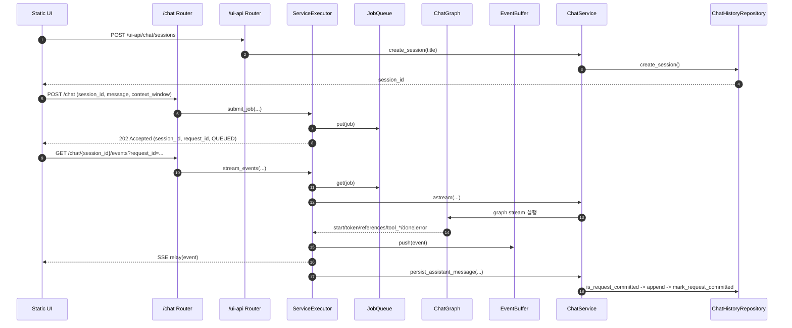

# Plan-and-then-Execute Agent Template

LLM 기반 Plan-and-then-Execute Agent를 빠르게 시작하기 위한 Python/FastAPI 템플릿입니다.
권장 Python 버전은 `3.13+`입니다.

## 1. 빠른 시작

### 1-1. 프로젝트명 초기화(선택)

```bash
bash init.sh my-project
```

### 1-2. 가상환경/의존성 설치

```bash
uv venv .venv
uv sync
```

### 1-3. 환경 변수 파일 생성

```bash
cp .env.sample .env
```

## 2. 서버 실행

```bash
uv run uvicorn plan_and_then_execute_agent.api.main:app --host 0.0.0.0 --port 8000 --reload
```

접속 주소:

- API 문서: `http://127.0.0.1:8000/docs`
- 헬스체크: `http://127.0.0.1:8000/health`
- 내장 ChatUI: `http://127.0.0.1:8000/ui`

## 3. API 요약

### 3-1. Chat API

| Method | Path | 설명 |
| --- | --- | --- |
| `POST` | `/chat` | 채팅 작업 제출 (`session_id`, `message`, `context_window`) |
| `GET` | `/chat/{session_id}` | 세션 스냅샷 조회 |
| `GET` | `/chat/{session_id}/events?request_id=...` | 요청 단위 SSE 이벤트 구독 |

### 3-2. UI API

| Method | Path | 설명 |
| --- | --- | --- |
| `POST` | `/ui-api/chat/sessions` | UI 세션 생성 |
| `GET` | `/ui-api/chat/sessions` | UI 세션 목록 |
| `GET` | `/ui-api/chat/sessions/{session_id}/messages` | UI 메시지 목록 |
| `DELETE` | `/ui-api/chat/sessions/{session_id}` | 세션+메시지 삭제 |

## 4. 실행 흐름

### 4-1. End-to-End 시퀀스



### 4-2. 그래프 흐름도


### 4-3. 노드별 작업 표

| 노드 | 주요 작업 | 입력 | 출력 | 다음 노드 |
| --- | --- | --- | --- | --- |
| `safeguard` | LLM으로 입력 안전성 판정(`PASS/PII/HARMFUL/PROMPT_INJECTION`) | `user_message` | `safeguard_result` | `safeguard_route` |
| `safeguard_route` | 결과값 정규화/별칭 교정 후 분기 결정 | `safeguard_result` | `safeguard_route`, `safeguard_result` | `planner_prepare` (`safeguard_route=response`), `blocked` (`safeguard_route=blocked`) |
| `blocked` | 차단 사유별 고정 안내 문구 생성 | `safeguard_result` | `assistant_message` | `END` |
| `planner_prepare` | 최근 히스토리 요약, 실행 상태 기본값 정리 | `history`, `step_results`, `step_failures` | `planner_history_summary`, `step_results`, `step_failures`, `replan_count` | `planner_tools_payload` |
| `planner_tools_payload` | Planner 프롬프트용 Tool 스펙 payload 생성 | `ToolRegistry` | `planner_tools_payload`, `available_tool_names` | `planner_llm` |
| `planner_llm` | 실행 계획 JSON 원문 생성 | `user_message`, `planner_history_summary`, `planner_tools_payload` | `plan_raw` | `planner_parse` |
| `planner_parse` | 계획 원문 JSON 파싱 | `plan_raw` | `plan_obj` | `planner_schema_validate` |
| `planner_schema_validate` | 계획 스키마 정규화 | `plan_obj` | `plan_id`, `plan_steps` | `planner_dependency_validate` |
| `planner_dependency_validate` | `tool_name` 등록 여부, `depends_on` 무결성/사이클 검증 | `plan_steps`, `ToolRegistry` | `plan_steps` | `execute_queue_build` |
| `execute_queue_build` | 의존성 레벨별 실행 큐 생성, 배치 상태 초기화 | `plan_steps` | `plan_steps`, `execute_queue`, `current_batch`, `batch_expected_count`, `batch_tool_exec_inputs`, `batch_tool_results`, `batch_tool_failures`, `step_results`, `step_failures` | `execute_queue_next_batch` |
| `execute_queue_next_batch` | 다음 batch 선택 또는 응답 단계 전환 | `execute_queue` | `current_batch`, `execute_queue`, `batch_expected_count`, `current_batch_started_at`, `batch_tool_exec_inputs`, `batch_tool_results`, `batch_tool_failures`, `execute_decision` | `execute_batch_prepare` (`execute_decision=execute`), `response_prepare` (`execute_decision=response`) |
| `execute_batch_prepare` | fan-out용 ToolCall 입력 목록 생성 | `current_batch`, `plan_steps`, `session_id`, `request_id`, `plan_id` | `batch_tool_exec_inputs`, `batch_expected_count`, `batch_tool_results`, `batch_tool_failures` | `execute_batch_fanout_route` |
| `execute_batch_fanout_route` | fan-out 라우팅(입력 있으면 fan-out, 없으면 기본 분기) | `batch_tool_exec_inputs` | 없음 | `tool_exec` (fan-out), `execute_batch_collect` (default branch) |
| `tool_exec` | Tool 실행(타임아웃/재시도/이벤트 발행) | `tool_call` | `batch_tool_results` 또는 `batch_tool_failures` | `execute_batch_collect` |
| `execute_batch_collect` | 배치 결과 병합, timeout/누락 step 실패 보정 | `batch_tool_results`, `batch_tool_failures`, `current_batch` | `step_results`, `step_failures`, `batch_failure_ids`, `batch_has_failures`, `batch_elapsed_seconds`, `batch_timeout_exceeded` | `execute_batch_decide` |
| `execute_batch_decide` | 다음 분기 결정(`next_batch/replan/response`) | `batch_has_failures`, `execute_queue`, `replan_count` | `execute_decision` | `execute_queue_next_batch` (`execute_decision=next_batch`), `replan_prepare` (`execute_decision=replan`), `response_prepare` (`execute_decision=response`) |
| `replan_prepare` | 이전 계획/실패 요약 생성, 재계획 횟수 증가 | `plan_id`, `plan_steps`, `step_failures` | `replan_previous_plan_summary`, `replan_failure_summary`, `replan_count`, `planner_tools_payload` | `replan_llm` |
| `replan_llm` | 수정 계획 JSON 원문 생성 | `replan_previous_plan_summary`, `replan_failure_summary`, `planner_tools_payload` | `replan_raw` | `replan_parse` |
| `replan_parse` | 재계획 원문 JSON 파싱 | `replan_raw` | `plan_obj` | `replan_validate` |
| `replan_validate` | 재계획 스키마/도구/의존성 검증 | `plan_obj`, `ToolRegistry` | `plan_id`, `plan_steps` | `execute_queue_build` |
| `response_prepare` | 실행 결과를 최종 답변 컨텍스트로 요약 | `plan_id`, `plan_steps`, `step_results`, `step_failures` | `rag_context`, `plan_execution_summary`, `rag_references` | `response_node` |
| `response_node` | 최종 답변 생성 | `user_message`, `rag_context` | `assistant_message` | `END` |

### 4-4. 이벤트 계약 요약

1. 이벤트 순서: `start -> token* -> references? -> tool_start/tool_result/tool_error* -> done|error`
2. 필수 식별자: `session_id`, `request_id`
3. 종료 조건: `done` 또는 `error`
4. 저장 멱등성: `request_id` 기준 단 한 번만 assistant 메시지 저장

## 5. 환경 변수 핵심

| 변수 | 기본값 | 설명 |
| --- | --- | --- |
| `GEMINI_MODEL` | `.env.sample` 참조 | 응답 생성 LLM 모델명 |
| `GEMINI_PROJECT` | 빈값 | Gemini 프로젝트 ID |
| `CHAT_DB_PATH` | `data/db/chat/chat_history.sqlite` | Chat 이력 SQLite 경로 |
| `CHAT_STREAM_TIMEOUT_SECONDS` | `180` | 스트림 타임아웃(초) |
| `CHAT_MEMORY_MAX_MESSAGES` | `200` | 세션 메모리 보관 메시지 수 |
| `CHAT_PERSIST_RETRY_LIMIT` | `2` | done 후 저장 재시도 횟수 |
| `CHAT_PERSIST_RETRY_DELAY_SECONDS` | `0.5` | 저장 재시도 간격(초) |

참고:

- `GEMINI_EMBEDDING_MODEL`, `GEMINI_EMBEDDING_DIM`, `LANCEDB_URI`는 현재 기본 Chat 런타임에서 직접 사용하지 않습니다.
- 위 키는 벡터 엔진 실험/확장 시에만 사용합니다.

## 6. 채팅 이력 초기화

기본 저장소는 SQLite(`CHAT_DB_PATH`)입니다.

```bash
rm -f data/db/chat/chat_history.sqlite
```

또는 테이블 데이터만 삭제:

```bash
sqlite3 data/db/chat/chat_history.sqlite "DELETE FROM chat_messages; DELETE FROM chat_sessions;"
```

## 7. 프로젝트 구조

```text
src/plan_and_then_execute_agent/
  api/                  # FastAPI 라우터, DTO, DI 조립
  core/
    chat/               # 도메인 모델, 그래프, 노드, 프롬프트, Tool 등록
  shared/
    chat/               # ChatService/ServiceExecutor/Repository/Memory/공통 노드
    runtime/            # Queue/EventBuffer/Worker/ThreadPool
    logging/            # 공통 로깅
    config/             # 설정/환경 로더
    exceptions/         # 공통 예외
    const/              # 공통 상수
  integrations/         # DB/LLM/Embedding/FS 외부 연동 어댑터
  static/               # 정적 UI
tests/                  # pytest 테스트
docs/                   # 개발 문서
```

## 8. 문서 인덱스

| 문서 | 링크 | 설명 |
| --- | --- | --- |
| 문서 허브 | [docs/README.md](docs/README.md) | 전체 맵, 변경 진입점 |
| Setup 개요 | [docs/setup/overview.md](docs/setup/overview.md) | 환경/인프라 문서 인덱스 |
| Setup ENV | [docs/setup/env.md](docs/setup/env.md) | `.env` 키 상세 설명 |
| Setup LanceDB | [docs/setup/lancedb.md](docs/setup/lancedb.md) | 벡터 엔진 실험 안내 |
| Setup PostgreSQL | [docs/setup/postgresql_pgvector.md](docs/setup/postgresql_pgvector.md) | PostgreSQL + pgvector 구성 |
| Setup MongoDB | [docs/setup/mongodb.md](docs/setup/mongodb.md) | MongoDB 구성 |
| Setup FileSystem | [docs/setup/filesystem.md](docs/setup/filesystem.md) | 파일 시스템 로그 연동 |
| API Chat | [docs/api/chat.md](docs/api/chat.md) | `/chat` 인터페이스, SSE |
| Core Chat | [docs/core/chat.md](docs/core/chat.md) | 그래프/노드 동작 |
| Shared Chat | [docs/shared/chat/overview.md](docs/shared/chat/overview.md) | 실행기/저장/멱등 규칙 |

## 9. 테스트

테스트 범위:

1. 기본 테스트 경로는 실제 구현/실환경 기반 시나리오입니다.
2. Tool 계층 단위 테스트는 Tool 응답 payload 기반 검증 시나리오를 포함합니다.
3. Tool 관련 테스트는 이벤트 계약(`tool_start/tool_result/tool_error`)과 식별 필드(`step_id`, `plan_id`)를 동일하게 유지합니다.

전체:

```bash
uv run pytest
```

E2E:

```bash
uv run pytest tests/e2e/test_chat_api_server_e2e.py -q
```
