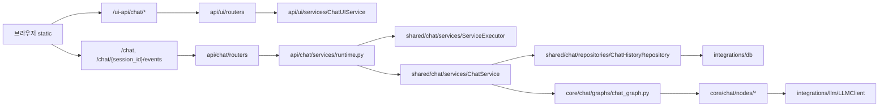

# 개발 문서 허브

이 문서는 `src/plan_and_then_execute_agent` 기준으로 문서를 읽고, 기능을 빠르게 추가/수정하기 위한 진입점입니다.

## 문서 사용 원칙

1. 실제 파일 경로와 동일한 문서 경로를 사용합니다.
2. API 인터페이스는 라우터/모델 코드 기준으로만 기술합니다.
3. 동작 순서와 실패 복구 절차를 함께 제공합니다.
4. 예시 코드는 현재 저장소의 구현 방식과 일치해야 합니다.

## 문서 트리

```text
docs/
  README.md
  api/
    overview.md
    chat.md
    ui.md
    health.md
  core/
    overview.md
    chat.md
  shared/
    overview.md
    chat.md
    config.md
    const.md
    exceptions.md
    logging.md
    runtime.md
  integrations/
    overview.md
    db.md
    llm.md
    embedding.md
    fs.md
  setup/
    overview.md
    env.md
    lancedb.md
    postgresql_pgvector.md
    mongodb.md
    filesystem.md
  static/
    ui.md
```

## 코드-문서 매핑

| 코드 경로 | 문서 |
| --- | --- |
| `src/plan_and_then_execute_agent/api` | `docs/api/overview.md` |
| `src/plan_and_then_execute_agent/api/chat` | `docs/api/chat.md` |
| `src/plan_and_then_execute_agent/api/ui` | `docs/api/ui.md` |
| `src/plan_and_then_execute_agent/api/health` | `docs/api/health.md` |
| `src/plan_and_then_execute_agent/core` | `docs/core/overview.md` |
| `src/plan_and_then_execute_agent/core/chat` | `docs/core/chat.md` |
| `src/plan_and_then_execute_agent/shared` | `docs/shared/overview.md` |
| `src/plan_and_then_execute_agent/shared/chat` | `docs/shared/chat.md` |
| `src/plan_and_then_execute_agent/shared/runtime` | `docs/shared/runtime.md` |
| `src/plan_and_then_execute_agent/integrations` | `docs/integrations/overview.md` |
| `src/plan_and_then_execute_agent/static` | `docs/static/ui.md` |

## 설치/환경 문서

| 목적 | 문서 |
| --- | --- |
| setup 문서 인덱스 | `docs/setup/overview.md` |
| `.env` 키 상세/반영 여부 | `docs/setup/env.md` |
| 파일 기반 LanceDB 구성 | `docs/setup/lancedb.md` |
| PostgreSQL + pgvector 구성 | `docs/setup/postgresql_pgvector.md` |
| MongoDB 구성 | `docs/setup/mongodb.md` |
| 파일 시스템 연동 | `docs/setup/filesystem.md` |

## 실행 경로 요약



## 빠른 작업 절차

### 1. 기능 추가

1. API 인터페이스를 먼저 확정합니다. (`docs/api/chat.md`, `docs/api/ui.md`)
2. 도메인 상태/그래프 변경이 필요한지 확인합니다. (`docs/core/chat.md`)
3. 실행기/저장소 영향도를 확인합니다. (`docs/shared/chat.md`)
4. UI 연동 순서를 맞춥니다. (`docs/static/ui.md`)

### 2. 벡터/DB 확장

1. `docs/setup/lancedb.md`, `docs/setup/postgresql_pgvector.md`에서 대상 저장소 설정을 확인합니다.
2. `runtime.py` 조립 코드에서 실제 주입 경로를 확정합니다.
3. `docs/integrations/db.md`, `docs/integrations/embedding.md`와 인터페이스 일치를 점검합니다.

### 3. 장애 대응

1. 증상 위치를 먼저 분리합니다: UI 렌더, API 응답, SSE 스트림, 저장소.
2. `request_id` 단위로 스트림 이벤트를 추적합니다.
3. `ServiceExecutor` 상태(`IDLE/QUEUED/RUNNING/COMPLETED/FAILED`)를 확인합니다.
4. 저장 실패는 `ChatHistoryRepository`와 DB 엔진 로그를 분리해 봅니다.

## 문서 동기화 체크리스트

1. 문서에 기록한 경로/명령이 실제 파일 및 CLI 옵션과 일치하는지 확인합니다.
2. UI 세션 경로가 `/ui-api/chat/sessions*` 형태로 통일되어 있는지 확인합니다.
3. SSE 식별자가 `request_id`인지 확인합니다.
4. `.env` 예시값이 `.env.sample`과 충돌하지 않는지 확인합니다.

## 최근 동기화 내역 (2026-03-05)

1. 450줄 초과 스크립트 분리 구조를 문서에 반영했습니다.
2. `core/chat/nodes/_plan_utils.py`와 `integrations/db/base/models.py`가 파사드 역할임을 명시했습니다.
3. 로깅/실행기/Tool 실행기의 보조 구현 파일(`integrations/llm/_client_mixin.py`, `integrations/embedding/_client_mixin.py`, `shared/chat/services/_service_executor_support.py`) 경로를 문서에 추가했습니다.
4. 파일 시스템 로그 경로는 예시 경로이며, 실행 전에 디렉터리를 생성해야 함을 명시했습니다.
5. `docs/integrations/llm.md`, `docs/integrations/embedding.md`에 `integrations/llm/_client_mixin.py`, `integrations/embedding/_client_mixin.py` 책임을 반영했습니다.
6. `docs/setup/filesystem.md`, `docs/setup/overview.md`에 로깅 파사드(`logger.py`)와 분리 파일 경로를 동기화했습니다.
7. Tool 실행 테스트는 mock 응답 사용을 허용하되, `tool_*` 이벤트 계약을 유지해야 함을 문서에 명시했습니다.
