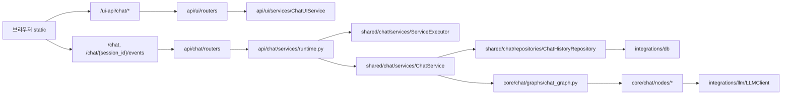

# 개발 문서 허브

이 문서는 `src/plan_and_then_execute_agent` 기준으로 문서를 읽고, 기능을 빠르게 추가/수정하기 위한 진입점입니다.

## 문서 트리

```text
docs/
  README.md
  api/
    overview.md
    chat.md
    ui.md
    health.md
  core/
    overview.md
    chat.md
  shared/
    overview.md
    chat/
      overview.md
      interface/
        ports.md
      graph/
        base_chat_graph.md
      memory/
        session_store.md
      nodes/
        _state_adapter.md
        _tool_exec_support.md
        branch_node.md
        fanout_branch_node.md
        function_node.md
        llm_node.md
        message_node.md
        tool_exec_node.md
      repositories/
        history_repository.md
        schemas/
          message_schema.md
          request_commit_schema.md
          session_schema.md
      services/
        _service_executor_support.md
        chat_service.md
        service_executor.md
      tools/
        prompt_payload.md
        registry.md
        types.md
    config.md
    const.md
    exceptions.md
    logging.md
    runtime.md
  integrations/
    overview.md
    db/
      overview.md
      client.md
      base/
      engines/
      query_builder/
    llm/
      overview.md
      client.md
      _client_mixin.md
    embedding/
      overview.md
      client.md
      _client_mixin.md
    fs/
      overview.md
      file_repository.md
      base/
      engines/
  setup/
    overview.md
    env.md
    lancedb.md
    postgresql_pgvector.md
    mongodb.md
    filesystem.md
  static/
    ui.md
```

## 코드-문서 매핑

| 코드 경로 | 문서 |
| --- | --- |
| `src/plan_and_then_execute_agent/api` | `docs/api/overview.md` |
| `src/plan_and_then_execute_agent/api/chat` | `docs/api/chat.md` |
| `src/plan_and_then_execute_agent/api/ui` | `docs/api/ui.md` |
| `src/plan_and_then_execute_agent/api/health` | `docs/api/health.md` |
| `src/plan_and_then_execute_agent/core` | `docs/core/overview.md` |
| `src/plan_and_then_execute_agent/core/chat` | `docs/core/chat.md` |
| `src/plan_and_then_execute_agent/shared` | `docs/shared/overview.md` |
| `src/plan_and_then_execute_agent/shared/chat` | `docs/shared/chat/overview.md` |
| `src/plan_and_then_execute_agent/shared/runtime` | `docs/shared/runtime.md` |
| `src/plan_and_then_execute_agent/integrations` | `docs/integrations/overview.md` |
| `src/plan_and_then_execute_agent/static` | `docs/static/ui.md` |

## Shared Chat 파일 매핑

`src/plan_and_then_execute_agent/shared/chat`의 `__init__.py`를 제외한 실행 파일 기준 매핑입니다.

| 코드 파일 | 문서 |
| --- | --- |
| `shared/chat/interface/ports.py` | `docs/shared/chat/interface/ports.md` |
| `shared/chat/graph/base_chat_graph.py` | `docs/shared/chat/graph/base_chat_graph.md` |
| `shared/chat/memory/session_store.py` | `docs/shared/chat/memory/session_store.md` |
| `shared/chat/nodes/_state_adapter.py` | `docs/shared/chat/nodes/_state_adapter.md` |
| `shared/chat/nodes/_tool_exec_support.py` | `docs/shared/chat/nodes/_tool_exec_support.md` |
| `shared/chat/nodes/branch_node.py` | `docs/shared/chat/nodes/branch_node.md` |
| `shared/chat/nodes/fanout_branch_node.py` | `docs/shared/chat/nodes/fanout_branch_node.md` |
| `shared/chat/nodes/function_node.py` | `docs/shared/chat/nodes/function_node.md` |
| `shared/chat/nodes/llm_node.py` | `docs/shared/chat/nodes/llm_node.md` |
| `shared/chat/nodes/message_node.py` | `docs/shared/chat/nodes/message_node.md` |
| `shared/chat/nodes/tool_exec_node.py` | `docs/shared/chat/nodes/tool_exec_node.md` |
| `shared/chat/repositories/history_repository.py` | `docs/shared/chat/repositories/history_repository.md` |
| `shared/chat/repositories/schemas/message_schema.py` | `docs/shared/chat/repositories/schemas/message_schema.md` |
| `shared/chat/repositories/schemas/request_commit_schema.py` | `docs/shared/chat/repositories/schemas/request_commit_schema.md` |
| `shared/chat/repositories/schemas/session_schema.py` | `docs/shared/chat/repositories/schemas/session_schema.md` |
| `shared/chat/services/_service_executor_support.py` | `docs/shared/chat/services/_service_executor_support.md` |
| `shared/chat/services/chat_service.py` | `docs/shared/chat/services/chat_service.md` |
| `shared/chat/services/service_executor.py` | `docs/shared/chat/services/service_executor.md` |
| `shared/chat/tools/prompt_payload.py` | `docs/shared/chat/tools/prompt_payload.md` |
| `shared/chat/tools/registry.py` | `docs/shared/chat/tools/registry.md` |
| `shared/chat/tools/types.py` | `docs/shared/chat/tools/types.md` |

## Integrations 파일 매핑

`src/plan_and_then_execute_agent/integrations`의 `__init__.py`를 제외한 실행 파일 문서는 폴더 단위 `overview.md`를 진입점으로 제공합니다.

| 코드 경로 | 진입 문서 |
| --- | --- |
| `integrations/db` | `docs/integrations/db/overview.md` |
| `integrations/db/base` | `docs/integrations/db/base/overview.md` |
| `integrations/db/engines` | `docs/integrations/db/engines/overview.md` |
| `integrations/db/query_builder` | `docs/integrations/db/query_builder/overview.md` |
| `integrations/llm` | `docs/integrations/llm/overview.md` |
| `integrations/embedding` | `docs/integrations/embedding/overview.md` |
| `integrations/fs` | `docs/integrations/fs/overview.md` |
| `integrations/fs/base` | `docs/integrations/fs/base/overview.md` |
| `integrations/fs/engines` | `docs/integrations/fs/engines/overview.md` |

## 설치/환경 문서

| 목적 | 문서 |
| --- | --- |
| setup 문서 인덱스 | `docs/setup/overview.md` |
| `.env` 키 상세/반영 여부 | `docs/setup/env.md` |
| 파일 기반 LanceDB 구성 | `docs/setup/lancedb.md` |
| PostgreSQL + pgvector 구성 | `docs/setup/postgresql_pgvector.md` |
| MongoDB 구성 | `docs/setup/mongodb.md` |
| 파일 시스템 연동 | `docs/setup/filesystem.md` |

## 실행 경로 요약



## 빠른 작업 절차

### 1. 기능 추가

1. API 인터페이스를 먼저 확정합니다. (`docs/api/chat.md`, `docs/api/ui.md`)
2. 도메인 상태/그래프 변경이 필요한지 확인합니다. (`docs/core/chat.md`)
3. 실행기/저장소 영향도를 `docs/shared/chat/overview.md`에서 분기한 뒤, 해당 파일 문서로 이동해 상세 변경 지점을 확인합니다.
4. UI 연동 순서를 맞춥니다. (`docs/static/ui.md`)

### 2. 벡터/DB 확장

1. `docs/setup/lancedb.md`, `docs/setup/postgresql_pgvector.md`에서 대상 저장소 설정을 확인합니다.
2. `runtime.py` 조립 코드에서 실제 주입 경로를 확정합니다.
3. `docs/integrations/db/overview.md`, `docs/integrations/embedding/overview.md`와 인터페이스 일치를 점검합니다.

### 3. 장애 대응

1. 증상 위치를 먼저 분리합니다: UI 렌더, API 응답, SSE 스트림, 저장소.
2. `request_id` 단위로 스트림 이벤트를 추적합니다.
3. `ServiceExecutor` 상태(`IDLE/QUEUED/RUNNING/COMPLETED/FAILED`)를 확인합니다.
4. 저장 실패는 `ChatHistoryRepository`와 DB 엔진 로그를 분리해 봅니다.
