# Core Chat

`src/plan_and_then_execute_agent/core/chat`의 현재 실행 구조(Plan-and-then-Execute)를 코드 기준으로 정리한다.

## 1. 용어 정리

| 용어 | 의미 | 관련 코드 |
| --- | --- | --- |
| 세션 | 대화 컨텍스트 단위 | `ChatSession` |
| 메시지 | 세션 내부 단일 발화 | `ChatMessage` |
| 그래프 상태 | 노드 간 전달되는 키 집합 | `ChatGraphState` |
| safeguard | 입력 유해성 분류 단계 | `safeguard_node` |
| planner | Tool 실행 계획(JSON) 생성 단계 | `planner_*` |
| execute | 배치 단위 Tool 실행 단계 | `execute_*`, `tool_exec_node` |
| replan | 실패 상황 재계획 단계 | `replan_*` |
| response | 최종 응답 생성 단계 | `response_prepare_node`, `response_node` |

## 2. 디렉터리와 관련 스크립트

```text
src/plan_and_then_execute_agent/core/chat/
  const/
  graphs/
  models/
  nodes/
  prompts/
  state/
  tools/
  utils/
```

| 분류 | 파일 | 역할 |
| --- | --- | --- |
| 엔티티 | `src/plan_and_then_execute_agent/core/chat/models/entities.py` | `ChatSession`, `ChatMessage`, `ChatRole` 정의 |
| 상수 | `src/plan_and_then_execute_agent/core/chat/const/settings.py` | DB 경로, 페이지, 문맥 길이 기본값 |
| 상태 | `src/plan_and_then_execute_agent/core/chat/state/graph_state.py` | 그래프 상태 키 정의 |
| 그래프 | `src/plan_and_then_execute_agent/core/chat/graphs/chat_graph.py` | 노드 등록, 엣지, stream 정책 |
| 노드 | `src/plan_and_then_execute_agent/core/chat/nodes/*.py` | safeguard/planner/execute/replan/response 조립 |
| Plan 유틸 공개 API | `src/plan_and_then_execute_agent/core/chat/nodes/_plan_utils.py` | Plan 유틸 단일 진입점(파사드) |
| Plan 유틸 구현 | `src/plan_and_then_execute_agent/core/chat/nodes/_plan_*.py` | 파싱/정규화/의존성 검증/요약 세부 구현 |
| 프롬프트 | `src/plan_and_then_execute_agent/core/chat/prompts/*.py` | 시스템 프롬프트 |
| Tool 구현 | `src/plan_and_then_execute_agent/core/chat/tools/*.py` | 기본 Tool 함수 구현 |
| Tool Registry | `src/plan_and_then_execute_agent/core/chat/tools/registry.py` | ToolRegistry singleton 생성/기본 Tool 등록 |
| 매퍼 | `src/plan_and_then_execute_agent/core/chat/utils/mapper.py` | 도메인 모델과 DB 문서 변환 |

## 3. ChatGraphState 핵심 키

`src/plan_and_then_execute_agent/core/chat/state/graph_state.py` 기준 주요 키:

1. 입력: `session_id`, `user_message`, `history`
2. 분류/분기: `safeguard_result`, `safeguard_route`
3. Planner: `planner_history_summary`, `planner_tools_payload`, `plan_raw`, `plan_steps`
4. Execute: `execute_queue`, `current_batch`, `batch_tool_results`, `batch_tool_failures`
5. Replan: `replan_raw`, `replan_count`, `replan_failure_summary`
6. 응답 컨텍스트: `plan_execution_summary`, `rag_context`, `rag_references`
7. 최종 출력: `assistant_message`

## 4. 그래프 구조

`src/plan_and_then_execute_agent/core/chat/graphs/chat_graph.py` 기준:

```mermaid
flowchart LR
    S[safeguard] --> SR[safeguard_route]
    SR -->|blocked| B[blocked]
    SR -->|response| PP[planner_prepare]

    PP --> PTP[planner_tools_payload]
    PTP --> PLLM[planner_llm]
    PLLM --> PPARSE[planner_parse]
    PPARSE --> PSV[planner_schema_validate]
    PSV --> PDV[planner_dependency_validate]

    PDV --> EQB[execute_queue_build]
    EQB --> EQN[execute_queue_next_batch]

    EQN -->|execute| EBP[execute_batch_prepare]
    EQN -->|response| RP[response_prepare]

    EBP --> EBFR[execute_batch_fanout_route]
    EBFR --> TEX[tool_exec]
    TEX --> EBC[execute_batch_collect]
    EBC --> EBD[execute_batch_decide]

    EBD -->|next_batch| EQN
    EBD -->|replan| RPP[replan_prepare]
    EBD -->|response| RP

    RPP --> RLLM[replan_llm]
    RLLM --> RPARSE[replan_parse]
    RPARSE --> RV[replan_validate]
    RV --> EQB

    RP --> RN[response_node]
```



## 5. Tool 경로

1. Tool 함수 구현: `src/plan_and_then_execute_agent/core/chat/tools/*.py`
2. Tool 등록/단일 singleton 관리: `src/plan_and_then_execute_agent/core/chat/tools/registry.py`
3. Tool 계약/레지스트리 타입: `src/plan_and_then_execute_agent/shared/chat/tools/*.py`
4. Tool 실행 노드: `src/plan_and_then_execute_agent/shared/chat/nodes/tool_exec_node.py`
5. Tool 실행 보조 로직: `src/plan_and_then_execute_agent/shared/chat/nodes/_tool_exec_support.py`

## 5-1. Plan 유틸 분리 구조

`src/plan_and_then_execute_agent/core/chat/nodes/_plan_utils.py` 기준 공개 함수는 그대로 유지되고, 구현만 분리됐다.

1. 파싱: `_plan_parse.py`
2. 정규화: `_plan_normalize.py`
3. 의존성 검증: `_plan_validate_dependencies.py`
4. 실행 큐 생성: `_plan_build_execute_queue.py`
5. 히스토리 요약: `_plan_summarize_history.py`
6. 실행 결과 요약: `_plan_summarize_step_results.py`

## 5-2. ToolRegistry 최소 인터페이스

`src/plan_and_then_execute_agent/shared/chat/tools/registry.py` 기준 공개 메서드:

1. 등록/조회: `add_tool`, `register_spec`, `resolve`, `has`
2. 목록 조회: `get_tools`(읽기 전용 tuple), `list_specs`(하위 호환 list), `list_for_planner`

`src/plan_and_then_execute_agent/core/chat/nodes/planner_tools_payload_node.py` 기준:

1. planner payload는 `build_planner_tools_payload(registry)`로 생성한다.
2. `available_tool_names`는 `registry.get_tools()` 결과에서 이름을 추출한다.

## 5-3. Tool 테스트 범위

1. Tool 실행 노드 단위 테스트는 Tool 응답 payload 기반 검증 시나리오를 포함한다.
2. 해당 시나리오는 `tool_start/tool_result/tool_error` 이벤트 계약과 `step_id`, `plan_id` 식별 필드 유지 여부를 확인한다.
3. Planner-Execute 통합 검증은 실제 Tool 구현 호출 경로가 중심이다.
