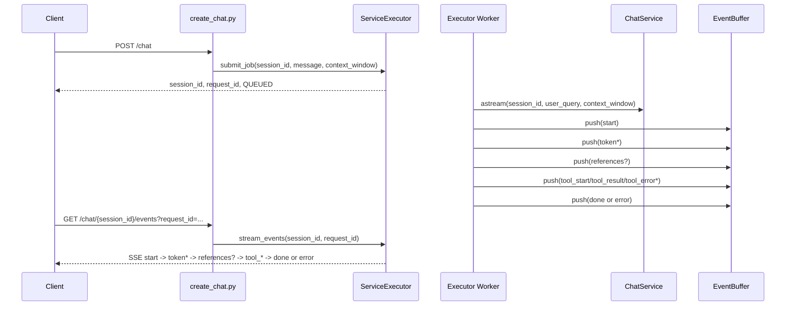

# API Chat

`src/tool_proxy_agent/api/chat` 모듈의 HTTP 인터페이스와 SSE 이벤트 계약을 현재 코드 기준으로 정리한다.

## 1. 용어 정리

| 용어 | 의미 | 관련 코드 |
| --- | --- | --- |
| 작업 제출 | 사용자 입력을 즉시 실행하지 않고 큐에 적재하는 단계 | `api/chat/routers/create_chat.py` |
| 요청 식별자 | 작업 제출 1건을 식별하는 UUID | `request_id` |
| 세션 식별자 | 대화 컨텍스트를 구분하는 ID | `session_id` |
| 세션 상태 | 세션의 최근 실행 상태 | `IDLE`, `QUEUED`, `RUNNING`, `COMPLETED`, `FAILED` |
| SSE | 서버가 이벤트를 연속 전달하는 스트림 응답 | `text/event-stream` |

## 2. 관련 스크립트

| 분류 | 파일 | 역할 |
| --- | --- | --- |
| 라우터 집계 | `src/tool_proxy_agent/api/chat/routers/router.py` | Chat 하위 라우터 등록 |
| 작업 제출 | `src/tool_proxy_agent/api/chat/routers/create_chat.py` | `POST /chat` 처리 |
| 이벤트 구독 | `src/tool_proxy_agent/api/chat/routers/stream_chat_events.py` | `GET /chat/{session_id}/events` SSE 중계 |
| 세션 스냅샷 | `src/tool_proxy_agent/api/chat/routers/get_chat_session.py` | `GET /chat/{session_id}` 처리 |
| 요청/응답 DTO | `src/tool_proxy_agent/api/chat/models/stream.py` | Submit/Stream 모델 |
| 실행 런타임 | `src/tool_proxy_agent/api/chat/services/runtime.py` | ChatService, ServiceExecutor 조립 |
| 실행 오케스트레이터 | `src/tool_proxy_agent/shared/chat/services/service_executor.py` | 큐 소비, 이벤트 변환, SSE payload 생성 |

## 3. HTTP 인터페이스

### 3-1. 채팅 작업 제출

- Method: `POST`
- Path: `/chat`
- Status: `202 Accepted`
- Request: `SubmitChatRequest`
- Response: `SubmitChatResponse`

요청 검증:

1. `message`는 최소 1자
2. `context_window`는 `1..100`
3. `session_id`가 없으면 신규 세션 생성
4. 존재하지 않는 `session_id`는 `CHAT_SESSION_NOT_FOUND`

응답 예시:

```json
{
  "session_id": "3f3b...",
  "request_id": "28c7...",
  "status": "QUEUED"
}
```

### 3-2. 스트림 이벤트 구독

- Method: `GET`
- Path: `/chat/{session_id}/events`
- Query: `request_id` 필수
- Status: `200 OK`
- Content-Type: `text/event-stream`

핵심 동작:

1. `ServiceExecutor.stream_events()`가 요청 단위 버퍼를 polling
2. 내부 이벤트를 공개 payload로 정규화
3. `done` 또는 `error`에서 스트림 종료
4. timeout 시 `type=error`, `status=FAILED` 이벤트 반환

### 3-3. 세션 스냅샷 조회

- Method: `GET`
- Path: `/chat/{session_id}`
- Status: `200 OK`
- Response: `SessionSnapshotResponse`

## 4. 실행 흐름



## 5. 이벤트 인터페이스 상세

### 5-1. 공개 이벤트 타입

| type | 설명 | 종료 여부 |
| --- | --- | --- |
| `start` | 실행 시작 이벤트 | 아니오 |
| `token` | 토큰 본문 이벤트 | 아니오 |
| `references` | 참고자료 이벤트 | 아니오 |
| `tool_start` | Tool 실행 시작 이벤트 | 아니오 |
| `tool_result` | Tool 실행 성공 이벤트 | 아니오 |
| `tool_error` | Tool 실행 실패 이벤트 | 아니오 |
| `done` | 정상 완료 이벤트 | 예 |
| `error` | 오류 종료 이벤트 | 예 |

### 5-2. node 값 의미

| node | 의미 | 생성 위치 |
| --- | --- | --- |
| `executor` | 시작/오류 이벤트 | `ServiceExecutor` |
| `response` | 일반 답변 토큰/완료 이벤트 | `core/chat/nodes/response_node.py` |
| `blocked` | 차단 답변 토큰/완료 이벤트 | `core/chat/nodes/safeguard_message_node.py` |
| `tool_exec` | Tool 실행 이벤트 | `shared/chat/nodes/tool_exec_node.py` |
| `rag` | references 이벤트 노드명 | `shared/chat/services/chat_service.py` |

### 5-3. 내부 이벤트 정규화 규칙

`ServiceExecutor._normalize_graph_event()` 기준:

1. `event=token` -> `type=token`
2. `event=assistant_message`는 `node=blocked`일 때만 `type=token`
3. `event=references` -> `type=references`
4. `event=tool_start|tool_result|tool_error` -> 동일 type
5. `event=done` -> `type=done`
6. `event=error` -> `type=error`

`ServiceExecutor._build_public_payload()` 기준:

1. `done`이면 `status=COMPLETED`
2. `error`이면 `status=FAILED`, `error_message` 포함
3. `metadata`가 있으면 그대로 전달

### 5-4. tool_* payload 표시 규칙

`tool_start/tool_result/tool_error` 이벤트의 `content`에는 실행 추적 필드가 포함될 수 있다.

주요 필드 예시:

1. `tool_name`, `step_id`, `plan_id`
2. `attempt`, `duration_ms`
3. `ok`, `error`, `error_code`, `output`

표시 규칙:

1. 추적/상관관계 필드(`step_id`, `plan_id`, `attempt`, `duration_ms`, `ok`, `error_code`)는 UI에 직접 노출하지 않는다.
2. UI는 `tool_name`, 상태, 사용자 관점 결과/오류 메시지 중심으로만 렌더링한다.

## 6. 예외 코드와 HTTP 매핑

| `detail.code` | HTTP 상태 |
| --- | --- |
| `CHAT_SESSION_NOT_FOUND` | `404 Not Found` |
| `CHAT_MESSAGE_EMPTY`, `CHAT_STREAM_NODE_INVALID` | `400 Bad Request` |
| `CHAT_JOB_QUEUE_FAILED` | `503 Service Unavailable` |
| `CHAT_STREAM_TIMEOUT` | `504 Gateway Timeout` |
| 기타 | `500 Internal Server Error` |

## 7. 확장 포인트

### 7-1. 요청 필드 추가

1. 요청 필드 확장은 `api/chat/models/stream.py`의 `SubmitChatRequest`에서 시작된다.
2. 라우터 계층에서는 `create_chat.py`의 `submit_job` 인자와 전달 구조가 함께 맞춰진다.
3. 실행 계층에서는 `ServiceExecutor` job payload가 동일 필드 집합으로 정렬된다.

### 7-2. 이벤트 필드 추가

1. 이벤트 필드 확장 지점은 `ServiceExecutor`의 payload 생성/정규화 로직이다.
2. 공개 인터페이스가 바뀌는 경우 `StreamPayload` 모델이 함께 갱신된다.
3. UI 반영 규칙은 `docs/static/ui.md`와 동일 필드 정의를 공유한다.

## 8. 트러블슈팅

| 증상 | 원인 후보 | 확인 파일 | 조치 |
| --- | --- | --- | --- |
| 작업 제출은 성공했는데 이벤트가 오지 않음 | 워커 미동작 또는 버퍼 설정 오류 | `runtime.py`, `service_executor.py` | 워커 시작/큐 poll 설정 확인 |
| `request_id`가 다른 이벤트가 섞여 보임 | 클라이언트 필터 누락 | `static/js/chat/transport/stream.js`, `static/js/chat/cell/stream.js` | transport/cell 양쪽 `request_id` 검증 로직 유지 |
| 항상 `error`로 종료됨 | 노드 예외 또는 timeout | `service_executor.py` | 오류 코드와 timeout 설정 점검 |
| tool 이벤트 누락 | planner가 tool step을 생성하지 않음 | `planner_*`, `tool_exec_node.py` | plan_steps와 registry 등록 상태 확인 |

## 10. 관련 문서

- `docs/api/overview.md`
- `docs/api/ui.md`
- `docs/core/chat.md`
- `docs/shared/chat/overview.md`
- `docs/static/ui.md`
