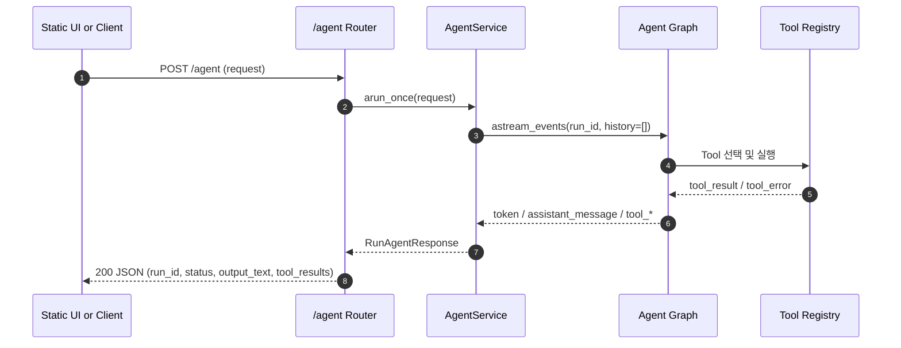
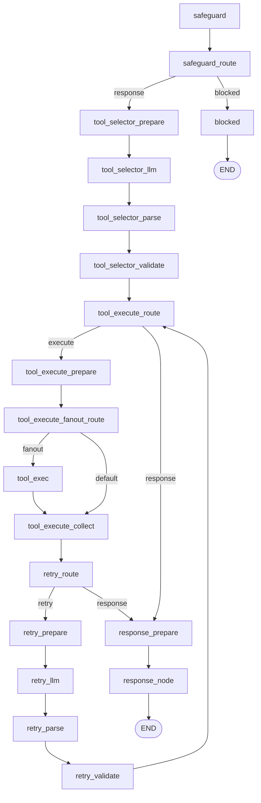

# one shot tool calling agent

LLM 기반 one shot tool calling agent 애플리케이션을 빠르게 시작하기 위한 Python/FastAPI 템플릿이다.
권장 Python 버전은 `3.13+`이다.

현재 템플릿은 `RuntimeEnvironmentLoader`로 환경을 로드한 뒤, `safeguard -> tool selector -> tool execute -> retry -> response` 파이프라인을 실행한다.
기본 런타임은 `Gemini LLM 노드 + AgentService + FastAPI /agent` 조합이다.
Tool 선택 단계는 `ToolRegistry`에 등록된 Tool 스펙을 기준으로 실행 대상을 고르고, 실행 결과는 최종 응답과 함께 단일 JSON으로 반환된다.

## 1. 빠른 시작

### 1-1. 프로젝트명 초기화(선택)

```bash
bash init.sh my-project
```

### 1-2. 가상환경/의존성 설치

```bash
uv venv .venv
uv sync --group dev
```

### 1-3. 환경 변수 파일 생성

기본 로컬 실행:

```bash
cp .env.sample .env
```

현재 기본 그래프는 Gemini 설정과 기본 Tool Registry를 사용한다.
`.env.sample`을 복사한 뒤 아래 핵심 값을 확인하고, `AGENT_REQUEST_TIMEOUT_SECONDS`는 필요하면 직접 추가한다.

```env
ENV=local
LOG_STDOUT=1

GEMINI_MODEL=gemini-3.1-flash-lite-preview
GEMINI_PROJECT=your-gcp-project-id
GEMINI_API_KEY=

AGENT_REQUEST_TIMEOUT_SECONDS=180
```

런타임 환경이 `dev/stg/prod`인 경우에는 루트 `.env` 외에 환경별 리소스 파일도 준비해야 한다.

예시(`dev`):

```bash
cp src/one_shot_tool_calling_agent/resources/dev/.env.sample src/one_shot_tool_calling_agent/resources/dev/.env
```

`RuntimeEnvironmentLoader`는 아래 순서로 환경을 로드한다.

1. 프로젝트 루트 `.env`
2. `ENV` / `APP_ENV` / `APP_STAGE` 해석
3. 값이 비어 있으면 `local`
4. 필요 시 `src/one_shot_tool_calling_agent/resources/<env>/.env`

### 1-4. 서버 실행

```bash
PYTHONPATH=src uv run uvicorn one_shot_tool_calling_agent.api.main:app --host 0.0.0.0 --port 8000 --reload
```

앱 시작 시 실제로 준비되는 순서:

1. `api/main.py`가 `RuntimeEnvironmentLoader`로 루트 `.env`와 환경별 `.env`를 먼저 로드한다.
2. 환경 로드 이후 Agent/Health 라우터와 정적 UI를 import 및 등록한다.
3. `api/agent/services/runtime.py`가 `AgentService` 싱글턴을 모듈 레벨에서 조립한다.
4. `core/agent/graphs/agent_graph.py`가 Tool 선택, 실행, 재시도, 응답 생성을 담당하는 그래프를 준비한다.
5. 요청이 들어오면 `/agent`가 그래프 이벤트를 집계해 단일 JSON 응답을 반환한다.

접속 주소:

- API 문서: `http://127.0.0.1:8000/docs`
- 헬스체크: `http://127.0.0.1:8000/health`
- 정적 UI: `http://127.0.0.1:8000/ui`

## 2. API 인터페이스 요약

### 2-1. Agent API

| Method | Path | 상태코드 | 설명 |
| --- | --- | --- | --- |
| `POST` | `/agent` | `200` | 사용자 요청 1건을 즉시 실행하고 최종 응답과 Tool 결과를 함께 반환 |

요청 예시:

```json
{
  "request": "김대리에게 일정 조율 메일 초안 작성해줘."
}
```

응답 예시:

```json
{
  "run_id": "c4f1...",
  "status": "COMPLETED",
  "output_text": "최종 응답 본문",
  "tool_results": [
    {
      "tool_name": "draft_email",
      "status": "SUCCESS",
      "output": {
        "recipient": "김대리",
        "subject": "일정 조율",
        "body": "...",
        "tone": "정중한",
        "mock": true
      },
      "error_message": null,
      "attempt": 1
    }
  ]
}
```

### 2-2. UI 경로

| Method | Path | 상태코드 | 설명 |
| --- | --- | --- | --- |
| `GET` | `/ui` | `200` | 단일 요청 입력, 실행 상태, 최종 응답, Tool 결과를 확인하는 정적 화면 |

### 2-3. Health API

| Method | Path | 상태코드 | 설명 |
| --- | --- | --- | --- |
| `GET` | `/health` | `200` | 서버 생존 상태 확인 |

## 3. 동작 방식

현재 시스템은 `단일 요청 + Tool 실행 그래프 + 단일 JSON 응답` 구조로 동작한다.

1. 클라이언트가 `POST /agent`로 요청 본문을 전달한다.
2. 라우터는 요청 DTO를 검증한 뒤 `AgentService.arun_once()`를 호출한다.
3. `AgentService`는 `run_id`를 만들고 그래프를 `history=[]` 기준으로 실행한다.
4. `safeguard` 단계가 입력 안전성을 분류한다.
5. `tool selector` 단계가 `ToolRegistry` 스펙을 바탕으로 필요한 Tool 호출 목록을 만든다.
6. `tool execute` 단계가 Tool을 실행하고 결과와 실패 정보를 수집한다.
7. 실패가 남아 있으면 `retry` 단계가 재시도 대상을 다시 고른다.
8. `response` 단계가 Tool 실행 결과를 바탕으로 최종 응답을 생성한다.
9. `AgentService`는 `token`, `assistant_message`, `tool_result`, `tool_error` 이벤트를 집계해 단일 응답 모델로 반환한다.

중요:

- `blocked` 경로로 종료되면 응답 `status`는 `BLOCKED`다.
- 기본 Tool인 `get_weather`, `draft_email`은 현재 고정 응답 기반 예시 구현이다.
- `add_number`는 실제 덧셈 Tool 예시이며, 정수 계산 질문에 사용할 수 있다.

### 3-1. End-to-End 시퀀스



### 3-2. 그래프 흐름도



### 3-3. 단계별 작업 표

| 단계 | 주요 작업 | 입력 | 출력 | 다음 단계 |
| --- | --- | --- | --- | --- |
| `safeguard` | 입력 안전성 판정과 차단 여부 결정 | `user_message` | `safeguard_result`, `safeguard_route` | `tool selector` 또는 `blocked` |
| `tool selector` | Tool 카탈로그 payload 생성, LLM 호출, 결과 파싱과 스키마 검증 | 사용자 요청, Tool 스펙 | `current_tool_calls`, `tool_execution_route` | `tool execute` 또는 `response` |
| `tool execute` | Tool fan-out 실행, 성공/실패 결과 병합 | Tool 호출 목록 | `completed_tool_results`, `unresolved_tool_failures` | `retry` |
| `retry` | 실패 Tool 재시도 여부 판단, 재실행 목록 생성 | 실패 Tool 결과 | `retry_decision`, `current_tool_calls` | `tool execute` 또는 `response` |
| `response` | Tool 결과 요약과 최종 응답 생성 | Tool 결과, 실패 요약 | `assistant_message`, `rag_references` | 종료 |
| `blocked` | 차단 사유에 맞는 고정 응답 생성 | `safeguard_result` | `assistant_message` | 종료 |

### 3-4. 기본 Tool 요약

| Tool | 설명 | 현재 구현 상태 |
| --- | --- | --- |
| `add_number` | 두 정수 `a`, `b`를 더한다. | 실제 계산 예시 |
| `get_weather` | 지역별 날씨 조회 Tool | 현재는 고정 응답 예시 |
| `draft_email` | 수신자, 제목, 목적을 바탕으로 메일 초안을 만든다. | 현재는 mock 초안 예시 |

### 3-5. 요청/응답 계약 요약

요청 필드:

| 필드 | 타입 | 제약 | 설명 |
| --- | --- | --- | --- |
| `request` | `string` | 최소 1자 | 사용자 단일 요청 본문 |

응답 필드:

| 필드 | 타입 | 설명 |
| --- | --- | --- |
| `run_id` | `string` | 요청 단위 실행 식별자 |
| `status` | `COMPLETED \| BLOCKED` | 최종 실행 상태 |
| `output_text` | `string` | 최종 응답 텍스트 |
| `tool_results` | `list` | Tool 실행 추적 결과 목록 |

Tool 결과 필드:

| 필드 | 타입 | 설명 |
| --- | --- | --- |
| `tool_name` | `string` | 실행한 Tool 이름 |
| `status` | `SUCCESS \| FAILED` | Tool 실행 상태 |
| `output` | `dict` | Tool 결과 payload |
| `error_message` | `string \| null` | 실패 시 오류 메시지 |
| `attempt` | `int` | 최종 시도 횟수 |

오류 응답:

| 코드 | HTTP | 설명 |
| --- | --- | --- |
| `AGENT_REQUEST_EMPTY` | `400` | 요청 본문이 비어 있음 |
| `AGENT_REQUEST_TIMEOUT` | `504` | Agent 실행 시간이 제한을 초과함 |
| 기타 내부 예외 | `500` | 런타임 내부 오류 |

## 4. 환경 변수 (`.env`)

기본 샘플 파일은 `.env.sample`이다.
전체 키 설명과 로딩 우선순위는 `docs/setup/env.md`를 참고한다.

### 4-1. 런타임 / 로그

| 변수 | 기본값 | 설명 |
| --- | --- | --- |
| `ENV` | `local`(빈값일 때) | `local/dev/stg/prod` 런타임 선택 |
| `LOG_STDOUT` | `False` | stdout 로그 출력 여부 |
| `AGENT_REQUEST_TIMEOUT_SECONDS` | `180` | `/agent` 요청 최대 실행 시간(초) |

### 4-2. LLM

| 변수 | 기본값 | 설명 |
| --- | --- | --- |
| `GEMINI_MODEL` | - | safeguard, tool selector, retry, response 노드에서 사용할 모델명 |
| `GEMINI_PROJECT` | - | Gemini 프로젝트 식별자 |
| `GEMINI_API_KEY` | - | Gemini 인증에 사용하는 API 키 |
| `GEMINI_EMBEDDING_MODEL` | - | 임베딩 확장 시 사용할 모델명 |
| `GEMINI_EMBEDDING_DIM` | `1024` | 임베딩 차원 기본값 |

### 4-3. 선택적 인프라 / 테스트 키

| 범주 | 예시 키 | 사용 맥락 |
| --- | --- | --- |
| PostgreSQL | `POSTGRES_*`, `POSTGRES_DSN` | DB 엔진 테스트, 수동 조립 |
| MongoDB | `MONGODB_*`, `MONGODB_URI` | MongoDB 엔진 테스트, 수동 조립 |
| Redis | `REDIS_*`, `REDIS_URL` | Redis 엔진 테스트 |
| Elasticsearch | `ELASTICSEARCH_*` | Elasticsearch 엔진 테스트 |
| LanceDB / SQLite | `LANCEDB_URI`, `SQLITE_*` | 벡터 저장소 또는 SQLite 엔진 테스트 |

## 5. 프로젝트 구조

### 5-1. 최상위 구조

```text
.
  src/one_shot_tool_calling_agent/
    api/                # HTTP 진입점, DTO, 런타임 조립
    core/               # Agent 그래프, 노드, Tool, 프롬프트
    shared/             # 공용 서비스, Tool 레지스트리, 런타임 유틸
    integrations/       # 외부 시스템 연동 어댑터
    resources/          # 런타임 환경별 리소스 파일
    static/             # 정적 UI 리소스
  tests/                # pytest 테스트
  docs/                 # 코드 기준 상세 문서
  data/                 # 로컬 실행 데이터 경로
```

### 5-2. `src/one_shot_tool_calling_agent/` 디렉터리 레벨 책임 맵

| 경로 | 역할 | 구현 책임 범위 |
| --- | --- | --- |
| `src/one_shot_tool_calling_agent/api` | FastAPI 진입 계층 | 라우터 등록, 요청/응답 모델, 런타임 의존성 주입 |
| `src/one_shot_tool_calling_agent/core` | Agent 도메인 계층 | 그래프 상태, 프롬프트, 노드 조립, Tool 정의 |
| `src/one_shot_tool_calling_agent/shared` | 공용 실행 계층 | `AgentService`, Tool 레지스트리, 공통 예외/로깅/설정, 범용 런타임 유틸 |
| `src/one_shot_tool_calling_agent/integrations` | 외부 연동 계층 | LLM/DB/파일 시스템/임베딩 어댑터 |
| `src/one_shot_tool_calling_agent/resources` | 환경 리소스 계층 | `dev/stg/prod`별 `.env.sample` 및 환경 파일 보관 |
| `src/one_shot_tool_calling_agent/static` | 웹 UI 정적 리소스 계층 | HTML/CSS/JS와 화면 상태 처리 |

### 5-3. `src/one_shot_tool_calling_agent/api` 하위 구조

```text
src/one_shot_tool_calling_agent/api/
  main.py               # 앱 엔트리, /ui 마운트, 라우터 등록
  const/                # API path/tag 상수
  agent/                # one shot tool calling agent API
  health/               # 서버 상태 확인 API
```

| 경로 | 역할 |
| --- | --- |
| `api/agent/models` | `/agent` 요청/응답 DTO |
| `api/agent/routers` | `/agent` 실행 라우터 |
| `api/agent/services` | `AgentService` 런타임 조립 |
| `api/health` | `/health` 단일 엔드포인트 |

### 5-4. `src/one_shot_tool_calling_agent/core/agent` 하위 구조

```text
src/one_shot_tool_calling_agent/core/agent/
  const/                # 기본 메시지와 설정 상수
  models/               # 실행 결과, 엔티티 모델
  state/                # 그래프 상태 계약
  prompts/              # safeguard / selector / retry / response 프롬프트
  nodes/                # 그래프 노드 구현
  graphs/               # LangGraph 그래프 조립
  tools/                # 기본 Tool 구현과 Registry
```

| 경로 | 역할 |
| --- | --- |
| `core/agent/graphs` | `safeguard -> tool selector -> tool execute -> retry -> response` 그래프 정의 |
| `core/agent/nodes` | 노드별 실행 로직과 분기 처리 |
| `core/agent/tools` | `add_number`, `get_weather`, `draft_email` 등록 |
| `core/agent/prompts` | 각 LLM 노드 프롬프트 관리 |

### 5-5. `src/one_shot_tool_calling_agent/shared` 하위 구조

```text
src/one_shot_tool_calling_agent/shared/
  agent/                # 공용 그래프 래퍼, 서비스, Tool 타입
  runtime/              # 큐, 워커, 스레드풀
  config/               # 환경 로더와 설정 파서
  logging/              # 공용 로거와 로그 저장소
  exceptions/           # 공통 예외 모델
  const/                # 공통 상수
```

| 경로 | 역할 |
| --- | --- |
| `shared/agent/services/agent_service.py` | 그래프 이벤트를 단일 응답으로 집계 |
| `shared/agent/tools` | Tool 레지스트리, payload, schema validator |
| `shared/runtime` | 확장 조립 시 사용할 범용 런타임 유틸 |
| `shared/config` | 런타임 환경 로드와 설정 해석 |

`shared/runtime`의 Queue, Worker, ThreadPool은 현재 기본 `/agent` 실행 경로에 자동 연결되지 않는다.
이 모듈들은 큐 기반 작업 처리나 백그라운드 워커를 별도로 조립할 때만 사용한다.

## 6. 관련 문서

| 문서 | 설명 |
| --- | --- |
| `docs/README.md` | 개발 문서 허브 |
| `docs/api/overview.md` | 공개 API 개요 |
| `docs/api/agent.md` | `/agent` 요청/응답 계약 |
| `docs/core/agent.md` | 그래프 목적과 실행 특징 |
| `docs/shared/agent/overview.md` | `AgentService`와 공용 Agent 계층 개요 |
| `docs/setup/env.md` | 환경 변수 상세 설명 |
| `docs/static/ui.md` | 정적 UI 화면 동작 |

## 7. 테스트

빠르게 검증할 때 사용한 명령:

```bash
uv run pytest tests/api/test_agent_routes.py tests/core/agent/tools/test_draft_email.py tests/core/agent/nodes/test_tool_call_selection.py tests/shared/agent/tools/test_registry.py tests/shared/agent/tools/test_schema_validator.py
uv run pytest tests/e2e/test_agent_api_server_e2e.py
uv run ty check src
```

## 8. 확장 필요 내역

- 직접 SSE 응답 경로 추가 여부 검토
- 큐 + GET 폴링 기반 작업 접수/상태 조회 경로 검토
- 큐 + GET 폴링 + SSE 조합 확장 여부 검토
